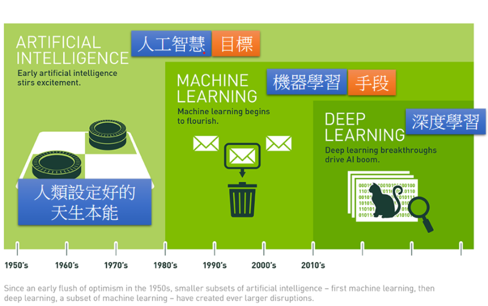
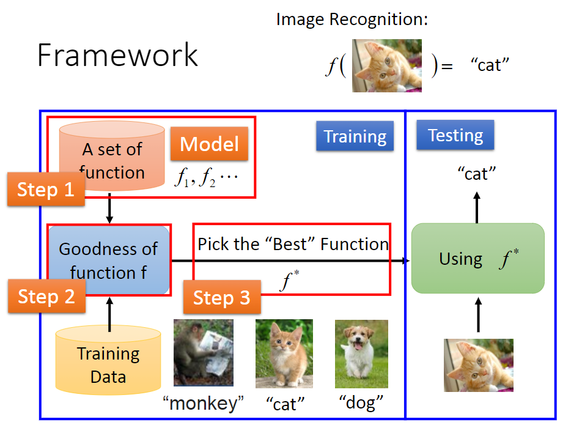
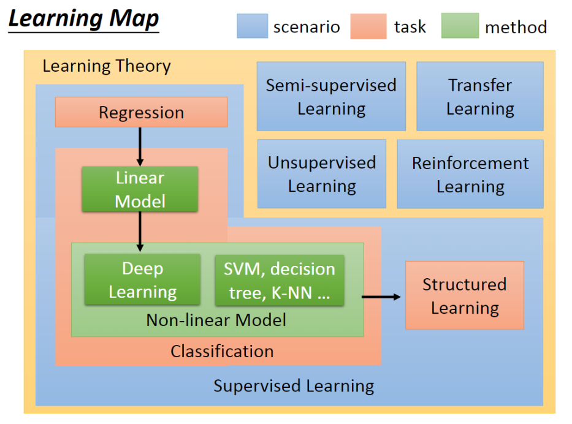
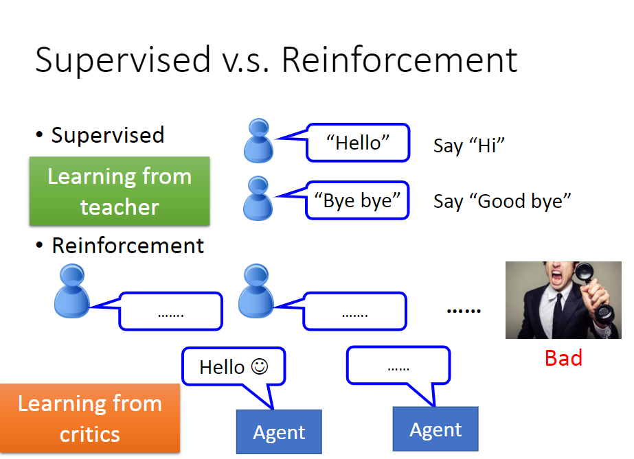
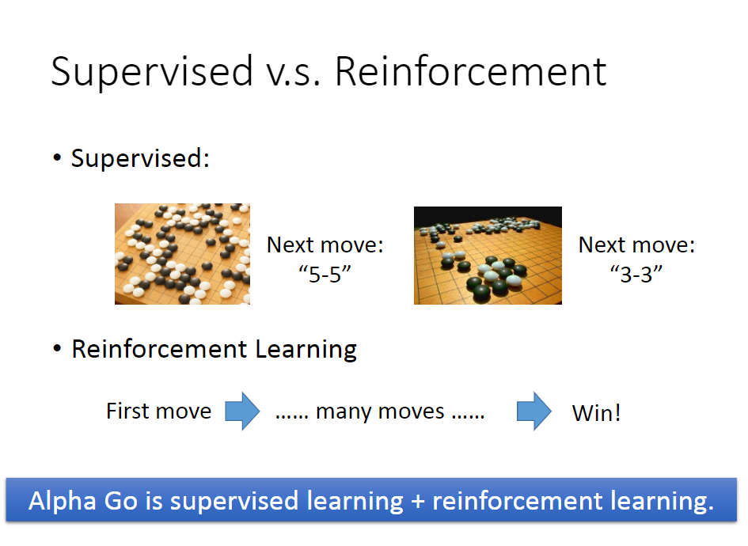

## Introduction of Machine Learning

1. AI 介绍

    

2. 机器学习步骤

    Step 1 ：建立一些Function，也成为Model

    Step 2 ：找到评价函数好坏的标准来选出最好的函数

    Step 3：通过训练数据来训练函数，使得函数能举一反三

    

3. 学习导图

    

    * Scenario意思是你有什么样的training data。

        |   **machine learning**   |       Scenario       |
        | :----------------------: | :------------------: |
        |   Supervised Learning    |     Labeled data     |
        | Semi-supervised Learning | Part of labeled data |
        |  Unsupervised Learning   |    unlabeled data    |
        |    Transfer Learning     |   irrelevant data    |
        |  Reinforcement Learning  |       critics        |

    * Task的意思为output的形式。

    * Method的意思为具体实现方法。

4. Supervised Learning

    * Regression
        * The output of the target is scalar(标量，数值)
        * 核心思想：连续函数下进行预测
        * 例：预测PM2.5进行天气预报
    * Classification
        * Binary Classification
            * 例：Spam filtering；癌症检测
        * Multi-Class Classification
            * 例：Document Classification，将新闻分类
    * Linear Model
        * 能做的事有限，一些简单的模型可以用它来做，但遇到复杂问题就力不从心了。
    * Non-linear Model
        * Deep Learning
            * Alpha Go
            * Classification-Image Recognition
        * Support Vector Machine
        * Decision Tree
        * K-NN
    * Structuerd Learning
        * Beyond Classification（不只是单纯的分类问题，而是有结构性的）
        * 例如：语言识别，人脸识别，语言翻译等，是结构化输出。此类问题常配合Reinforcement 
            Learning 解决。

5. Semi-supervised Learning 

    如要建立一个辨识猫与狗的系统，手上有一部分Labeled data（已经标记好的猫狗图片），和一部分Unlabeled data（未做过标记的猫狗图片），那么Semi-supervised做的就是利用Unlabeled data优化function，也常用于数据不足时进行学习。

6. Transfer Learning 

    如要建立一个辨识猫与狗的系统，手上有一部分Labeled data（已经标记好的猫狗图片），和一部分其他物种的图片（标记或未标记都可以），利用这部分来优化该系统。

7. Unsupervised Learning

    无Label，例如给定一大堆文字，让机器自己会阅读理解内容；从一堆画中，机器自己学会画图。

8. Reinforcement Learning

    * Learning from critics（从反馈中学习）

    * 当无法使用Supervised Learning时可使用

    * Alpha Go = Reinforcement Learning + Deep Learning

    * Supervised vs. Reinforcement

        

        

9. 参考资料

    [[机器学习入门] 李宏毅机器学习笔记-1（Learning Map 课程导览图）](https://blog.csdn.net/soulmeetliang/article/details/72591054)

    [李宏毅機器學習筆記-1 機器學習簡介(Intro of Machine Learning)](http://obstaclepath.blogspot.com/2018/02/1.html)

    

