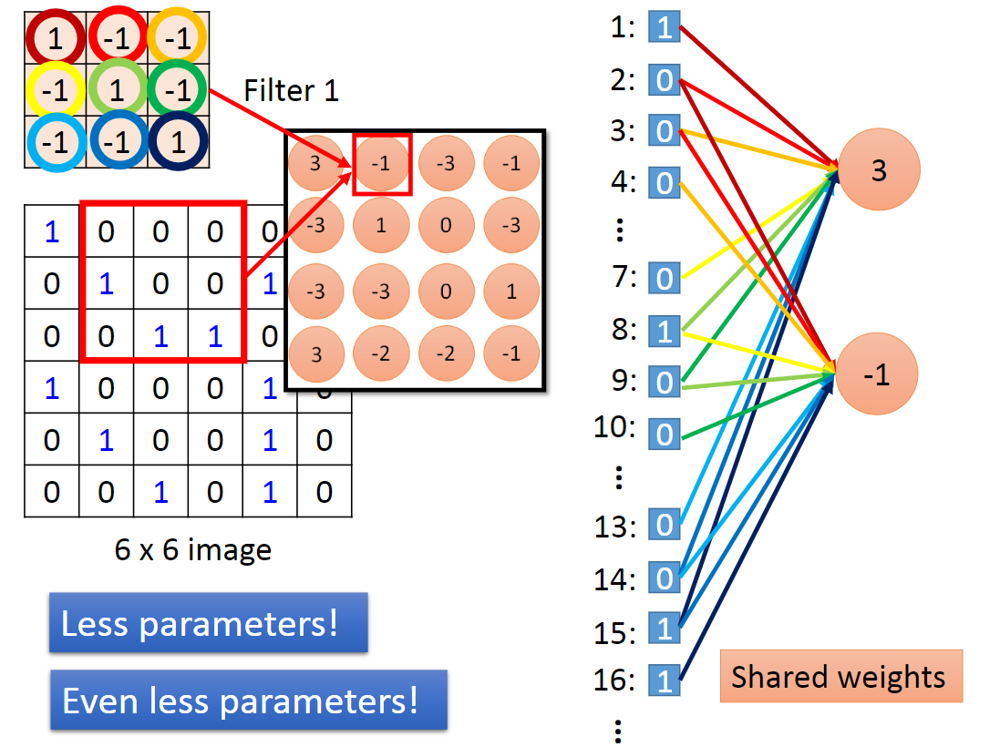

## Convolutional Neural Network

### Why CNN for Image

CNN的参数比全神经网络少得多，为什么CNN能用较少的参数处理图像呢，原因在于：

1. 一些模式比整张图片小得多，例如“鸟喙”比整张图要更小。
2. 同样的模式可能出现在图像的不同区域（故可以共享一些参数），例如“鸟喙”可能出现在图片的中间或者左上方。
3. 对图像的subsampling（下采样）不会改变图像的辨识度，从而图像变小，参数也少了。

### The whole CNN

如下图，Convolution(卷积层)解决前两个问题，Max Pooling(池化层)解决第三个问题。

#### CNN - Convolution（卷积层）

例如下图中，在输入image中选择一个3*3的矩阵与Filter1做内积，得到一个值，然后根据 stride参数移动响应的距离，不断做内积，直至遍历完整个输入image矩阵，从而得到Property2。

当然，可能有多个filter，当很多filter叠在一起时，就构成了Feature Map。Feature Map中的每一层就是一个image。

当然，当输入的图片为彩色（RGB编码）时，此时的filter不再是矩阵，变成了一个张量（Tensor）。

对比Convolution和Fully Connected两种方式，Convolution其实就是Fully connected去掉一些权重weight的结果。

如下图，卷积是一种神经网络的连接方式： 

Shared weights: 同色的weight相等。 这就共享了参数，减少了参数的使用。

上图的动态的过程：[动态过程](http://cs231n.github.io/assets/conv-demo/index.html)

#### CNN - Max Pooling

对于上一步中得到的Propert2，分组如下图，每一组选其平均或者是最大（把原来的4个Value变成 1个Value），从而缩小image。

得到了一个新的但比较小的image。

这个步骤可以重复很多次，从而缩小图片。

#### Flatten

最后把Feature Map拉直，最后放入Fully Connected Feedforward network里面。

### CNN in keras

### What does CNN learn?

上例中第二个卷积层有50个11x11的filter，它们的参数是学出来的，设第k个filter的活跃度为a^k，固定参数，用梯度上升法求使a^k最大的input image。 

得到的结果是，使各个filter活跃度最大的image是各种条纹。这层filter看的还是局部信息。 
而使flatten后的FC层（fully connected layers，全连接层）的filter活跃度最大的image，就显示出了各种轮廓，说明这些filter看的是整体信息。 

固定参数，求input image，让output layer的各neuron的output最大，并没有得到期望中的数字图片，而是很杂乱的图像。（白色表示有墨水。） 
对目标output加一个L1正则项（Lasso方法？），所得结果稍显数字轮廓。 

### Deep Dream & Deep Style

#### Deep Dream

Deep Dream: 将一张image作为CNN的输入，将CNN某个hidden layer的output（vector）拿出来，夸大某一个filter的表现（正值变得更大，负值变得更小），把它作为新的image的target。最后使得识别出来的东西更夸张地变现出来。

#### Deep Style

对于下图左边，取的是Filter的output，得到识别content，右边取的是Filter的output之间的correlation代表style。最后输出一张具有左边content右边style的image。

### More application on CNN

* Playing Go

* Speech：Filters仅仅在频率方向扫描，不在时间方向扫描。

    

* Text：Filter在entence matrix的时间方向扫描。

    

