## Why Deep？

### Modularization

在比较浅层网络与深层网络时，要让“矮胖”的网络和“高瘦”的网络的参数数目相等，这样比较才公平。 
即便是在深层网络参数较少的情况下，深层网络也会比浅层网络表现好。 
这是因为“深层”其实相当于“模组化”，第一个隐层是最基本的分类器，第二个隐层是用第一个隐层建造的分类器，以此类推。 

例如要进行以下对男生女生及其头发长度进行分类，由于长发男生比较少，故分类效果不好，故因此先模组化，先对长发与否，男女与否进行分类，然后再进行详细的分类。

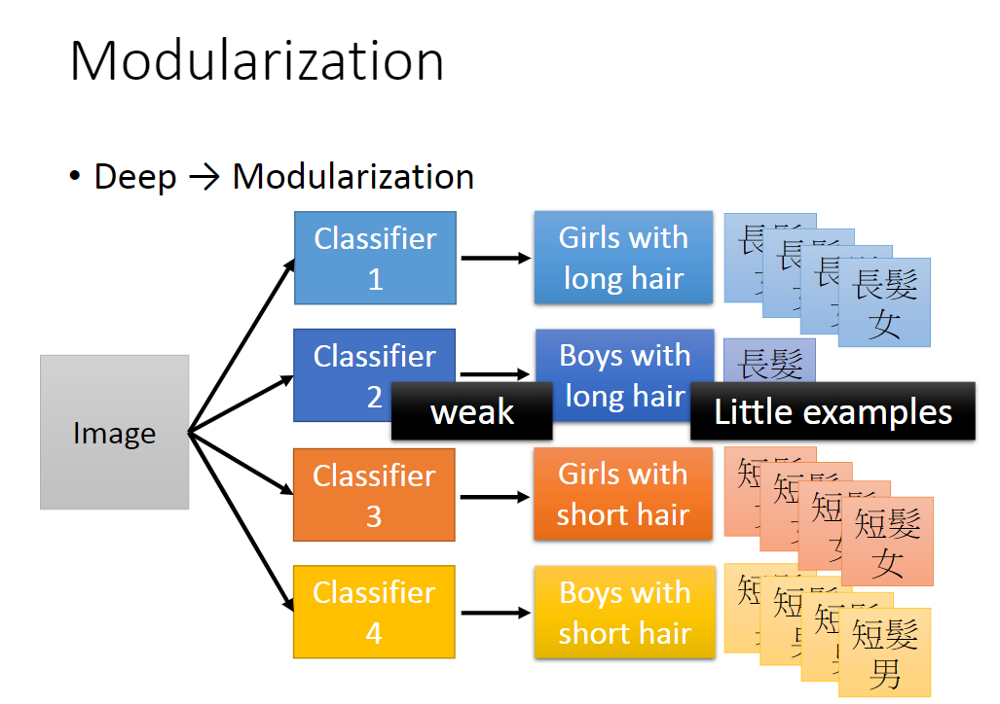

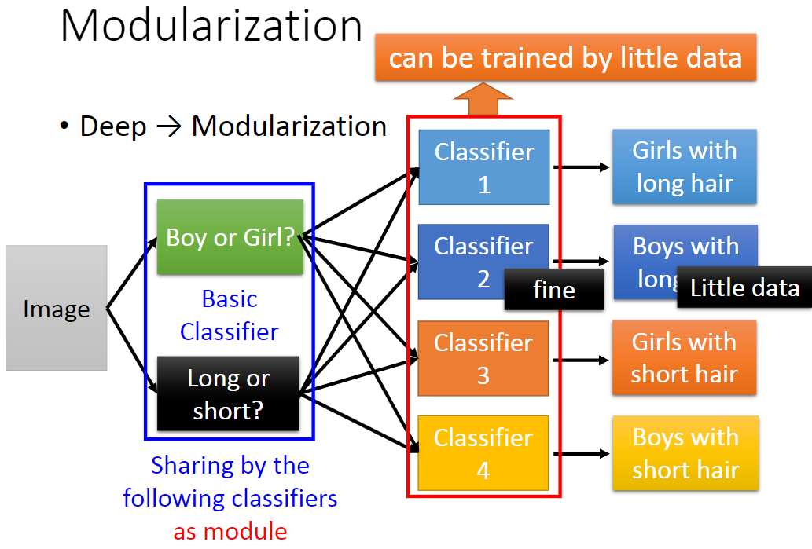

Modularization把本来复杂的问题变简单，即使training data没那么也能有较好的performance ，所以deep learning相对所需的data较少。

根据下图定理可知，任何函数都能用一层hidden layer表示出来。但是效率并不高。

浅层网络确实可以表示任意函数，但是使用深层结构更有效率。 

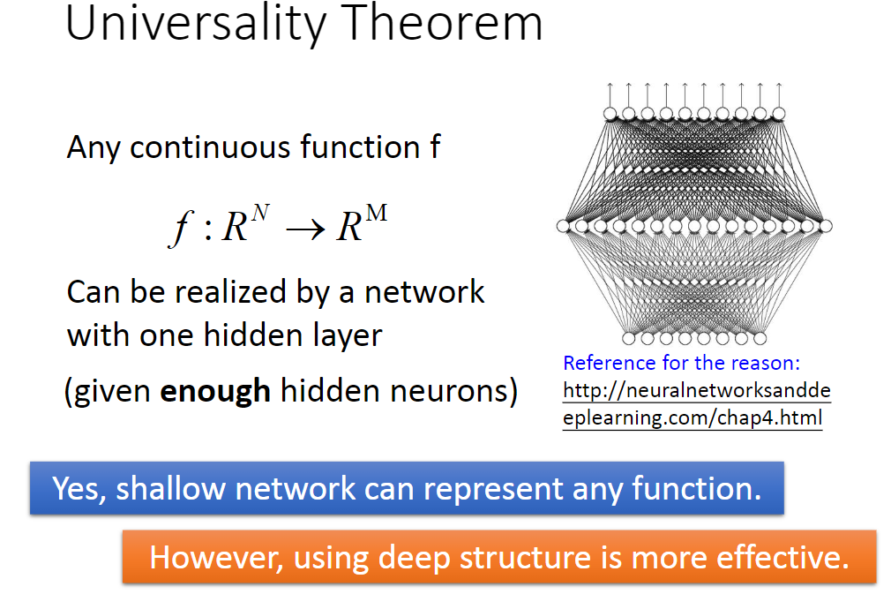

### Analogy

#### 电路

将逻辑电路和神经网络对比如下图。逻辑门电路，用两层逻辑门就可以实现任何布尔函数，但是用多层结构更简单、需要的逻辑门更少。 

神经网络也是如此，单隐层网络可以表示任何连续函数，但是多层结构表示起来更简单、需要的神经元更少，所以比较不容易overfitting，或只需较少的data。 
而且，深层结构可以比较有效率地使用data。 

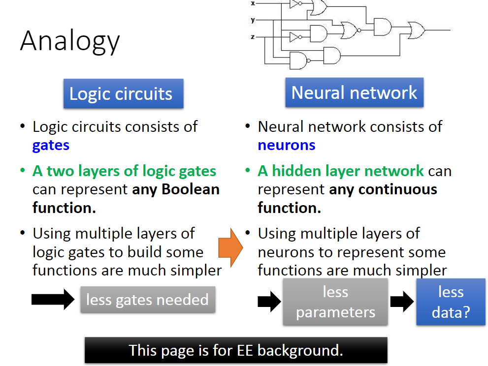

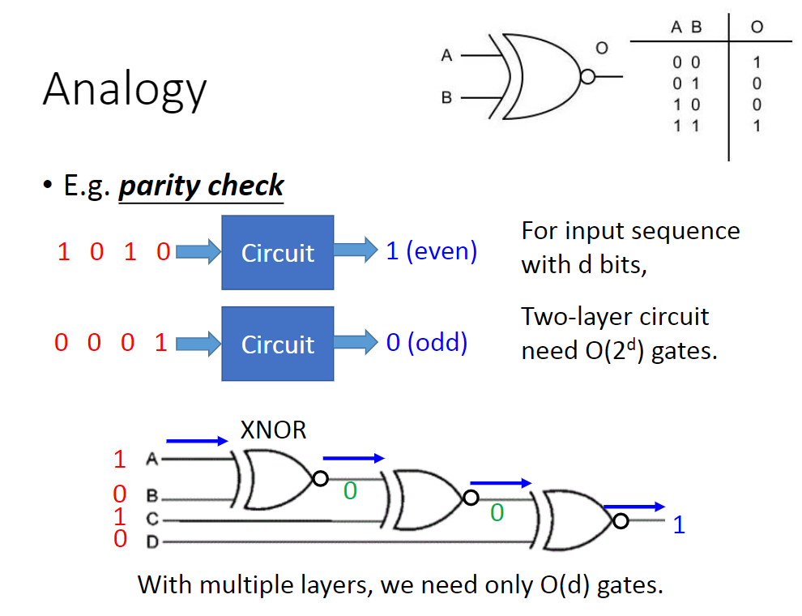

#### 窗花

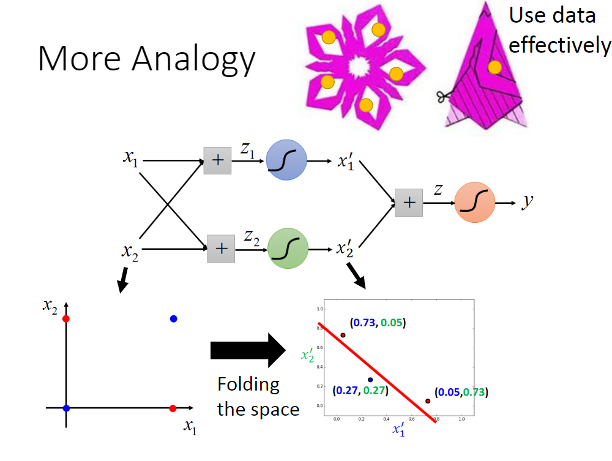

#### 实验

1层hidden layer与3层hidden layer（相同数目的参数），3层的效果更好。 
但理论上，3层可达到的效果，1层也能达到：要在1层learn的时候，target从真实label改为3层的output，这样1层的结果会接近3层的结果。

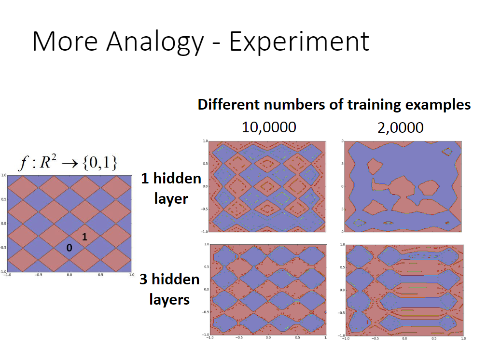

### End-to-end Learning

每一个function的功能都是自己学出来的。

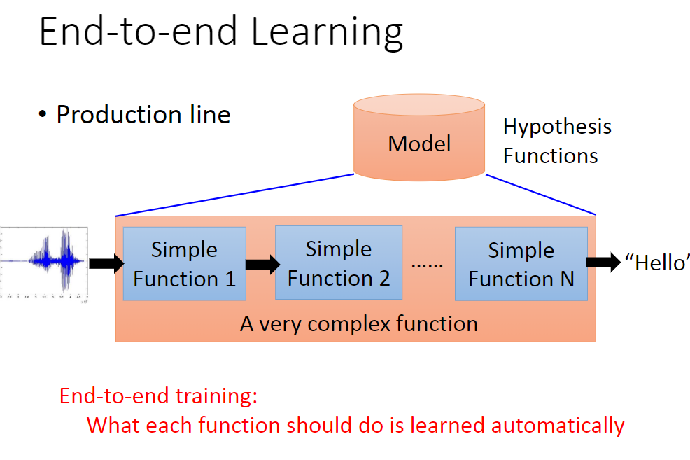

#### Speech Recognition

早期的语音识别。

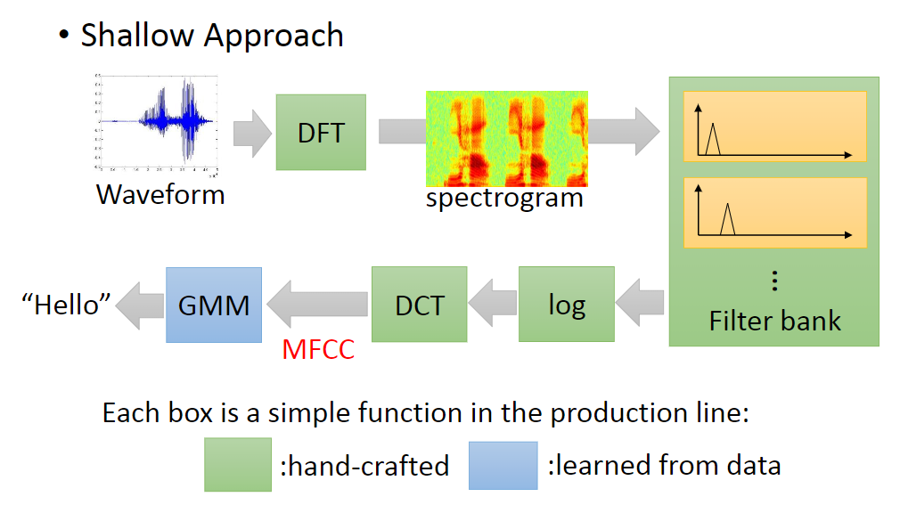

Deep Learning作用下的语音识别。

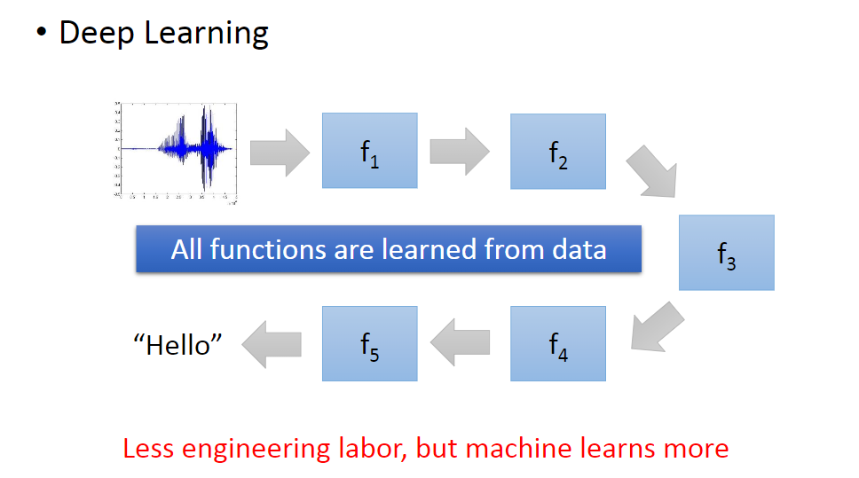

#### Image Recognition

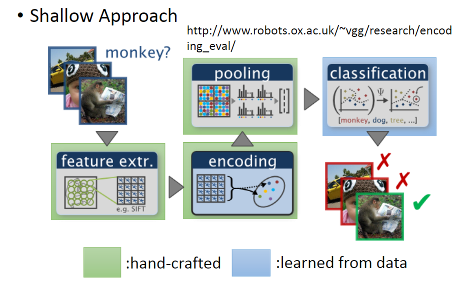

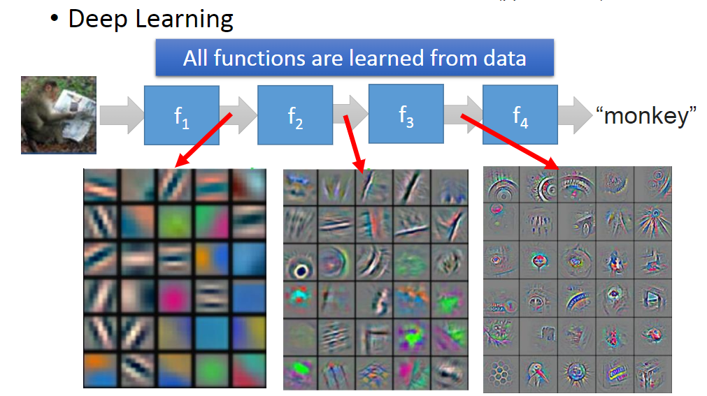

经过多层作用后，识别效果明显提升。

### Complex Task

当然，在做图像识别的时候，可能会把白色的狗认成北极熊；正面和侧面看列车都有很大不同。

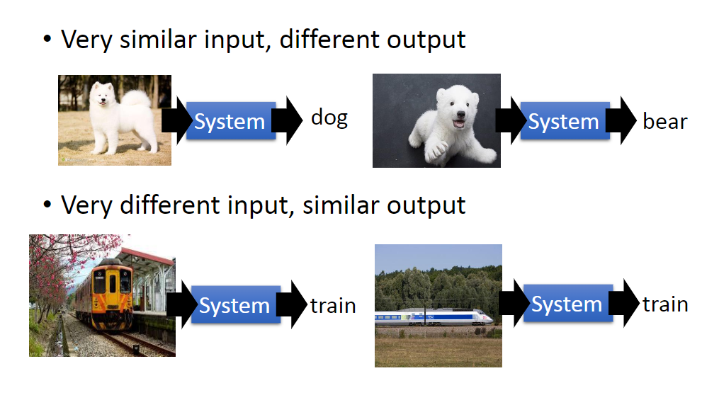

语音识别下，经过八层之后，不同人说的同样的话被归到同一类了。

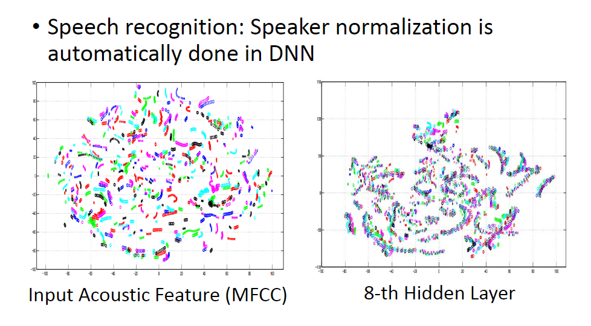

数字识别例子

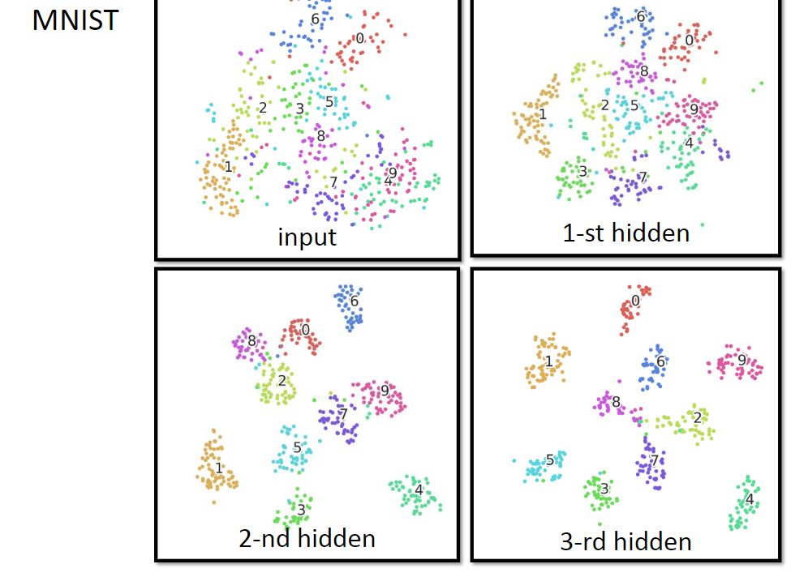

