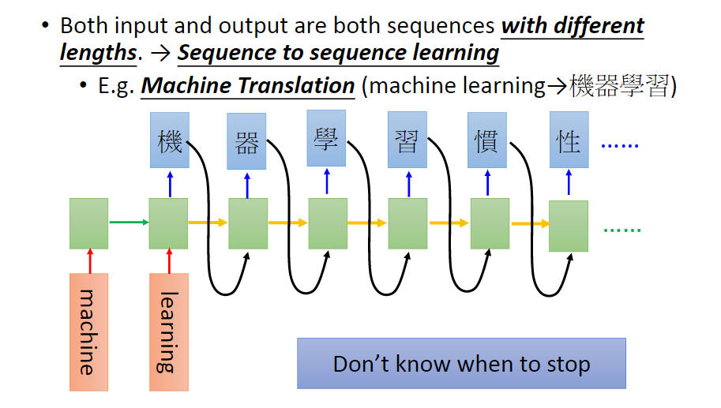

# Recurrent Neural Network (RNN)

## **RNN的基本概念与SimpleRNN**

### 以定票系统为例

以订票系统中的Slot Filling为例，我们希望订票系统听到用户说:”I would like to arrive Taipei on November 2nd.” 时做好Slot Filling, 即识别出语音中 Taipei 属于 Destination 这个slot, November 2nd 属于 Time of arrival 这个slot, 而其它词汇不属于任何slot。 
能否用以订票系统中的Slot Filling为例，我们希望订票系统听到用户说:”I would like to arrive Taipei on November 2nd.” 时做好Slot Filling, 即识别出语音中 Taipei 属于 Destination 这个slot, November 2nd 属于 Time of arrival 这个slot, 而其它词汇不属于任何slot。 
能否用Feedforward network解决这一问题呢？ 
先说结论：不能。 解决这一问题呢？ 

如上图所示在我们的Feedforward network里面，对于输入的word，通常都是表示成vector，对于如何使用vector来表示word,通常我们最容易想到的是1-of-N encoding，如下图所示

  

但是在1-of-N encoding会出现Beyond 1-of-N encoding的问题，即总会出现不在词表中的word，在这里把不在词表中的word用other表示，比如下图中的Gandalf与Sauron。

同样也可以使用Word hashing来表示，比如下图中的apple就使用Word hashing表示：

到目前为止我们已经知道如何把word表示成vector，对于我们的问题slot filling，在使用Feedforward network中我们的输入是vector,输出是计算输入的vector是否是slots的概率

但是仅用Feedforward network时，会出现如下问题：

上图中对于arrive Taipei on November 2nd和leave Taipei on November 2nd两句话,如果仅仅使用Feedforward network，对于Taipei这个word不可能出现两个slot，即分别对应dest与place of departure。因此我们需要使我们的Neural network具备memory的功能（**通俗来讲**，就是利用上下文信息）。

### SimpleRNN

在RNN中，hidden layer的neuron产生的output会被存到memory中，对之后的input, hidden layer的neuron不只考虑input， 还会考虑存在memory中的值。memory在没有任何input时需要初始值。 
RNN会考虑input sequence的order，改变input sequence的order，output会随之改变。 

下图例子中并不是三个神经网络，而是一个神经网络使用了三次。

根据下图首先把arrive(即X^1)输入RNN，经过hidden layer输出是a1，同时把a1放入memory中(图中浅蓝色表示)，接下来输入Taipei(即X^2)，此时hidden layer的输出既依赖于X2又依赖于memeory中的a1(即上一个hidden layer的输出)，上述过程依次传递。此种方法就能区分arrive taipei和leave taipei了。

上述RNN都是单层的，当然RNN也可以叠加很多层。

### Elman Network & Jordan Network

两者的区别在于Elman Network是利用hidden layer的输出作为下一个的输入，而 Jordan Network是直接把输出作为下一个hindden layer的另一个输入。

据说 Jordan Network 有更好的performance，因为在Elman Network 中放到memory里的是没有target的，有点难控制它学到什么东西放到memory里面，而在Jordan Network中放到memory里的是有target的，我们比较清楚放到target中的是什么东西。

### Bidirectional RNN

RNN还可以是双向的。刚才看到的例子中，输入一个句子，RNN从句首读到句尾。其实读的顺序也可以是反过来的。同时训练正向RNN与逆向RNN，将二者的hidden layer都接给一个output layer。用双向RNN的好处是，它产生output时看的范围比较广，看了整个input sequence。 

## LSTM

现在常用的memory是LSTM(Long Short-Term Memory), 结构比较复杂，有三个Gate. 
当外界想写入memory cell的时候，必须通过input gate，只有在input gate被打开的时候，memory gate才可以被写入，input gate 是打开还是关闭，是neural network自己学的。同理还有一个output gate, 它的开或关也是neural network 学到的。还有一个forget gate, 决定什么时候将memory cell中的内容忘掉，它的开或关也是neural network 学到的。 
可以将LSTM看做special neuron(4 inputs, 1 output), 4 inputs指的是外界想要存到memory cell 里的值+控制三个门的信号。 

Long Short-term Memory 里的Long 是形容Short-term Memory 的。在最开始看到的最简单的RNN模型中，memory是short-term的，每次有新的输入，memory都会被洗掉。而LSTM的short-term保持的比较久: 只要控制forget gate的信号决定不forget，memory的值就会被存起来。

下面这张图更清晰的表现了LSTM的结构， $z, z_i, z_o, z_f$ 都是scalar, 这4个input scalar 是由input vector与weight vector计算内积再加上bias而来，weight vector与bias是由training data用gradient descent学到的。 

activation function选择sigmoid。因为sigmoid输出的0-1之间的值可以表示gate打开的程度（1：打开，0：关闭）。

#### 手动演示

#### LSTM组成的网络

把初始神经网络中的neuron换成LSTM，就是用LSTM的网络的结构。参数量变成了之前的4倍。 

假设现在一层有n个LSTM，n个memory cell的值组成vector $c^{t-1}$，下图中的$z, z_i, z_f, z_o$ 都是n维vector, 第i维控制第i个LSTM相应的gate。

而实际中要更复杂一点：把每个LSTM在时刻t的output $h^t$接到该LSTM在下一时刻的输入，同时所谓peephole的意思是把前一时刻memory cell中的值也拉到下一时刻的input中。即，操控LSTM4个input $z, z_i, z_f, z_o$,时同时考虑了$x^{t+1}, h^t, c^t$。

一般一层不够，所谓Multiple-layer LSTM就是把前一层各LSTM输出的$h^t$ 作为下一层对应LSTM的输入$x^t$。

Keras支持三种RNN，分别是LSTM, GRU（LSTM的简化，只有两个gate，减少了参数避免了过拟合，performance与LSTM差不多）, SimpleRNN（本节最开始的RNN结构）。

## **RNN的Learning**

RNN在Learning时如何定义loss function呢？以slot filling 为例，对每个输入$x^i$ 其输出的$y^i$ 与相应的reference vector计算cross entropy, cross entropy之和就是loss function. 训练时word sequence不能打散，要先用$x^1$ 得到$y^1$, 再用$x^2$ 得到$y^2$。

定义好loss function之后，用gradient descent做training。gradient descent的算法从BP进阶为BPTT（Backpropagation through time）。但是，很遗憾的，RNN的训练是比较困难的，其error surface要么很平缓要么很陡峭。这样在做gradient descent时，参数可能跳到悬崖上，造成loss暴增，或者跳到悬崖边上（gradient很大），造成参数飞出去(NAN)。解决办法是clipping: 当gradient＞某个阈值时，令gradient = 阈值。

为何RNN会有rough的error surface？ 
并不是因为来自sigmoid的gradient vanish，因为换成ReLU也存在相同问题。（RNN中把sigmoid换成ReLU效果往往更差） 
其实是因为RNN处理的是time sequence, 同样的weight在不同时刻被多次使用。 

如下图，gradient在w=1.01处很大，然而在w=0.99处很小。w 有一点小小的变化，对 output 影响很大。

如何解决这一问题呢？使用最广泛的技巧是LSTM. 
为什么要把一般的RNN换成LSTM？因为LSTM可以处理gradient vanishing的问题：LSTM可以让error surface不那么崎岖，把平坦的部分拿掉，这样解决了gradient vanishing的问题，但没有解决gradient explosion的问题。 
那么，为什么LSTM可以处理gradient vanishing的问题呢？

在一般的RNN中，每个时刻neuron的output都会被放到memory中去，所以在每个时刻memory中的值都会被洗掉。但在LSTM中，是把memory中原来的值乘上一个数再加上一个数，即memory和input是想加的关系。所以LSTM中如果weight影响了memory中的值，那么这个影响会永远都存在（除非forget gate决定洗掉memory，有说法认为要给forget gate很大的bias以使其多数情况下开启），而不像SimpleRNN中memory的值在每个时刻都会被洗掉。 
若使用LSTM出现了过拟合，可考虑改用GRU。GRU的精神是“旧的不去，新的不来”，它将input gate与forget gate联动起来：若input gate 开，则forget gate 关。

其它处理gradient descent的技巧还有clockwise RNN, SCRN…… 

Hinton 提出一个有趣方法：

使用一般的 RNN (不用 LSTM)且使用 Identity matrix 来 initailize transition weight matrix 时，再搭配 ReLU 的 activation function ，会有比较好的 performance。以往如果我们用 random initial weight 的话，使用 sigmoid function 会比较好，但是如果我们用 Identity matrix 来 initialize weight，则使用 ReLU 会比较好

## More Application

* Input is a vector sequence, but output is only one vector.

    * 理解整个句子

    

    * 文章关键词提取

    

* Both input and output are both sequences, but the output is shorter.

    * 语音识别

        input 一长串语音讯号，每隔 0.1 秒取样一次
        output 一串较短的讯息 character sequence 经过 triming 把重复的东西删掉可以得到信息。

        但是怎么区分“好棒”和“好棒棒”呢？

        CTC：output 除了中文字以外，再增加一个新的符号 NULL ，这样就可以解决叠字的问题。

    

    

    穷举所有可能的 文字与 NULL 之间的排列组合，全部都当作正确的下去 train 再看我们的语音讯号属于哪一个类别。

    

* Both input and output are both sequences with different lengths.

    * 翻译

        英文跟中文讲同一句话，不能确定哪个语言会比较长

        

        所以同样的技巧用上，再增加一个 character 代表 “断”，让 machine 一看到断就停下来。

        

    

    

​    

​    

​    