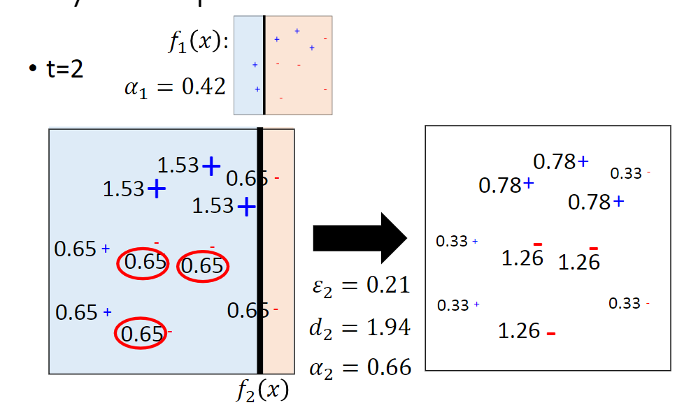

# Ensemble

Ensemble 类似于Moba类游戏中“打团战”，在Kaggle中是很重要的方法。

Ensemble的Framework是：

1. 先找到若干分类器，这些分类器是彼此不同的；
2. 再将这些分类器妥当地集合起来。

Ensemble的不同方法，是为了应付不同的状况。

## Ensemble: Bagging

比较简单的model会有Bias比较大，Variance就比较小；

比较复杂的model会有Bias小，Variance就比较大。

通过下图中同时考虑Bias和Variance，Error rate随着model复杂度增加逐渐下降，然后再逐渐上升（因为overfitting）

如果模型很复杂，可以训练出多个复杂的模型，取平均，以减小variance，提高泛化能力。

对于下图中的情况，得到了四个function。最后整合时，如果是回归问题，就对function的output做平均；如果时分类问题，就做voting。

### Decision Tree

在决策树是一个非常容易overfitting的方法，只要树足够深，一定能在训练数据上做到100%的正确率，但是在测试数据上结果并不一定好。所以我们使用的model容易overfitting时，就需要做bagging，决策树就是一个例子。

### Random Forest

用Bagging的方法对数据进行重采样，那么得到的每棵树形状相似。所以在每次分裂节点时随机限制哪些feature可用哪些feature不可用，避免各棵树长得太像。 

一般在做train时会把手上的label data 切成training set跟validation set 。但使用bagging的时候，可以不用把 data 切成 training set 跟 validation set，同样可以拥有 validation 的效果，这就是 Out-of-bag validation：

做bagging的时候，训练出来的function都是用部分的data train出来的：

f1 只用 x1,x2train；f2 只用 x3,x4 train；f3 只用 x1,x3 train；f4 只用 x2,x4 train

所以

可以用 f2 跟 f4 bagging 的结果在 x1 资料集上去测试；

可以用 f2 跟 f3 bagging 的结果在 x2 资料集上去测试；

可以用 f1 跟 f4 bagging 的结果在 x3 资料集上去测试 ；

可以用 f1 跟 f3 bagging 的结果在 x4 资料集上去测试。

接下来把 x1 ~ x4 的所有测试结果把它平均计算 error rate，得到 out-of-bag (OOB) error 这个结果可以反应测试的正确率。

## Ensemble: Boosting

Boosting 方法使用较弱的模型。

如果分类器在训练数据上有大于50%的正确率，那么在Boosting之后会得到100%的正确率。 
Boosting的流程是：先有最初的分类器f1, 然后找到与f1互补的分类器f2，…… 
在Bagging中每个分类器都是独立的，训练时不相干，可以同时训练。而在Boosting中，要先训练完f1，再根据f1的特性训练f2……

那么，我们怎么得到不同的classifier呢？

可以制造不同的training set 来resampling，也可以reweighting来做。

### Adaboost

Adaboost的做法就是，训练好f1后，调整training set的weight，让f1在新的training set上错误率达到50%, 再用新的training set训练f2，......
调整training set的weight 的方法是，对f1正确分类的example, 其weight除以一个大于1的值；对f1错误分类的example, 其weight乘以相同的值，这个值可以计算出来的。 

例子如下：

调整权重来突出$f_1(1)$ 的error（对$f_1(1)$预测对的权重减小，预测错的权重增加）

如果 $x^n$ 被 $f_1$ 分类错误，那我们就把 $x^n$ 乘以一个权重 $d_1$ ,其中 $d_1 > 1$；

如果 $x^n$ 被 $f_1$ 分类正确，那我们就把 $x^n$ 除一个权重 $d_1$ , $d_1 > 1$。

那么，$d_1$的值要设置为多少，才能使得$f_1$ 的 error rate = 0.5呢？

#### Algorithm

##### Toy Example

### Math

证明：证明随着T 的增大，$H(x)$ 会在训练数据上取得越来越小的错误率。

首先给出训练错误率的upper-bound，然后证明这个upper-bound恰好等于$\frac{1}{N}Z_{T+1}$,之后证明$T↑, Z_{T+1}↓$。

### AdaBoost 的神秘现象

随着轮数T的增加，$H(x)$在训练数据上的错误率降为0，但是训练错误为0之后，测试错误率还在下降。

我们将$\hat y g(x)$作为margin，margin越“正”表示越正确。可见，5个分类器的组合已经有0%的训练错误率，但再增加新的分类器margin会被往右推，也就是说就算训练错误率为0，Adaboost也会继续放大margin。放大margin，相当于在减小penalty。

### General Formulation of Boosting

## Ensemble: Stacking

注意训练数据的划分：前面的四个系统和final classifier要使用不同的训练数据。 
final classifier决定各系统的weight.

