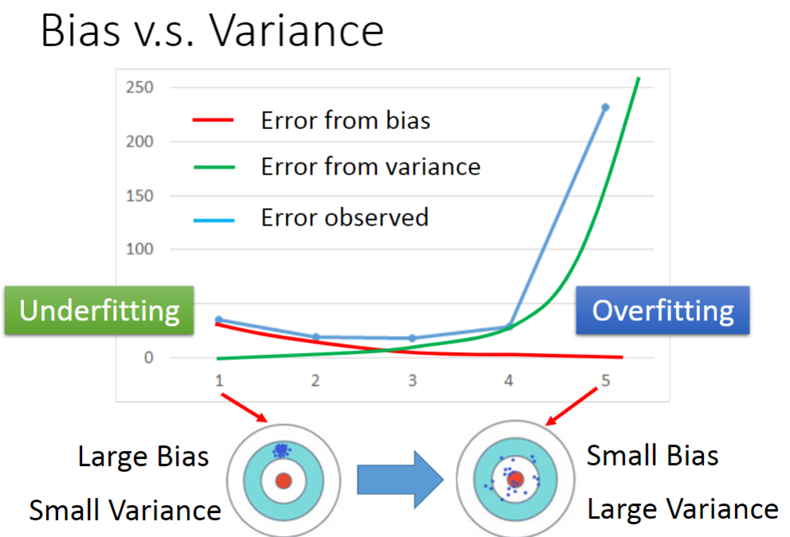

## Bias and Variance

### 1. Error 来源

Bias(偏差) 和 Variance(方差)

### 2. Bias and Variance of Estimator - 如何估算Bias和Variance

1. 点估计步骤：

    1. 抽取样本
    2. 计算样本的均值，方差等
    3. 使用统计量近似估算总体的方差，均值

2. Bias和Variance的详细解释

    

    
    
    * bias表示的是枪瞄准以后是否有偏差
    * Variance表示的枪打的是否有抖动
     
    

### 3. Variance

左边为越简单的模型，同一训练数据得到的不同模型都集中于真实模型附近，Variance小。   

相反，右边由于模型复杂，不同模型的分布相差大，造成Variance大。

### 4. Bias

​	

越复杂的模型，得到的预测结果就约接近靶心。

### 5. What to do with large bias and large variance?

regularzation (正则化)是为了使曲线更加光滑，但是可能造成更大的Bias

### 6. Model Selection

1. 平衡Bias 和 Variance
2. 不能按照Testing Error来决定模型，因为Testing set可能不具代表性。具体解释如下：
    * 无法知道现实中的真实的Testing Set。用于Test的数据是自己收集到的，不能代表整体。
    * 已选定的Testing set本身也存在一定偏差，这是无法避免的，因为我们需要自己进行分出训练集和测试集。选择在Testing set中Error最小的model可能会使得在真实应用中造成很大的Error。

### 7. Cross Validation

为解决6中的问题，我们使用交叉验证的方法。

1. 将Training Set 分为两部分，分别为Training Set(训练集)和Validation Set(验证集)。
2. 用Training Set来训练三组模型，在Validation中得到Error，得到Error最小的模型。
3. 用未分组的Training Set继续训练2中得到的模型，在Public Testing Set中得到Error。
4. 在Private Testing Set中得到的Error，再来评估模型好坏。
5. 不能这样做：当在Public Testing Set中得到的效果不好时，不能重新回到前面再来调整模型的参数。这样做不一定能在Private Testing Set中得到好的Errot。

### 8. N-fold Cross Validation

将上一步中的原始的Training Set再细分为N组继续完成整个操作。