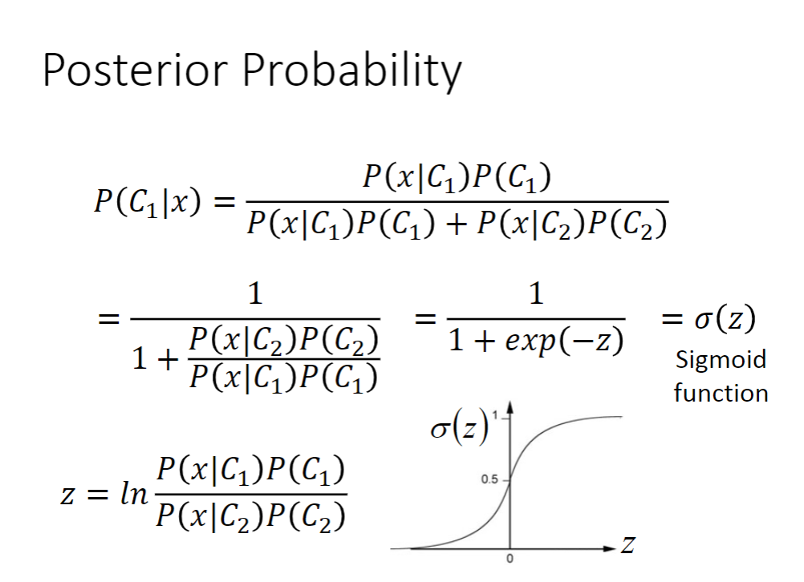

## Classification: Probabilistic Generative Model

### Classification

分类具体例子。

### How to do Classification

以Pokemon精灵的属性为例来进行分类。

这里提出的一种思路是按照Regression的思想来进行分类，通过Regression模型的预测值来归类。

然而以上的那种方法可能发生偏差，导致分界线不准确。

Ideal Alternatives：

### Example of Two Boxes

给定两个盒子，里面放了绿球和蓝球。

求取出来的球是蓝球是Box1中的概率是多少？

又上图的例子可得以下图的生成模型。

### Probability from Class

  那么，回到上面的例子，该怎么去判别一直Pokemon精灵属于那个物种呢？

假定图上的点是符合高斯分布，即正态分布的。

给定点之后，怎么找到具体的Gaussian Distribution呢？

#### 1. Gaussian Distribution

输入：某一只Pokemon精灵的数据。

输出：那只Pokemon精灵从一个分布里面被sample出来的概率。

高斯分布形状取决于平均值μ和协方差Σ。

如下图，假设有一个高斯分布存在，从这个分布中sample 79 次以后。那么，如何找到具体分布如何呢？

如何找到这个Gaussion function呢？

通过sample处找到两个平均值μ和协方差Σ参数。带入参数，然后用新点的feature计算f(x)，得到概率值。

如果x越接近中心点μ，sample出来的几率是比较大的。

下图中的New x在远处，sample出来的几率是比较小的

#### 2. Maximum Likelihood

如何找到μ和Σ呢？

虽然说每一个高斯分布都有可能sample处这79个点，但是它们sample出来的每个点的几率是不同的。

给定一个μ和Σ，就可以算高斯分布sample处这79个点的概率。

穷举所有的μ和Σ，看具体哪一个μ和Σ能使L(μ,Σ)最大，那点就是我们要找的μ和Σ，写作μ* 和 Σ*。

对于Pokemon精灵的例子，最后找到的μ和Σ如下图所示。接下里便可以开始classification了。

#### 3. Do classfication

通过上一部，得到的参数，结果如下。

然而，从二维空间和高维空间中的结果都不是很理想。那么如何改进呢？

#### 4. Modifying Model

假设两个类别共用一个Σ(covariance matrix)。新的Σ计算方法如下图。

新的结果如下。共用covariance matrix 使得结果改善。

### Summary

具体的三个步骤如下：

为什么选择高斯分布模型呢？自己来决定选择那个模型，如果是二元特征量，还可以选择伯努利分布。

如果所有的feature都是独立的，还可以使用朴素贝叶斯分类法。

### Math

分析后验概率（posterior probability）：

将上面公式整理后，可得到一个sigmoid function。

从上面的推到可知，如果Σ1=Σ2，则可以得到一个线性模型。那为什么舍近求远去找概率而不是去找w和b这两个参数呢？下一节课使用逻辑斯谛来解决。