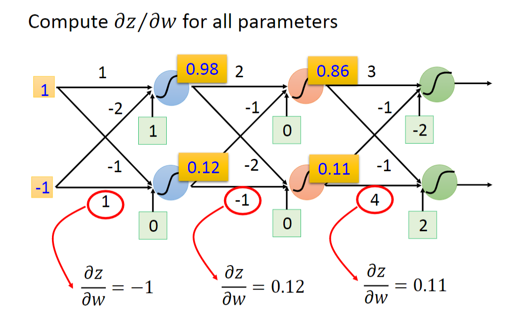

## Backpropagation(反向传播算法)

### Gradient Descent

在神经网络的训练中，Gradient Descent与其他方法原理一致。

本质上，Backpropagation就是Gradient Descent，区别在于参数的数量，当有了大量参数的时候，我们需要使用backpropagation加快计算。

计算微分时，我们使用链式法则（Chain Rule）。

### Backpaopagation

Loss function如下图，关键问题就是求偏微分。

如下图，任取一个neural，运用链式法则，将代求微分分为两部分，分别为Forward pass 和 backward pass。

#### Forward pass

对于Forward pass 部分，如图可知，∂z / ∂w1 的值为输入的x1。

按照这种方法，便可以快速完成计算所有的Forward pass部分的偏微分。

#### Backward pass

对于该部分，对∂C / ∂z 做如下图中的变换，其中的前一项便能方便得求得微分。

后一项可以这么拆开，但是下图中问号处该怎么求呢？

结合上面两步，得到∂C / ∂z如下：
$$
\frac{\partial C}{\partial z}=\sigma^{\prime}(z)\left[w_{3} \frac{\partial C}{\partial z^{\prime}}+w_{4} \frac{\partial C}{\partial z^{\prime \prime}}\right]
$$

换个角度看，我们得到了一个新neural：

##### Case 1. Output Layer

如果下一层为Output layer，就能得到答案。

##### Case 2. Not Output Layer

如果不是Output Layer，便要一层一层得计算，知道下一层为output layer为止。

该问题得实质就是建立一个反向得neural network，从后往前计算。

#### Summary

