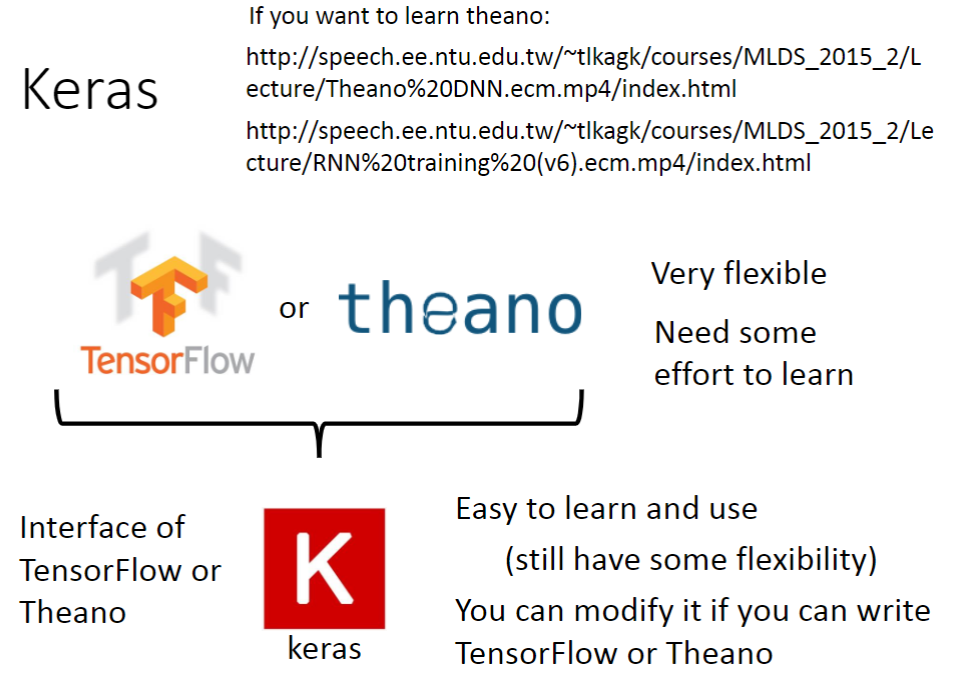
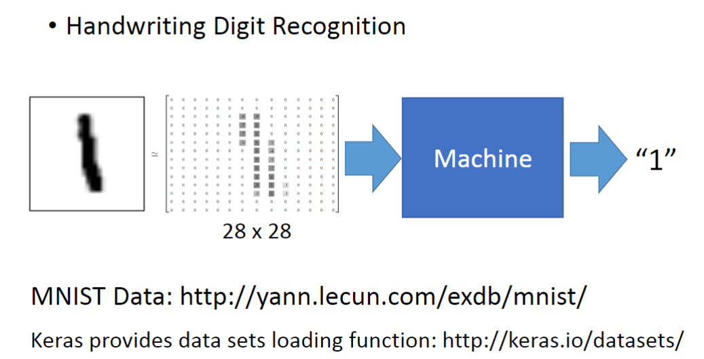
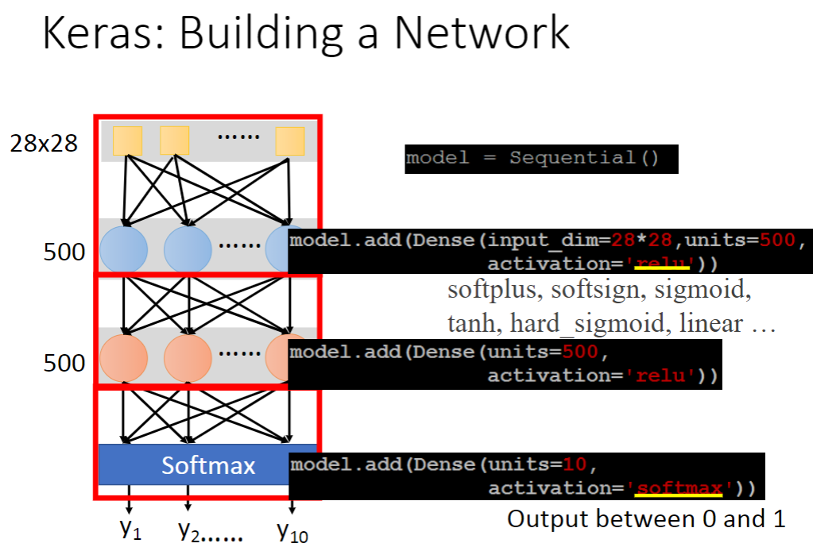
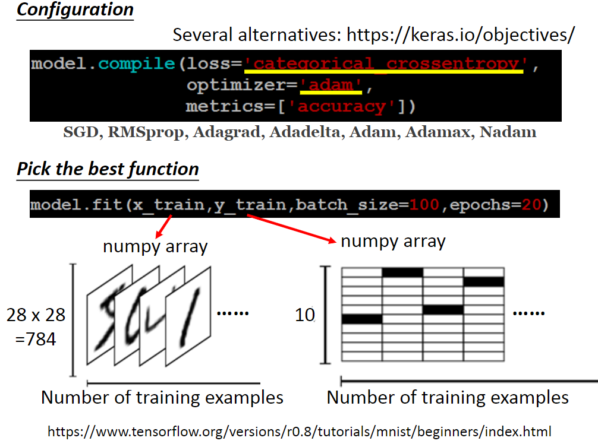
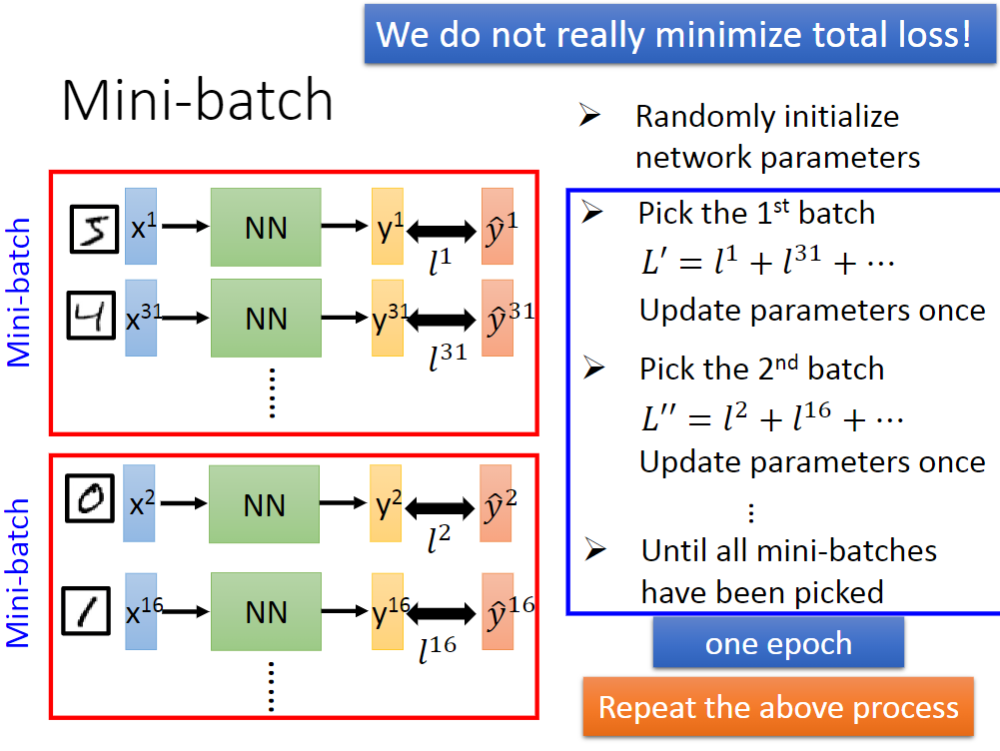
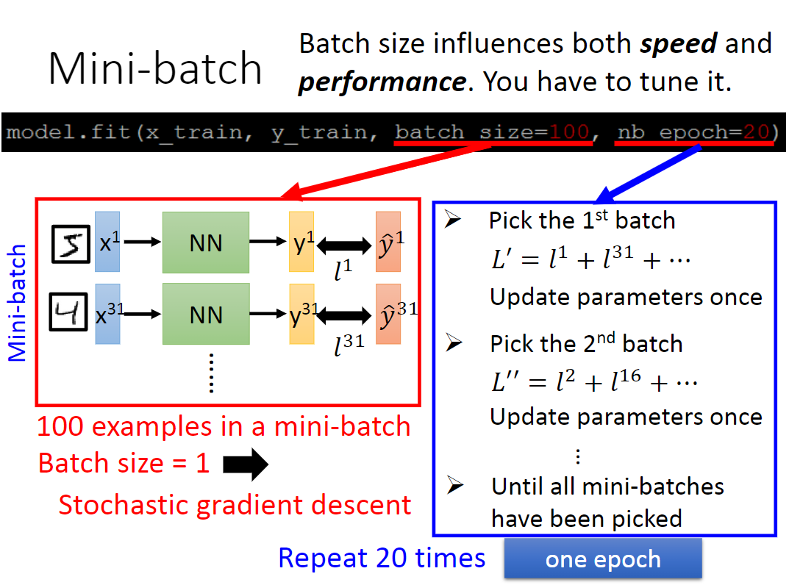
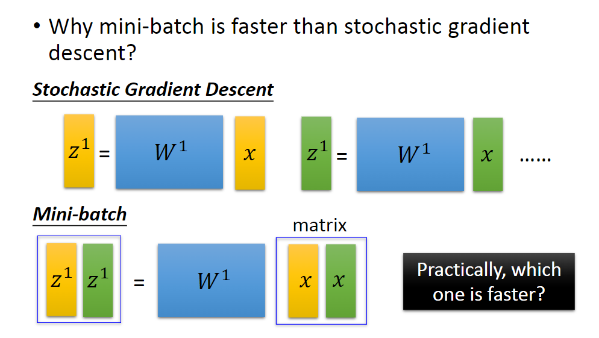

## “Hello world” of deep learning

### Keras

Keras是一个TensorFlow的一个接口，比TensorFlow更易于学习和使用。

### Example Application - Handwriting Digit Recognition

使用Keras建立一个网络的步骤如下图

### Mini-batch

小批次梯度下降 (mini-batch gradient descent)

若拿整个训练集做梯度下降演算法时，必须处理过所有的训练资料，才能踏出梯度下降的一小步，然后你必须再处理过整个训练集。例如有五百万笔资料，每处理完五百万笔，才能再踏出梯度下降的另一小步。

一个更快的方式是，把训练集分割成比较小的， 一堆小小的资料集，我们称他们称为 "mini-batches" 。所以五百万笔训练资料，可切成每一千笔为一小批资料，共5000批的小批资料集。用小批次梯度下降把整个训练集处理过一次，也称为「做一个 “epoch” 的训练」。 “epoch” 的意思是把训练集扫过一遍。所以五百万笔训练资料以批次梯度下降法训练，等于把训练集扫过5000遍，如同让你走5000步的梯度下降。当你训练非常多的资料直到收敛为止的过程，小批次梯度下降跑得比批次梯度下降还快得多。

如果batch_size = 1, 则为SGD。 
如果batch_size = # training data, 则为(Full Batch) Gradient Descent. 
Batch Size会影响训练速度和训练结果，需要tune。

以50000 examples为例， 
batch size = 1时，每个epoch更新50000次，用时166s; 
batch size = 10时，每个epoch更新5000次，用时17s. 
二者在170内都做~5W次更新，且batch size = 10时更稳定。 

特别大batch_size会导致Gpu平行计算的时候卡住，Full batch容易陷入局部最优值。

那为什么mini-batch方法要快于SGD方法呢？

对GPU来说，让它做上述两个运算，所用的时间几乎是一样的，在矩阵相乘中的每一个元素，都是可以并行运算的，所以上面用的时间会变成下面的两倍，所以GPU+mini-batch会使效率大大提升。

