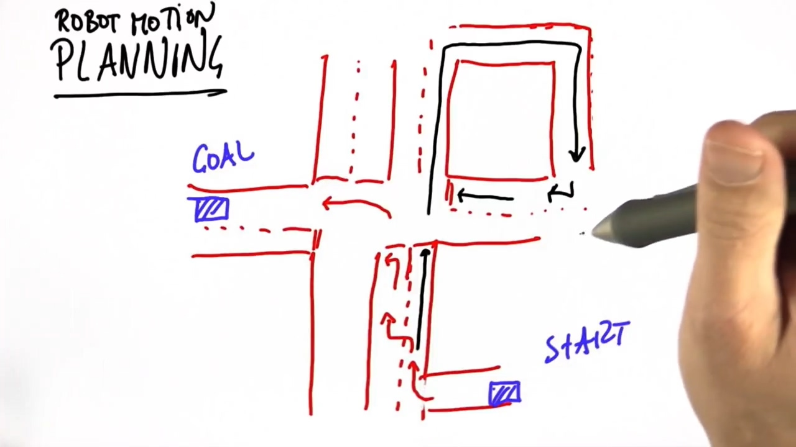
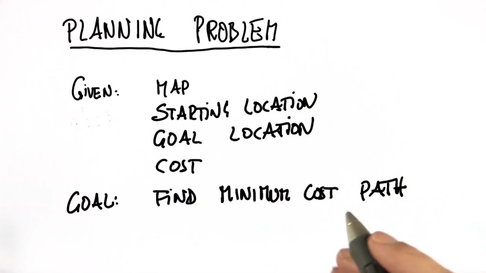

#### Montion Planing

运动规划（motion planning）可以分为路径规划（path planning）和轨迹规划（trajectory planning）两部分。

如下图红线中的路径可能无法完美实现（因为无法在短距离内快速变换车道），然而黑线却能避免这个问题。

对于任意路径规划问题，一般求解步骤如下：

#### Reference

[Trajectory planning vs motion planning?](https://www.zhihu.com/question/268393735)

