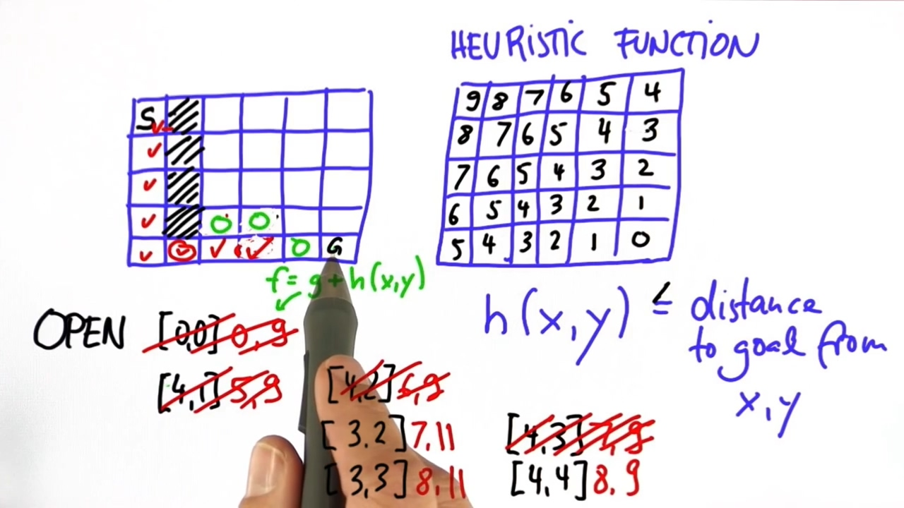

### 1. A* Search

To implement A* search, you will implement the following psuedocode, step by step in a sequence of exercises:

> **Search**( *grid*, *initial_point*, *goal_point* ) :
>
> 1. Initialize an empty list of open nodes.
>
> 2. Initialize a starting node with the following:
>
>     - x and y values given by *initial_point*.
>     - g = 0, where g is the cost for each move.
>     - h given by the heuristic function (a function of the current coordinates and the goal).
>
> 3. Add the new node to the list of open nodes.
>
> 4. **while** the list of open nodes is nonempty:
>
>     1. Sort the open list by f-value
>     2. Pop the optimal cell (called the *current* cell).
>     3. Mark the cell's coordinates in the grid as part of the path.
>     4. **if** the *current* cell is the goal cell:
>
>     - return the *grid*.
>
>     1. **else**, expand the search to the *current* node's neighbors. This includes the following steps:
>
>     - Check each neighbor cell in the *grid* to ensure that the cell is empty: it hasn't been closed and is not an obstacle.
>     - If the cell is empty, compute the cost (g value) and the heuristic, and add to the list of open nodes.
>     - Mark the cell as closed.
>
> 5. If you exit the while loop because the list of open nodes is empty, you have run out of new nodes to explore and haven't found a path.





### 2. Writing the A* Heuristic

Write a `Heuristic` function which takes four `int`s as arguments. The `int`s represent two pairs of 2D coordinates: $ (x_1, y_1, x_2, y_2) $ . The function should return an `int` which is the Manhattan Distance from one coordinate to the other: $|x_2- x_1| + |y_2 - y_1| $.

```C++
// Calculate the manhattan distance
int Heuristic(int x1,int y1,int x2,int y2){
  return abs(x1-x2) + abs(y1-y2);
}

```


### 3. Pass by Reference

```C++
#include <iostream>
#include <string>
using std::cout;
using std::string;

int MultiplyByTwo_passbyvalue(int i) {
    i = 2*i;
    return i;
}

int MultiplyByTwo_passreference(int &i) {
    i = 2*i;
    return i;
}

int MultiplyByTwo_passpointer(int *i) {
    *i = 2*(*i);
    return *i;
}


void DoubleString(string &value) {
    // Concatentate the string with a space and itself.
    value = value + " " + value;
}

int main() {
    //Passing Values
    int a = 5;
    cout << "The int a equals: " << a << "\n";
    int b = MultiplyByTwo_passbyvalue(a);
    cout << "The int b equals: " << b << "\n";
    cout << "The int a still equals: " << a << "\n";

    //Passing ref
    int c = 5;
    cout << "The int c equals: " << c << "\n";
    int d = MultiplyByTwo_passreference(c);
    cout << "The int d equals: " << d << "\n";
    cout << "The int c equals: " << c << "\n";
    
    //pass pointer in C code
    int e = 5;
    cout << "The int e equals: " << e << "\n";
    int f = MultiplyByTwo_passpointer(&e);
    cout << "The int f equals: " << f << "\n";
    cout << "The int e equals: " << e << "\n";


    //Passing ref
    string s = "Hello";
    cout << "The string s is: " << s << "\n";
    DoubleString(s);
    cout << "The string s is now: " << s << "\n";
}

```


### 4. Adding Nodes to the Open Vector

As you've seen from Sebastian's explanation of A* search, the search algorithm keeps a list of potential board cells to search through. In this implementation of A*, we will refer to a board cell along with it's `g` and `h` values as a *node*. In other words, each node will consist of the following values which are needed for the A* algorithm:

- an **x** coordinate,
- a **y** coordinate,
- the **g** value (or *cost*) that has accumulated up to that cell,
- the **h** value for the cell, given by the heuristic function.

In the code, nodes will be implemented with the type `vector<int>`, and should have the form `{x, y, g, h}` for `int`s x, y, g, and h. Also, the open list will be implemented as a C++ vector (of type `vector<vector<int>>`). The goal in this exercise is for you to write a helper function for your A* Search which will add nodes to the open vector and mark them as visited in the grid.

1. Write an `AddToOpen` function which accepts the following arguments:
    - Four `int`s, one for each of the `x`, `y`, `g`, and `h` values.
    - References to one `vector<vector<int>>` for the vector of open nodes.
    - Reference to one `vector<vector<State>>` for the grid.
2. The `AddToOpen` function should do two things:
    * Create a `vector<int>` node with the form `{x, y, g, h}` and push the node to the back of the open vector.
    * Set the grid value for the `x` and `y` coordinates to the enum value `kClosed`. We have added `kClosed` to the set of enum values.

```c++
void AddToOpen(int x, int y, int g, int h, vector<vector(int)> &open_nodes, vector<vector<State>> &grid){
    vector<int> node{x,y,g,h};
    open_node.push_back(node);
    grid[x][y] = State::kClosed;
}
```


### 5. Initialize the Open Vector

1. Initialize variables with the starting node values as follows:

- `x` and `y` are given by the `init` variable values,

- Set the initial cost `g` = 0,

- `h` is given by `Heuristic` function.

2. Add first node to open vector using the `AddToOpen` function by passing the node values: `x`, `y`, `g`, and `h`, along with the `open` and `grid` vectors.

```C++
vector<vector<State>> Search(vector<vector<State>> grid, int init[2], int goal[2]){
    // Create the vector of open nodes.
    vector<vector<int>> open{};

    // Init the starting node.
    int x = init[0];
    int y = init[1];
    int g = 0;
    int h = Heuristic(x, y ,goal[0],goal[1]);

    // Use AddToOpen to add the starting node to the open vector.
    // We immediately treat the init node as the first open node
    AddToOpen(x,y,g,h,open,grid);
    cout<<"NO path found"<<endl;
    return vector<vector<State>> {};
}
```


### 6. Create a Comparison Function

The H value or heuristic gets smaller the closer node is to the goal. So incorporating this into your overall cost ensures you're searching in the right direction.

The G value or distance cost increases with each step in the search. Incorporating this cost into the overall cost ensures that the search finds the most direct route possible instead of wandering around the grid.

Before you can use the vector of open nodes to expand the A* search, you will first need to be able to sort the vector. Since the vector contains nodes `{x, y, g, h}`, and there is no standard library function to sort these types of vectors, you will begin by writing a function which compares two nodes to determine their order.

Write a function `Compare` that accepts two nodes of type `vector<int>` as arguments. It should return a boolean `true` if the f-value of the first argument is greater than the f-value of the second, and it should return `false` otherwise. Recall that the f-value is the sum of the cost and heuristic: `f = g + h`.

```C++
bool Compare(vector<int> &node1,vector<int> &node2){
    return (node1[2]+node1[3] > node2[2]+node2[3]);
}
```


### 7. Write a While Loop for the A* Algorithm

A* search works by sorting the open list using the f-value, and using the node with the lowest f-value as the next node in the search. This process continues until the goal node has been found or the open list runs out of nodes to use for searching.

```C++
void CellSort(vector<vector<int> *v){
    sort(v->beign(), v->end(), Compare);
}

vector<vector<State>> Search(vector<vector<State>> grid, int init[2], int goal[2]) {
  // Create the vector of open nodes.
  vector<vector<int>> open {};

  // Initialize the starting node.
  int x = init[0];
  int y = init[1];
  int g = 0;
  int h = Heuristic(x, y, goal[0],goal[1]);
  AddToOpen(x, y, g, h, open, grid);
  /*
  // TODO: while open vector is non empty {
    // TODO: Sort the open list using CellSort, and get the current node.

    // TODO: Get the x and y values from the current node,
    // and set grid[x][y] to kPath.

    // TODO: Check if you've reached the goal. If so, return grid.


    // If we're not done, expand search to current node's neighbors. This step will be completed in a later quiz.
    // ExpandNeighbors

  //} // TODO: End while loop
  */

  while (open.size()>0){
      //sort all open list by f value
      CellSort(&open);
      //get the min f value node, the node is where we will go
      //because the Compare get the decending order , the lastest node is the min-f node
      vector<int> curminfnode = open.back();
      open.pop_back();
      int curx = curminfnode[0];
      int cury = curminfnode[1];
      grid[curx][cury] = State::kPath;

      if (curx == goal[0] && cury == goal[1])
        return grid;

        // If we're not done, expand search to current node's neighbors.
        // ExpandNeighbors

  }

  // We've run out of new nodes to explore and haven't found a path.
  cout << "No path found!" << "\n";
  return std::vector<vector<State>>{};
}

```


### 8. Check for Valid Neighbors

The last part of the A* algorithm to be implemented is the part that adds neighboring nodes to the open vector. In order to expand your A* search from the current node to neighboring nodes, you first will need to check that neighboring grid cells are not closed, and that they are not an obstacle. In this exercise, you will write a function `CheckValidCell` that does exactly this.

Write a function `CheckValidCell` that accepts two `ints` for the x and y coordinates and a reference to the `grid`. The function should do two things:

1. Check that the (x, y) coordinate pair is on the grid.

2. Check that the grid at (x, y) is `kEmpty` (this is the default case if the grid cell is not `kClosed` or a `kObstacle`).

    If both of these conditions are true, then `CheckValidCell` should return `true`. Otherwise, it should return `false`.

```C++
bool CheckValidCell(int x ,int y, vector<vector<State>> &grid){
    if(x>=0 && grid.size() && y>=0 && y<grid[0].size() ){
        if(State::kEmpty == grid[x][y])
            return true;
    }
    return false;
}
```


### 9. Constants

C++ supports two notions of immutability:

 - `const`: meaning roughly " I promise not to change this value."…The compiler enforces the promise made by `const`….
 - `constexpr`: meaning roughly "to be evaluated at compile time." This is used primarily to specify constants… 

```c++
/* Constants

This example highlights how to use const to promise not to modify a variable,
even though the variable can only be evaluated at run time.

The example also show how to use constexpr to guarantee that a variable can be evaluated at compile time.
*/

#include <iostream>
#include <vector>


//j can cowork with a non-const i, but k can't
void example1(){
    int i;
    std::cout << "Enter an integer value for i: ";
    std::cin >> i;
    const int j = i * 2;  // "j can only be evaluated at run time."
                          // "But I promise not to change it after it is initialized."

    constexpr int k = 3;  // "k, in contrast, can be evaluated at compile time."

    std::cout << "j = " << j << "\n";
    std::cout << "k = " << k << "\n";
}


void example2(){
    const int i = 2; // "I promise not to change this."
    i++;             // "I just broke my promise."

    //will get error
    //main.cpp: In function ‘void example2()’:
    //main.cpp:41:6: error: increment of read-only variable ‘i’
    //     i++;             // "I just broke my promise."
}

void example3(){

    constexpr int i = 2;  // "i can be evaluated at compile time."
    i++;                  // "But changing a constexpr variable triggers an error."


    //main.cpp: In function ‘void example3()’:
    //main.cpp:53:6: error: increment of read-only variable ‘i’
    //     i++;                  // "But changing a constexpr variable triggers an error."

}


void example4(){
    //The compiler will catch a constexpr variable that cannot be evaluated at compile time.
    int i;
    std::cout << "Enter an integer value for i: ";
    std::cin >> i;
    constexpr int j = i * 2;  // "j can only be evaluated at run time, because i will get the value in run time."
                              // "constexpr must be evaluated at compile time."
                              // "So this code will produce a compilation error."

}


/*
A common usage of const is to guard against accidentally changing a variable,
especially when it is passed-by-reference as a function argument.
*/

int sum(const std::vector<int> &v)
{
    int sum = 0;
    for(int i : v)
        sum += i;
    return sum;
}

/*
The major difference between const and constexpr, is that constexpr must be evaluated at compile time.
*/

int main()
{
    example1();
    //example2();
    //example3();
    //example4();
    std::vector<int> v {0, 1, 2, 3, 4};
    std::cout << sum(v) << "\n";
}

```


### 10. Expand the A* Search to Neighbors

Write a function `ExpandNeighbors` that accepts references to the following:

- The current node,
- the open vector,
- the grid, and
- an int array for the goal coordinates.

```C++
/**
 * Expand current nodes's neighbors and add them to the open list.
 */
// TODO: ExpandNeighbors(arguments) {

  // TODO: Get current node's data.

  // TODO: Loop through current node's potential neighbors.

    // TODO: Check that the potential neighbor's x2 and y2 values are on the grid and not closed.

      // TODO: Increment g value, compute h value, and add neighbor to open list.

// } TODO: End the function

void ExpandNeighbors(vector<int> &current_node, int *goal, vector<vector<int>> &openlist,vector<vector<State>> &grid){

    //Get current node's data.
    int curx = current_node[0];
    int cury = current_node[1];
    int curg = current_node[2];
    int curh = current_node[3];
    int newg = curg + 1;
    cout << __func__ << ", cru x:"<<curx<<", cur y:"<<cury<<"\n";
    //Loop through current node's potential neighbors.
    for(int i = 0; i < 4; i++){

        int poetential_x = curx +  delta[i][0];
        int poetential_y = cury +  delta[i][1];

        //Check that the potential neighbor's x2 and y2 values are on the grid and not closed.
        // if the point is State::kEmpty (which means not kObstcal, kPath)
        if (CheckValidCell(poetential_x, poetential_y, grid)){
            //Increment g value, compute h value, and add neighbor to open list
            //for future use.
            int newh =Heuristic(poetential_x,poetential_y,goal[0],goal[1]);
            cout<< poetential_x<<poetential_y<<goal[0]<<goal[1]<<newg<<newh<<"\n";
            AddToOpen(poetential_x, poetential_y, newg, newh, openlist, grid);

        }
    }

}

```


### 11.  Complete Program

```C++
#include <iostream>
#include <vector>
#include <sstream>
#include <string>
#include <fstream>
#include <algorithm>
using namespace std;
enum class State {kEmpty, kObstacle,kClosed,kPath};
const int delta[4][2]{{-1, 0}, {0, -1}, {1, 0}, {0, 1}};

vector<State> ParseLine(string line){
    istringstream sline(line);
    int n;
    char c;
    vector<State> row;
    while(sline >> n >> c && c == ','){
        if(n ==0){
            row.push_back(State::kEmpty);
        } else{
            row.push_back(State::kObstacle);
        }
    }
    return row;
}

vector<vector<State>> ReadBoardFile(string path){
    ifstream myfile(path);
    vector<vector<State>> board{};
    if(myfile){
        string line;
        while(getline(myfile, line)){
            vector<State> row = ParseLine(line);
            board.push_back(row);
        }
    }
    cout<< "board.size() or i:"<<board.size()<<", board[0].size() or j:"<<board[0].size() << "\n";

    return board;
}

bool Compare(vector<int> &a,vector<int> &b){
    return (a[2] + a[3] > b[2] + b[3]);
}

void CellSort(vector<vector<int>> *v){
    sort(v->begin(), v->end(), Compare);
}

int Heuristic(int x1,int y1,int x2,int y2){
    return abs(x2-x1) + abs(y2-y1);
}

bool CheckValidCell(int x ,int y, vector<vector<State>> &grid){
    //if(x>=0 && x<grid.size() && y>=0 && y<grid[0].size() ){
        //if(State::kEmpty == grid[x][y])
            //return true;
    //}

    bool on_grid_x = (x>=0 && x<grid.size());
    bool on_grid_y = (y >= 0 && y < grid[0].size());
    if(on_grid_x && on_grid_y)
        return grid[x][y] == State::kEmpty;
    return false;
}

void AddToOpen(int x, int y, int g, int h, vector<vector<int>> &openlist, vector<vector<State>> &grid){
    vector<int> node{x,y,g,h};
    openlist.push_back(node);
    grid[x][y] = State::kClosed;
}

void ExpandNeighbors(vector<int> &current_node, int *goal, vector<vector<int>> &openlist, vector<vector<State>> &grid){

    int curx = current_node[0];
    int cury = current_node[1];
    int curg = current_node[2];
    int cuth = current_node[3];
    int newg = curg + 1;
    cout << __func__ << ", cru x:"<<curx<<", cur y:"<<cury<<"\n";

    for(int i=0;i<4;i++){

        int poetential_x = curx + delta[i][0];
        int poetential_y = cury + delta[i][1];

        if(CheckValidCell(poetential_x , poetential_y, grid)){
            int newh = Heuristic(poetential_x,poetential_y,goal[0],goal[1]);
            cout<< poetential_x<<"  "<<poetential_y<<"  "<<goal[0]<<"  "<<goal[1]<<"  "<<newg<<"  "<<newh<<endl;
            AddToOpen(poetential_x, poetential_y, newg, newh, openlist, grid);
        }
    }

}

vector<vector<State>> Search(vector<vector<State>> grid, int init[2], int goal[2]){
    // Create the vector of open nodes.
    vector<vector<int>> open{};

    // Init the starting node.
    int x = init[0];
    int y = init[1];
    int g = 0;
    int h = Heuristic(x, y ,goal[0],goal[1]);

    // Use AddToOpen to add the starting node to the open vector.
    // We immediately treat the init node as the first open node
    AddToOpen(x,y,g,h,open,grid);

    while(open.size()>0){
        CellSort(&open);
        //
        auto current = open.back();
        open.pop_back();
        x = current[0];
        y = current[1];
        grid[x][y] = State::kPath;

        if(x == goal[0] && y == goal[1])
            return grid;

        ExpandNeighbors(current, goal, open, grid);
    }
    cout<<"NO path found"<<endl;
    return vector<vector<State>> {};

}

string CellString(State cell){
    switch(cell) {
        case State :: kObstacle : return "1    ";
        case State :: kClosed : return "X    ";
        case State :: kPath : return "P    ";
        case State :: kEmpty : return "0    ";
        default : return "?    ";
    }
}


void PrintBoard(const vector<vector<State>> board){
    for(int i = 0; i < board.size(); i++){
        for(int j=0; j< board[i].size();j++){
            cout<< CellString(board[i][j]);
        }
        cout<<endl;
    }

}

int main(){
    int init_point[2] = {0, 0};
    int goal_point[2] = {0, 5};

    auto board = ReadBoardFile("1.board");
    PrintBoard(board);

    auto Solution = Search(board, init_point,goal_point);

    PrintBoard(Solution);

}

```

