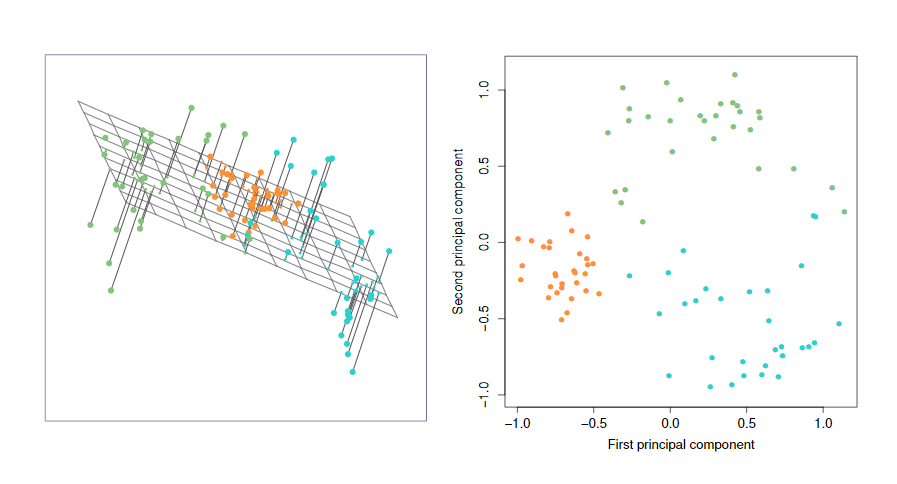
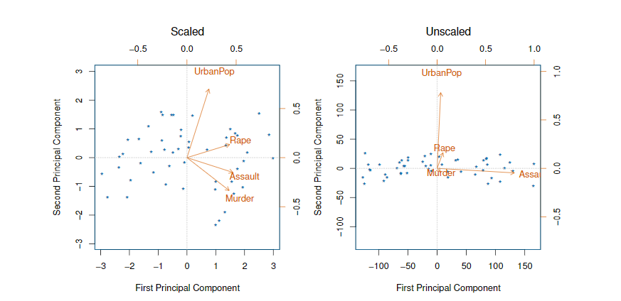
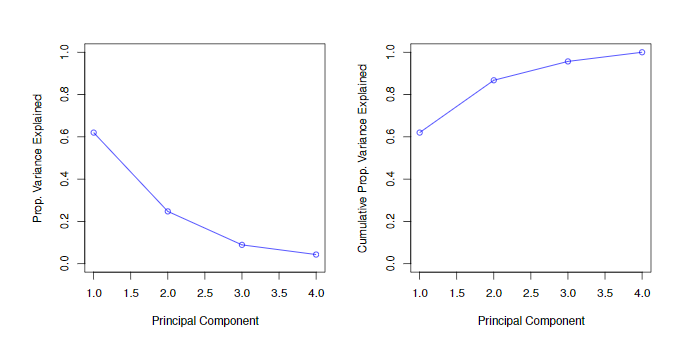
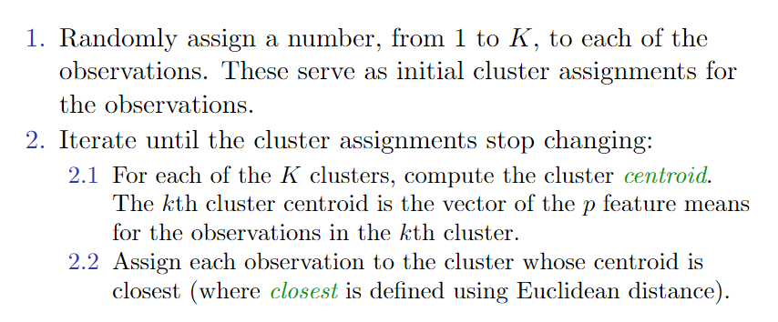
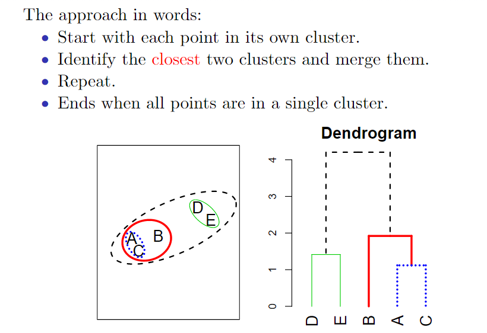
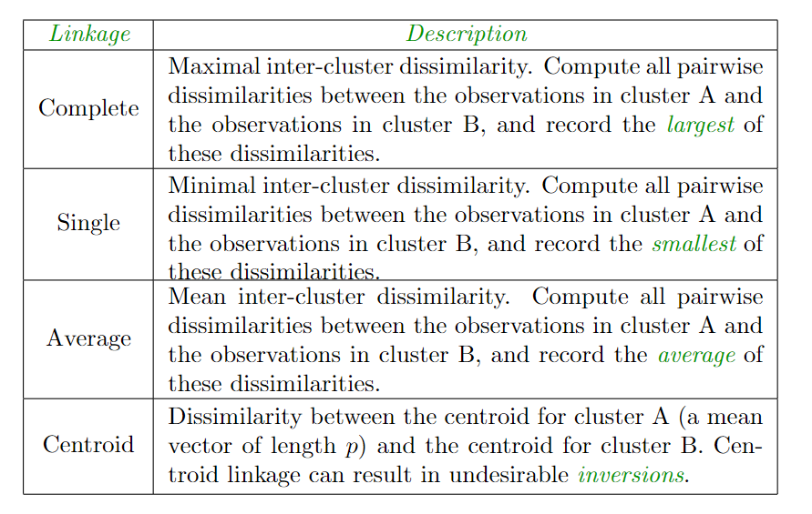
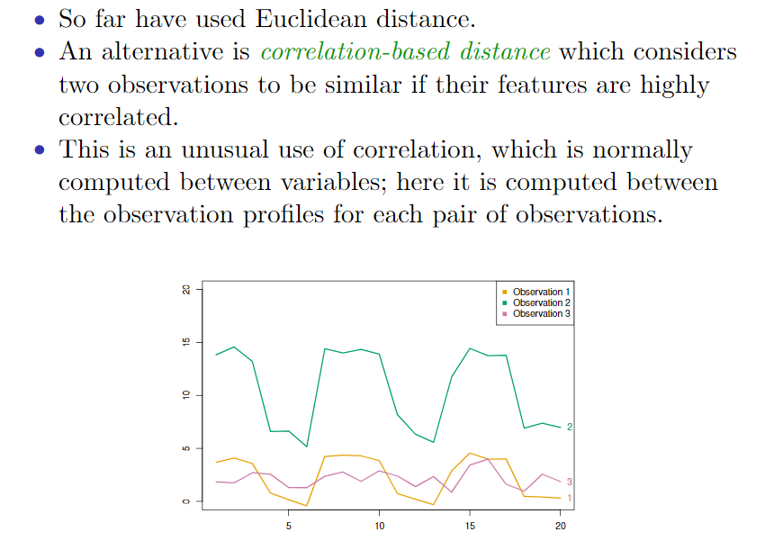

# Unsupervised Learning

* 主成分分析（principle components analysis）：一种用于数据可视化以及在有指导学习方法之前对数据进行预处理的工具
* 聚类分析（clustering）：一大类寻找数据中未知子类的方法。

## The Challenge of Unsupervised Learning

* 无指导学习通常更具挑战性。无指导学习模型的训练更倾向于主观性，不设定明确的目标作为分析的指向，比如预测中的响应变量
* 无指导学习技术在很多领域中变得越来越重要：
    * subgroups of breast cancer patients grouped by their gene expression measurements,
    * groups of shoppers characterized by their browsing and purchase histories,
    * movies grouped by the ratings assigned by movie viewers.
* 相比于指导学习需要人工干预标记数据，无指导学习使用无标记数据。

## Principal Components Analysis

* PCA方法产生一组数据的低维表示。它找到具有最大方差的变量的线性组合序列，并且这些变量是不相关的。
* PCA还可以作为数据可视化（观测或变量的可视化）的工具。

### Principal Components Analysis:  details

一组变量$X_1$，$X_2$，…，$X_p$。的第一主成分（first principle component）是变量标准化线性组合中方差最大的组合，如下所示：
$$
Z _ { 1 } = \phi _ { 11 } X _ { 1 } + \phi _ { 21 } X _ { 2 } + \ldots + \phi _ { p 1 } X _ { p }
$$
标准化的含义是，$\sum _ { j = 1 } ^ { p } \phi _ { j 1 } ^ { 2 } = 1$ ，其中，$\phi _ { 11 } , \ldots , \phi _ { p 1 }$ 指的是第一主成分的载荷（loading）。同时，这些载荷构成了主成分的载荷向量$\phi _ { 1 } = \left( \phi _ { 11 } \phi _ { 21 } \ldots \phi _ { p 1 } \right) ^ { T }$ 。为防止载荷绝对值任意大而导致方差变得任意大，限定这些载荷的平方和为1。

#### Computation of Principal Components

假设有一个n x p维数据集X，如何计算它的第一主成分呢？因为只对方差感兴趣，所以假定X中的每个变量都经过中心化处理，其均值均为0（即矩阵X在列方向上的均值均为0），然后寻求具有如下形式的样本特征值的线性组合：
$$
z _ { i 1 } = \phi _ { 11 } x _ { i 1 } + \phi _ { 21 } x _ { i 2 } + \ldots + \phi _ { p 1 } x _ { i p }
$$
上式中，$i = 1 , \dots , n$ 在$\sum _ { j = 1 } ^ { p } \phi _ { j 1 } ^ { 2 } = 1$的限定条件下， 具有最大的样本方差。

因为$\frac { 1 } { n } \sum _ { i = 1 } ^ { n } x _ { i j } = 0$ ，$z _ { 11 } , \cdots , z _ { n 1 }$ 的均值也为0，故需要最大化的目标函数可以写成$\frac { 1 } { n } \sum _ { i = 1 } ^ { n } z _ { i 1 } ^ { 2 }$

换言之，第一主成分的载荷向量在解如下的最优化问题：
$$
\underset { \phi _ { 11 } , \ldots , \phi _ { p 1 } } { \operatorname { maximize } } \frac { 1 } { n } \sum _ { i = 1 } ^ { n } \left( \sum _ { j = 1 } ^ { p } \phi _ { j 1 } x _ { i j } \right) ^ { 2 } \text { subject to } \sum _ { j = 1 } ^ { p } \phi _ { j 1 } ^ { 2 } = 1
$$
求解上式可以通过线性代数中的一个基本技术——特征分解。

#### Geometry of PCA

* 第一主成分有一个非常合理的几何解释，载荷向量$\phi_{1}$ = $\phi _ { 11 } , \phi _ { 21 } , \ldots , \phi _ { p 1 }$ 定义了一个在向量空间上数据变异最大的方向。
* 如果将这n个数据点$x_1$，…，$x_n$投影到这个方向上，这些投影值就是主成分的得分$z _ { 11 } , \dots , z _ { n 1 }$ 。

#### Further principal components

当这组特征的第一主成分$Z_1$，确定之后，可以继续寻找第二主成分$Z_2$。第二主成分也是$X_1$，$X_2$，…，$X_p$，的线性组合，这个线性组合是与$Z_1$不相关的各种线性组合中方差最大的一个。第二主成分得分$z _ { 12 } , \dots , z _ { n 2 }$有以下形式：
$$
z _ { i 2 } = \phi _ { 12 } x _ { i 1 } + \phi _ { 22 } x _ { i 2 } + \ldots + \phi _ { p 2 } x _ { i p }
$$
当 $\phi _ { 2 }$ 是第二主成分的载荷向量是，其分量是 $\phi _ { 12 } , \phi _ { 22 } , \ldots , \phi _ { p 2 }$。

结果表明，当$Z_2$与$Z_1$不相关时，相当于将方向 $\phi_2$ 与$\phi_{1}$ 正交垂直。

### Another Interpretation of Principal Components

* 第一主成分载荷向量有一个特殊的性质：它是p维空间中一条最接近n个观测的线（用平均平方欧式距离度量接近的程度）。
* 与n个观测最接近的维度方向的主成分概念是对第一主成分内涵的延展。
* 比如在平方欧式距离意义下，数据集的前两个主成分张成了与n个观测最接近的平面。

## More details on PCA

### Scaling of the variables matters

* If the variables are in different units, scaling each to have standard deviation equal to one is recommended.
* If they are in the same units, you might or might not scale the variables.

### Proportion Variance Explained

在一个给定的数据集中，将观测投影到前几个少数的主成分上损失了多少信息？即数据的方差中有多少是不在前两个主成分的解释范围内的？更通俗地说，我们感兴趣的是每个主成分的方差解释比率（proportion of variance explained，PVE）。

数据集中（假设变量已中心化，其均值为0）中总方差的定义如下：
$$
\sum _ { j = 1 } ^ { p } \operatorname { Var } \left( X _ { j } \right) = \sum _ { j = 1 } ^ { p } \frac { 1 } { n } \sum _ { i = 1 } ^ { n } x _ { i j } ^ { 2 }
$$
第m个主成分的方差解释比率时：
$$
\frac { 1 } { n } \sum _ { i = 1 } ^ { n } z _ { i n } ^ { 2 } = \frac { 1 } { n } \sum _ { i = 1 } ^ { n } \left( \sum _ { j = 1 } ^ { p } \phi _ { j n } x _ { i j } \right) ^ { 2 }
\\
\\
or
\\
\\
\operatorname { Var } \left( Z _ { m } \right) = \frac { 1 } { n } \sum _ { i = 1 } ^ { n } z _ { i m } ^ { 2 }
$$
因此，第m个主成分的PVE可以由以下公式得到：
$$
\frac { \sum _ { i = 1 } ^ { n } \left( \sum _ { j = 1 } ^ { p } \phi _ { j n } x _ { i j } \right) ^ { 2 } } { \sum _ { i = 1 } ^ { p } \sum _ { i = 1 } ^ { n } x _ { i j } ^ { 2 } }
\\
or
\\
\frac { \sum _ { i = 1 } ^ { n } z _ { i m } ^ { 2 } } { \sum _ { j = 1 } ^ { p } \sum _ { i = 1 } ^ { n } x _ { i j } ^ { 2 } }
$$

### How many principal components should we use?

可以通过碎石图（scree plot）来决定所需的主成分数量。

然而，这种可视化分析感觉有些随意。

在实践中，往往通过看前几个主成分来寻找数据中有价值的模式。如果在前几个主成分中都找不到有价值的模式，那更多的主成分也不太可能会有价值。相反，如果前几个主成分有价值，那通常会继续观察随后的主成分，直到找不到更多有价值的模式为止。这是得到一致公认的一条主观决策方法，同时这一原则也反映出以下的事实：PCA是探索性数据分析中被广泛应用的一类方法。

PCA用于无指导学习，不能使用交叉验证决定主成分数量。因为无响应值y的参与。因此，有指导学习往往定义更清晰，评价更客观。

## Clustering

聚类分析（clustering）是在一个数据集中寻找子群或类的技术，应用非常广泛。在对数据集中的观测进行聚类时，希望将数据分割到不同的类中，使每个类内的观测彼此非常相似，而不同类中的观测彼此差异很大。当然，为了确切地表达相似的概念，必须对2个或更多观测的相似或者相异进行定义。而这个问题则必须结合问题所来源的特殊背景经数据分析后方能获得答案。

### PCA vs Clustering

聚类分析与主成分分析一样，都希望用少量概括性信息简化数据，但两者的机制是不同的。

* PCA试图寻找观测的一个低维表示来解释大部分方差；
* 聚类分析试图从观测中寻找同质子类。

### Two clustering methods

* K均值聚类试图将观测划分到事先规定数量的类中；

* 系统聚类并不需要事先规定所需的类数。其实，我们最后会通过分析观测的树型表示，即谱系图（dendrogram）来确定类数，不仅如此，通过看谱系图还可以马上获得从1类到n类类数不等的分类情况。

    

   ### K-means clustering 

首先定义一些符号，用 $C_1,\dots ,C_k$ 表示在每个类中包含观测指标的集合，这些集合满足两个性质：

1. $ C _ { 1 } \cup C _ { 2 } \cup \ldots \cup C _ { K } = \{ 1 , \ldots , n \}$ 。即每个观测属于$K$个类中至少一个类。
2. $C _ { k } \cap C _ { k ^ { \prime } } = \emptyset$ 对于 所有的 $k \neq k ^ { \prime }$ 都成立。即类与类之间是无重叠的：没有一个观测同时属于两个类或更多类。

K均值聚类法的思想是一个好的聚类法可以使类内差异（within-cluster variation）尽可能小。

第$C_k$类的类差异是对第$C_k$类中观测互不相同程度的度量$W(C_k)$。因此需要最小化如下问题：
$$
\underset { C _ { 1 } , \ldots , C _ { K } } { \operatorname { minimize } } \left\{ \sum _ { k = 1 } ^ { K } \operatorname { WCV } \left( C _ { k } \right) \right\}
$$
这个公式的意思是把观测分割到K个类中，使得K个类总的类内差异尽可能小。

为了实现上式，需要给类内差异一个定义。有很多方法可以定义这个概念，但用的最多的是平方欧式距离。即定义：
$$
\operatorname { WCV } \left( C _ { k } \right) = \frac { 1 } { \left| C _ { k } \right| } \sum _ { i , i ^ { \prime } \in C _ { k } } \sum _ { j = 1 } ^ { p } \left( x _ { i j } - x _ { i ^ { \prime } j } \right) ^ { 2 }
$$
这里$ \left| C _ { k } \right|$ 代表在第K个类中观测的数量。换言之，第k个类的类内差异就等于在第b类中各个观测之间所有成对的平方欧式距离的总和除以第个类中观测的总数。结合上面上个式子，可以得到：
$$
\underset { C _ { 1 } , \ldots , C _ { K } } { \operatorname { minimize } } \left\{ \sum _ { k = 1 } ^ { K } \frac { 1 } { \left| C _ { k } \right| } \sum _ { i , i ^ { \prime } \in C _ { k } } \sum _ { j = 1 } ^ { p } \left( x _ { i j } - x _ { i ^ { \prime } j } \right) ^ { 2 } \right\}
$$
有$K^n$中方法可以把n个观测分配到K个类中，故运用以下的局部优化算法：

1. 为每个观测随机分配一个从1到K的敛字。这些数字可以看做对这些观测的初始类。
2. 重复下列操作，直到类的分配停止为止：
    1. 分别计算K个类的类中心。第长个类中心是第个类中的p维观测向觉的均值向量。
    2. 将每个观测分配到距离其最近的类中心所在的类中（用欧式距离定义“最近”）。

上述算法保证在每步结束后，上式的值都会减小。以下恒等式有助于理解这个性质：
$$
\frac { 1 } { \left| C _ { k } \right| } \sum _ { i , i ^ { \prime } \in C _ { k } } \sum _ { j = 1 } ^ { p } \left( x _ { i j } - x _ { i ^ { \prime } j } \right) ^ { 2 } = 2 \sum _ { i \in C _ { k } } \sum _ { j = 1 } ^ { p } \left( x _ { i j } - \overline { x } _ { k j } \right) ^ { 2 }
$$
$\overline { x } _ { k j } = \frac { 1 } { \left| C _ { k } \right| } \sum _ { i \in C _ { k } } x _ { i j }$ 是第 $C_k$ 类中第 $j$ 个分量的均值。

该算法一直运行时，所得到的聚类分析效果会持续改善，知道结果不在改变为止。当结果不再改变时，分类就已经达到了一个局部最优（local optimum）。

## Hierarchical Clustering

K均值聚类法的一个潜在的不足是它需要预设类数K，系统聚类法是另一种事先不需要规定类数K的聚类方法。与K均值聚类法相比，系统聚类法还有一个优点是它可以输出一个迷人的有关各个观测的树型表示，称作谱系图（dendrogram）。

本节设计的是自下而上的（bottom-up）也称为凝聚法（agglomerative）的聚类方法。这是一种最常见的聚类方法，它的谱系图（通常被形容为一颗上下颠倒的树）从叶子开始将类聚集到树干上。

#### Hierarchical Clustering Algorithm

1. 首先，计算a个观测中所有$\left( \begin{array} { l } { n } \\ { 2 } \end{array} \right) = n ( n - 1 ) / 2$ 对每两个数据之间的相异度（比如欧式距离），将每个观测看做一类。
2. 令$i=n,n-1,\dots,2$ ;
    1. 在 i 个类中，比较任意两类间的相异度，找到相异度最小的（即最相似的）那一对，将它们结合起来。用两个类之间的相异度表示这两个类在谱系图中交汇的高度。
    2. 计算剩下的i-1个新类中，每两个类间的相异度。

#### Types of Linkage

下表列出了列出了4种最常见的距离形式：最长（complete）距离法、类平均法（average）、最短（single）距离法和重心法（centroid）。

|  距离方式  | 描述                                                         |
| :--------: | ------------------------------------------------------------ |
| 最长距离法 | 最大类间相异度。计算A类和B类之间的所有观测的相异度，并记录最大的相异度。 |
| 最短距离法 | 计算A类和B类之间的所有观测之间的相异度，并记录最小的相异度。最短距离法会导致观测一个接一个地汇合延伸拖尾的类。 |
|  类平均法  | 平均类间相异度。计算A类和B类之间的所有观测的相异度，并记录这些相异度的平均值。 |
|   重心法   | A类中心（长度为p的均值向量）和B类中心的相异度。重心法会导致一种不良的倒置现象的发生。 |

#### Choice of Dissimilarity Measure

上述公式中都是选择的欧式距离，但是有些情况下用其他指标来度量相异性可能会更好。

比如，当两个观测之间高度相关时，即使这些观测在欧式距离的意义下可能相距很远，但用相关性的距离却可以发现它们的相似性。

下图表示的是欧式距离和基于相关性距离之间的差异，基于相关性距离关注的是观测剖面的形状而不是大小。

## Practical issues

* 观测或变量需要先经过某种标准化处理吗？比如，变量中心化为均值为0，或标准化为标准差为1；
* 系统聚类法中的问题：
    * 用什么指标度量相异度？
    * 选择怎样的距离计算距离？
    * 在谱系图的哪个位置切割出不同的类？
* 分成多少类比较适合？
* 基于什么特征去分类呢？

## Conclusion

* Unsupervised learning is important for understanding the variation and grouping structure of a set of unlabeled data, and can be a useful pre-processor for supervised learning.
* It is intrinsically more difficult than supervised learning because there is no gold standard (like an outcome variable) and no single objective (like test set accuracy).
* It is an active field of research, with many recently developed tools such as self-organizing maps, independent components analysis and spectral clustering.