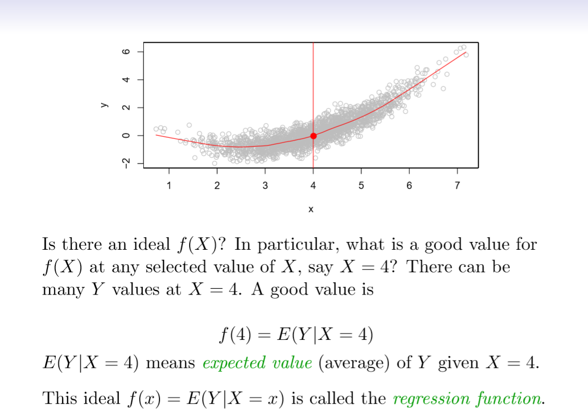
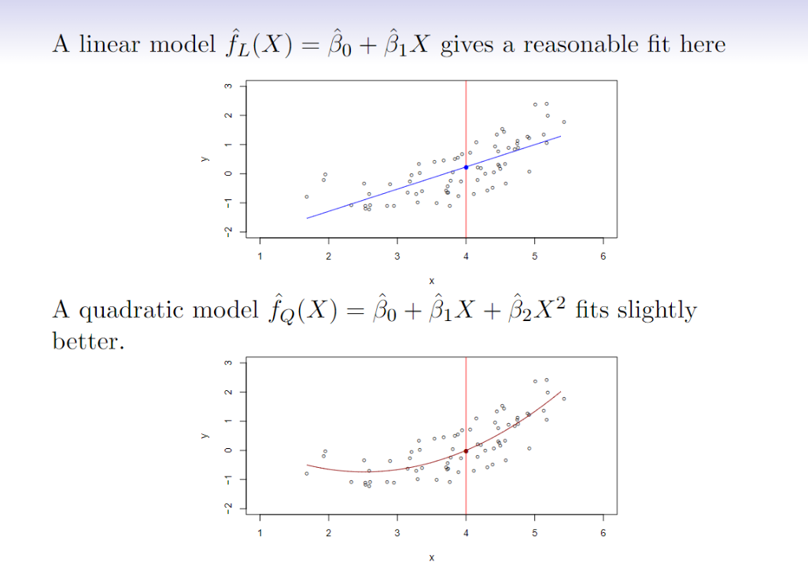
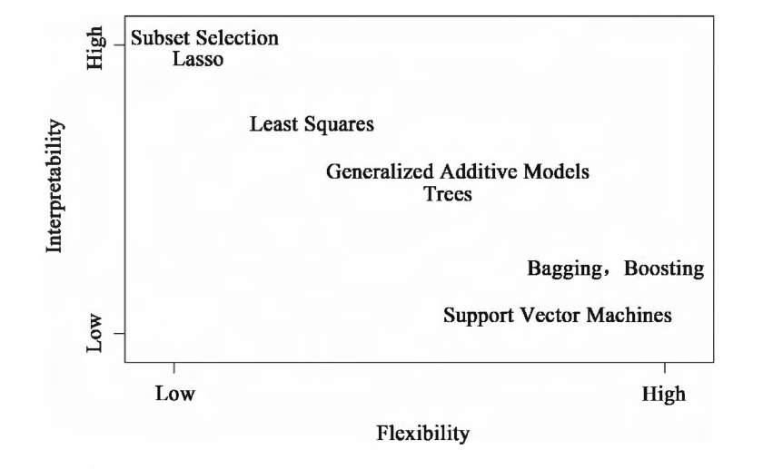
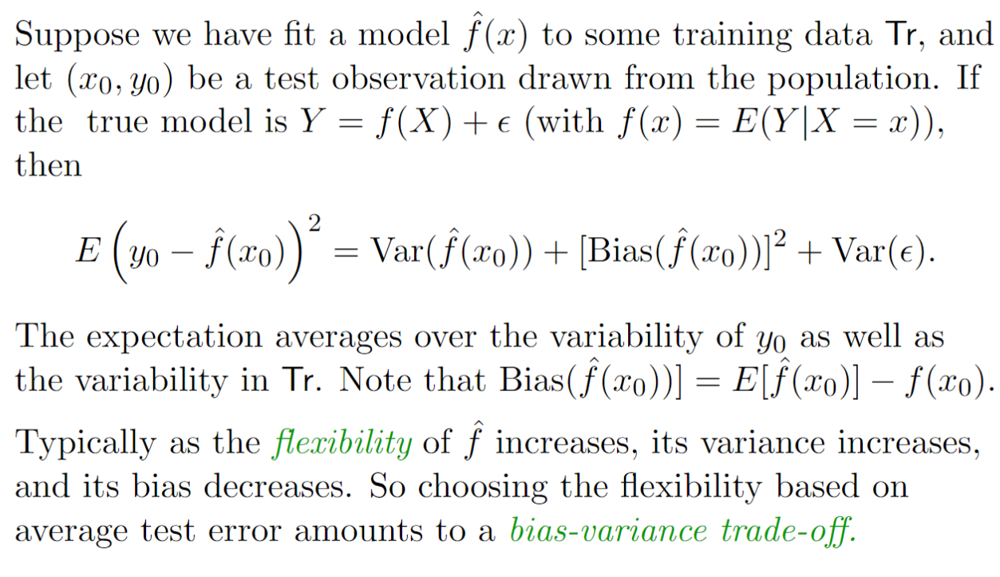
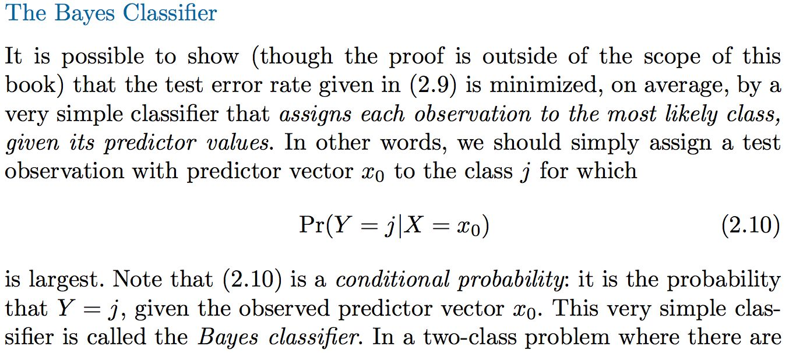
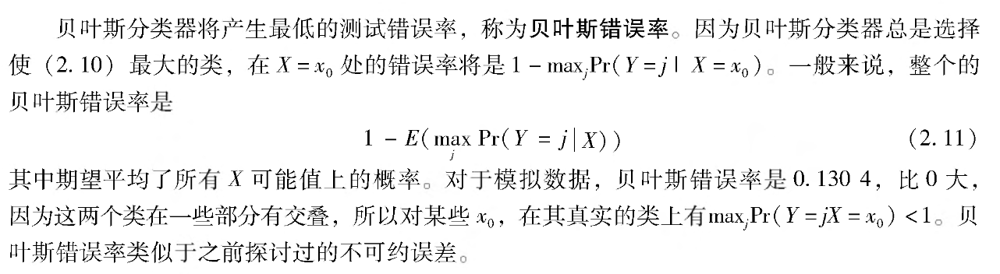
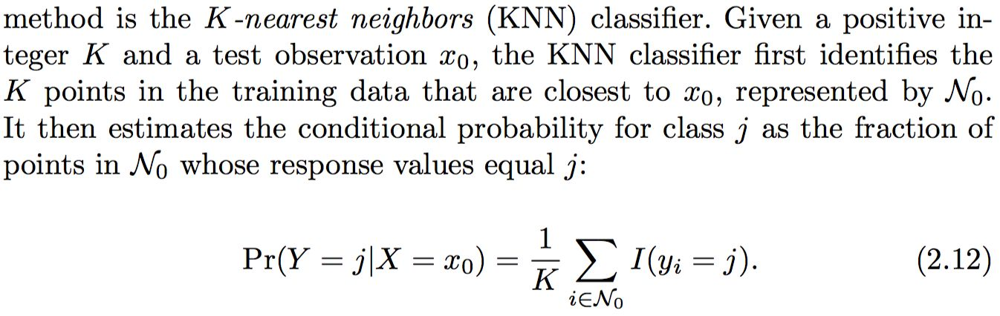

## Introduction to Regression Models

### 1. f(X)的作用

* 在点 X=x 时可以用来预测Y的值

* 用来检验X的分量对Y的影响占比及不相关度

  例如 f(Seniority, Years of Education, Marital Status)中，Seniority, Years of Education存在大的占比   

- 根据f的复杂性，可以弄清楚X的每个分量是如何影响Y的

- 期望值和回归函数的定义

  

### 2. 回归函数f(x)

* 矢量

* 对于均方预测误差，f(x)是Y的最佳预测

*  ε = Y − f(x) 为不可约误差 （即使已经知道特定的f(x),我们在预测时仍然会产生误差，因为在每个X=x的地方，通常存在可能的Y值的分布）

* 对于任意的一个f(x)的预测^f(x)，有
    $$
    E[(Y − \hat{f}(X))^{2}|X = x]
    = [f(x) − \hat{f}(x)]^{2}
    + Var(ε)
    $$
    其中第一项是可约误差，代表预测量和实际值Y的均方误差或期望平方误差值；第二项是不可约误差，代表误差项ε的方差。
    
* 什么情况下需要估计f？

    * 预测（predication）

        通过下式来预测Y，
        $$
        \hat{Y}=\hat{f}(x)
        $$
        这里的^f是黑箱（black box）,意味着着如果黑箱能提供准确的预测Y，并不十分追求^f的准确形式。

    * 推断（inference）

        去理解Y作为X1,X2,...,Xp的函数是怎么变化的，此时需要知道f的具体形式。

## Dimensionality and Structured Models  

### 3. 如何估计f

1. 参数方法

    1. 首先，假设函数f具有一定的形式或形状，例如，一个常用的假设f是线性的，具有以下形式    
        $$
        f(x) = β_{0} + β_{1}X_{1} + β_{2}X_{2} + ... + β_{p}X_{p}
        $$
        这是线性模型(Linear model), 一旦假设f为线性的，估计f的问题就简化了。不必估计任意一个p维函数，只需估计p+1个系数β0，β1，...βp。

    2. 模型选定后，需要使用训练数据去拟合或训练模型。在上述模型中，需估计参数β0，β1，...βp。就是说要确定参数的值，满足
        $$
        y \approx β_{0} + β_{1}X_{1} + β_{2}X_{2} + ... + β_{p}X_{p}
        $$
        
        
        

2. 非参数方法

    * 不需要对函数f做明确的假设。相反，这类方法是接近数据点的估计，估计函数在去粗和光滑处理后尽可能与更多的数据点接近。
    * 优点：不限定函数f的具体形式，可在更大范围内选择更适合f形状的估计。
    * 弱点：无法将估计f的问题简化到仅仅对少数参数进行估计的问题，所以为了获得对f更为精准的估计，往往需要大量的观测点(远远超出参数方法所需要的点)。

### 4. The curse of dimensionality

​	[怎样理解 Curse of Dimensionality（维数灾难）?](https://www.zhihu.com/question/27836140)

​	[机器学习：维度灾难（Curse of Dimensionality）](https://blog.csdn.net/qq_39521554/article/details/80653712)

​	[The Curse of Dimensionality in classification](https://www.visiondummy.com/2014/04/curse-dimensionality-affect-classification/)

### 5. 权衡

 1. 预测准确性 vs. 模型解释性

    几种统计学习方法在在柔性和解释性之间的权衡。一般来讲，当一种方法的柔性增强时，其解释性则减弱。

    

 2. 拟合 vs. 过拟合 vs. 拟合不足

 3. Parsimony vs. black-box

## Model Selection and Bias-Variance Tradeoff  

### 6. 拟合效果检验

​	对一个给定的观测，需要定量测量预测的响应值与真实响应值之间的接近程度。在回归中，最常用的评价准则	是**均方误差(mean squared error, MSE)**,其表达式如下所示：
$$
MSE = \frac{1}{n}\sum_{i=1}^{n}(Y_{i} - \hat{f}(x_{i}) )^{2}
$$
​	其中^f(xi)是第i个观测点上应用^f的预测值。如果预测的响应值与真实的响应值很接近，则均方误差会非常小。

### 7. 偏差—方差权衡(Bias-Variance Trade-off)

​	对于上述公式
$$
E(y_{0}-\hat{f}(x_{0})^{2} = Var(\hat{f}(x_{0})) + [Bias(\hat{f}(x_{0}))]^{2} + Var(ε)
$$
​	等式左边位模型的**期望测试均方误差(expected test MSE)** ，实际上是用大量训练数据重复估计f后，又在X0处代入不同的估计所得的**平均测试均方误差(average test MSE)**。

​	为使期望测试误差达到最小，需要选择一种统计学习方法使方差和偏差同时达到最小。方差本身就是一个非负的量，偏差的平方也非负。因此，期望测试均方误差是不可能比上式中的不可约误差Var(ε)还小。

​	**方差(variance)**表的是用一个不同的训练数据集估计f时，估计函数的改变量。一般来说，光滑度越高的统计模型有更高的方差。

​	**偏差(bias)**指的是为了选择一个简单的模型逼近真实函数而被带人的误差，其构成可能非常复杂。一般来说，光滑度越高的方法所产生的偏差越小。

## Classification

### 8. 分类模型

​	最常用的衡量估计f精度的方法是训练**错误率**(error rate) , 也就是说对训练数据使用估计模型f所造成的误差比例。如下所示：
$$
\frac{1}{n}\sum_{i=1}^{n}I(Y_{i} \neq \hat y_{i})
$$
​	该等式被称为**训练错误(training error)**率是因为它是基于训练分类模型的数据所计算的。

​	在一组观测上的**测试错误(test error)**率的概念如下，在一组测试观测值(X0.Y0)上的误差计算具有以下形式：
$$
Ave(I(Y_{0} \neq \hat y_{0}))
$$
​	其中^y0用模型预测的分类标签，它由分类模型作用于测试观测值X0得到，用于检测模型的准确度。测试误差越小，模型越好。

 1. 贝叶斯分类器(bayes classifier)

    

    ​	贝叶斯模型是基于test error的思想，最小化test error，是一种分类模型。根据条件概率，根据不同的X0来选择出最大的Y，因此贝叶斯模型理论上能选出最小test error的模型。

    

 2. K最近邻(K-nearest neighbors, KNN)分类器

    ​	贝叶斯方法对于一个实际的观测数据而言，其实很难知道给定X后Y的条件分布，所以有的时候计算贝叶斯分类器是不可能的。KNN方法尝试在给定X后先估计Y的条件分布，然后将一个给定的观测分类到估计分布概率最大的类别中。

    

    ​	最后，对KNN方法运用贝叶斯规则将测试观测值X0分到概率最大的类中。

### 9. Refereces

[ISLR_StatisticalLearning](https://blog.csdn.net/Young_Gy/article/details/48830541)

[学习《Statistical Learning》笔记](https://blog.csdn.net/cmdssd1/article/details/51853895)

[Statistical learning Week 1 什么是统计学习？](https://blog.csdn.net/u014789266/article/details/53511408)