# Classification

### 1. Introduction to Classification Problems 

分类模型(classifier)是一种用来预测定性响应变量的方法。我们将讨论三种应用最广泛的分类方法：**逻辑斯蒂回归(logistic regression)**、**线性判别分析（linear discriminant analysis, LDA）**和**K最近邻(K-nearest neighbor)**。

Why Not Linear Regression? 

1. 通常不能将一个定性的响应变量自然地转化为两水平以上地定量变量来建立线性回归模型。
2. 对于两元定性响应变量，但它的估计值很可能在[0,1]之外，这个数值难以被当作概率来解释。

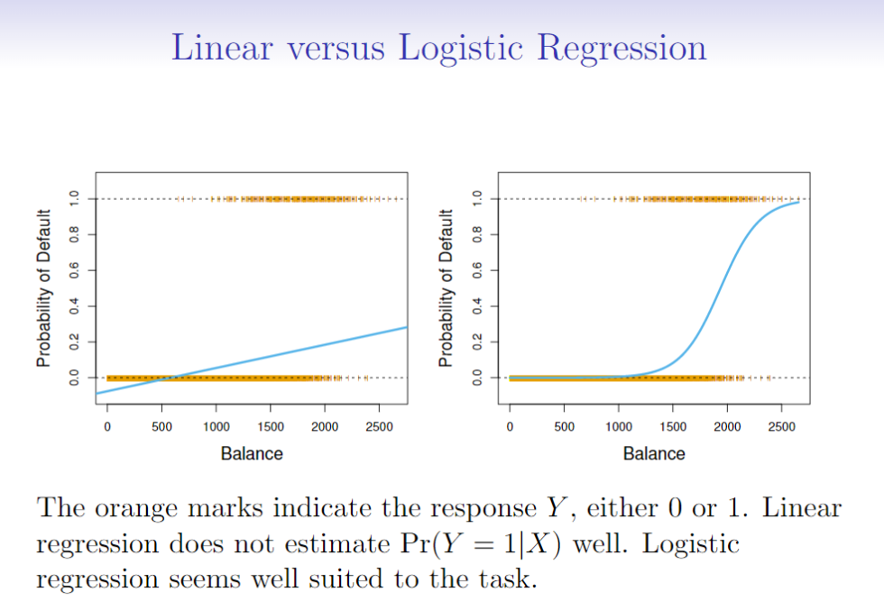

### 2. Logistic Regression 

逻辑斯谛回归对Y属于某一类的概率建模而不直接对响应变量Y建模。

#### 2.1 逻辑斯谛模型

1. logistic function 

    该如何对 p(X) = Pr(Y = 1|X) 和 X 这两个变量的关系进行建模了？（这里我们使用 0/1 表示 输出类别）
    $$
    p(X)=\frac{e^{\beta_{0}+\beta_{1} X}}{1+e^{\beta_{0}+\beta_{1} X}}
    $$
    
2. odd(发生比)
    $$
    \frac{p(X)}{1-p(X)}=e^{\beta_{0}+\beta_{1} X}
    $$
    p(x)/1-p(x)的值为发生比，取值范围为∞。

3. log-odd(或logit，对数发生比或分数对)
    $$
    \log \left(\frac{p(X)}{1-p(X)}\right)=\beta_{0}+\beta_{1} X
    $$
    此时1中的逻辑斯谛回归模型可以视为对数变换下关于X的一个线性模型。

#### 2.2 估计回归系数

​	极大似然估计（maximum likelihood）来确定逻辑斯谛模型中的系数。

​	似然函数（likelihood function）形式如下：
$$
l\left(\beta_{0}, \beta_{1}\right)=\prod_{i : y_{i}=1} p\left(x_{i}\right) \prod_{i : y_{i}=0}\left(1-p\left(x_{i^{\prime}}\right)\right)
$$

### 3. Multiple Logistic Regression

多元是指存在多个预测变量。多元逻辑斯谛回归如下：
$$
\begin{array}{l}{\qquad \log \left(\frac{p(X)}{1-p(X)}\right)=\beta_{0}+\beta_{1} X_{1}+\cdots+\beta_{p} X_{p}} \\ {\text { where } X=\left(X_{1}, \ldots, X_{p}\right) \text { are } p \text { predictors.} }\end{array}
\\
p(X)=\frac{e^{\beta_{0}+\beta_{1} X_{1}+\cdots+\beta_{p} X_{p}}}{1+e^{\beta_{0}+\beta_{1} X_{1}+\cdots+\beta_{p} X_{p}}}
$$
混淆现象(confounding)的含义：类似线性回归，只用一个预测变量得到的结果可能和多个预测变量得到的结果完全不一样，尤其是当这些因素之间存在相关性的时候。

### 4. Logistic Regression - Case-Control Sampling and Multiclass

多类别分类我们也可以使用逻辑回归方法来处理，但是实际中更常用的方法是 Linear Discriminant Analysis。

### 5. Discriminant Analysis

另外一种估计概率的方法如下：分布对每种响应分类（给定的Y）建立预测变量X的分布模型，然后运用贝叶斯定理反过来去估计P(Y|X)。假设这些分布为正态分布的话，便得到线性或二次判别分析。

Bayes theorem:
$$
\operatorname{Pr}(Y=k | X=x)=\frac{\operatorname{Pr}(X=x | Y=k) \cdot \operatorname{Pr}(Y=k)}{\operatorname{Pr}(X=x)}
$$
用于判别分析的另一种写法如下：
$$
\operatorname{Pr}(Y=k | X=x)=\frac{\pi_{k} f_{k}(x)}{\sum_{l=1}^{K} \pi_{l} f_{l}(x)}
$$
其中fk(x) = Pr(X=x|Y=k)表示第K类观测的X的**密度函数**(density function),πk= Pr(Y=k) 为一个随机选择的观测来自第K类的**先验**(prior)概率。Pr(Y=k | X=x)为X=x的观测下对应的Y的第k类水平的后验概率。

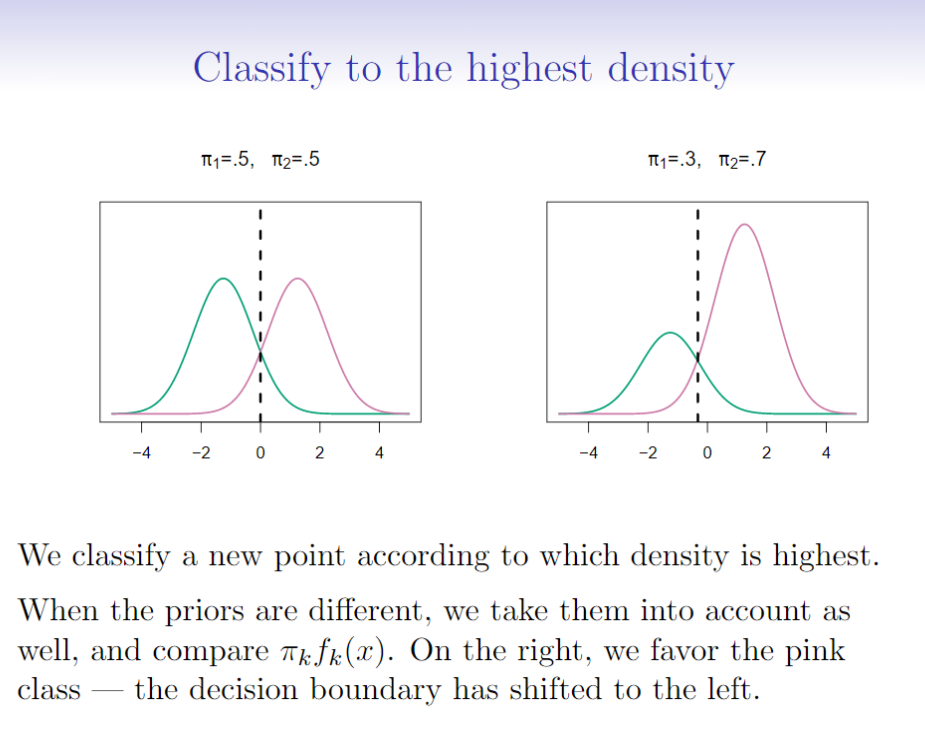

以下是Discriminant Analysis的优势：

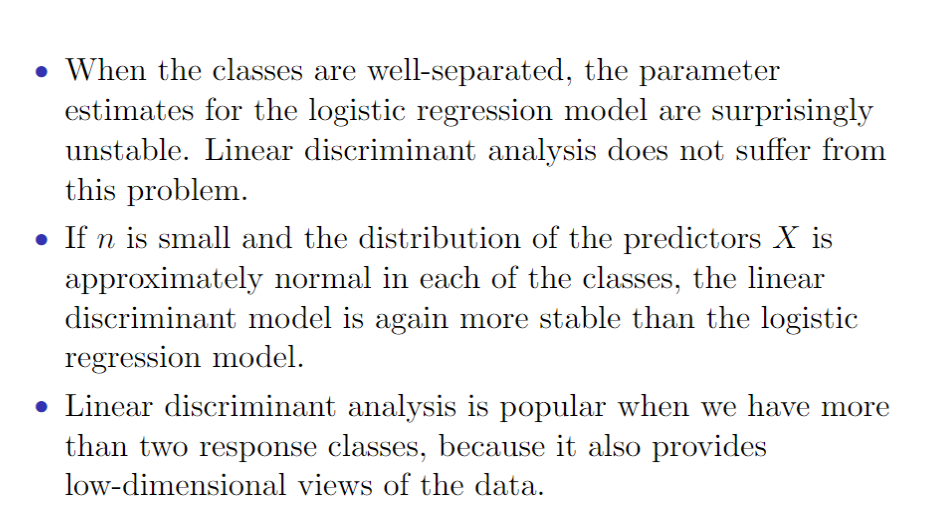

### 6. Linear Discriminant Analysis when p=1

假设p=1，即只有一个预测变量。假设fk(x)是正态的，高斯分布的密度函数为：
$$
f_{k}(x)=\frac{1}{\sqrt{2 \pi} \sigma_{k}} e^{-\frac{1}{2}\left(\frac{x-\mu_{k}}{\sigma_{k}}\right)^{2}}
$$
其中σk^2为方差，μk为平均值（第k类）。假设所有的σk=σ，所有k个类的方差是相同的。

将上式代入贝叶斯定理中，得到新的Pk(x)的表达式如下：
$$
p_{k}(x)=\frac{\pi_{k} \frac{1}{\sqrt{2 \pi} \sigma} e^{-\frac{1}{2}\left(\frac{x-\mu_{k}}{\sigma}\right)^{2}}}{\sum_{l=1}^{K} \pi_{l} \frac{1}{\sqrt{2 \pi} \sigma} e^{-\frac{1}{2}\left(\frac{x-\mu_{l}}{\sigma}\right)^{2}}}
$$
为了看到哪一个X能使概率最大，需要对上式取对数并整理（去掉不依赖于k的项）得：
$$
\delta_{k}(x)=x \cdot \frac{\mu_{k}}{\sigma^{2}}-\frac{\mu_{k}^{2}}{2 \sigma^{2}}+\log \left(\pi_{k}\right)
\\式1
$$
发现δk(x)是关于x的一个线性函数。

假设K=2，π1=π2= 0.5，我们可以发现贝叶斯决策边对于的点在：
$$
x=\frac{\mu_{1}^{2}-\mu_{2}^{2}}{2\left(\mu_{1}-\mu_{2}\right)}=\frac{\mu_{1}+\mu_{2}}{2}
$$

在实际中，却使很确定每一类X服从一个高斯分布，但仍需要估计参数的μ1，...，μk，π1, ... ,πk，σ^2。**线性判别分听(linear discriminant nalysis，LDA)方法**与贝叶斯分类器相似，将πk，μk，σ^2代入上文式1中。使用如下参数估计：
$$
\begin{aligned} \hat{\pi}_{k} &=\frac{n_{k}}{n} \\ \hat{\mu}_{k} &=\frac{1}{n_{k}} \sum_{i : y_{i}=k} x_{i} \\ \hat{\sigma}^{2} &=\frac{1}{n-K} \sum_{k=1}^{K} \sum_{i : y_{i}=k}\left(x_{i}-\hat{\mu}_{k}\right)^{2} \\ &=\sum_{k=1}^{K} \frac{n_{k}-1}{n-K} \cdot \hat{\sigma}_{k}^{2} \end{aligned}
$$
其中n为观测的总量，nk为属于第k类的观测量。μk的估计即为第k类观测的均值，而σ^2可以视为K类样本方差的加权平均。

### 7. Linear Discriminant Analysis when p > 1

者p维随机变量X服从多元高斯分布，则记为X~N(μ. Σ)，其中E(X)=μ是x(p个元素组成的向量)的均值，Cov(X) = Σ是X的p x p的协方差矩阵。多元高斯分布密度函数形式上可以定义为：
$$
f(x)=\frac{1}{(2 \pi)^{p / 2}|\Sigma|^{1 / 2}} e^{-\frac{1}{2}(x-\mu)^{T} \mathbf{\Sigma}^{-1}(x-\mu)}
$$
判别函数为：
$$
\delta_{k}(x)=x^{T} \boldsymbol{\Sigma}^{-1} \mu_{k}-\frac{1}{2} \mu_{k}^{T} \boldsymbol{\Sigma}^{-1} \mu_{k}+\log \pi_{k}
$$
函数复杂，但仍然为线性函数。

改变概率阈值可以用来权衡利弊：

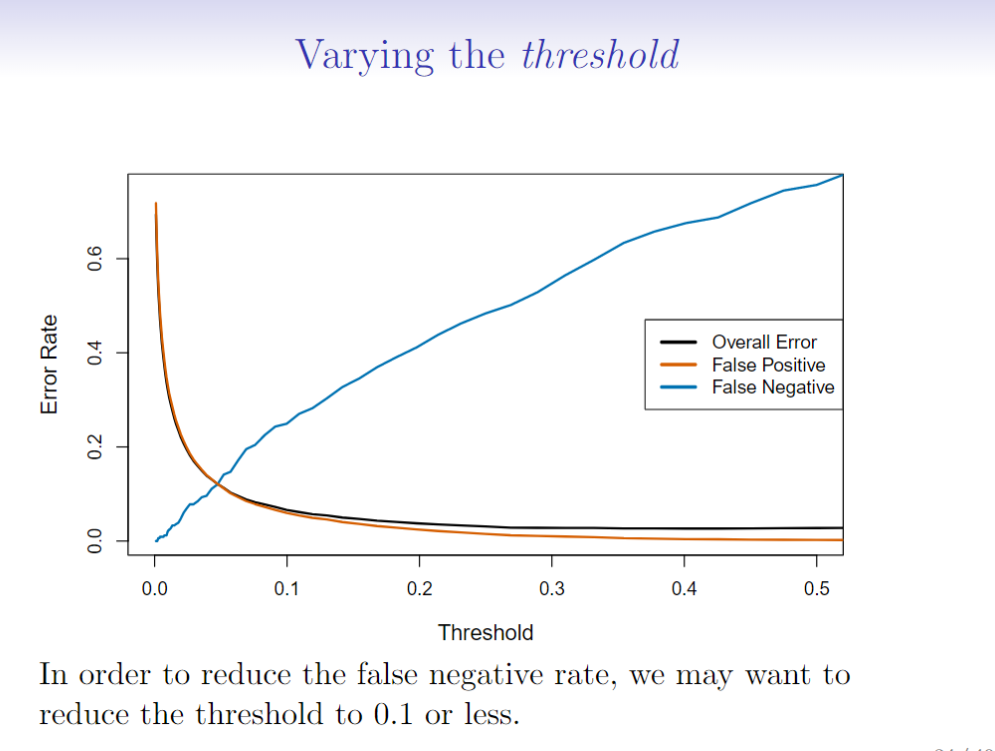

ROC曲线同时展示出所有可能阈值出现的两类错误。分类器的性能表现是通过ROC曲线下面的面积(area under the ROC crnve, AUC)来表示的，该曲线能够涵盖所有可能的阀值。一个理想的ROC曲线会紧贴左上角，所以AUC越大，分类器越好。

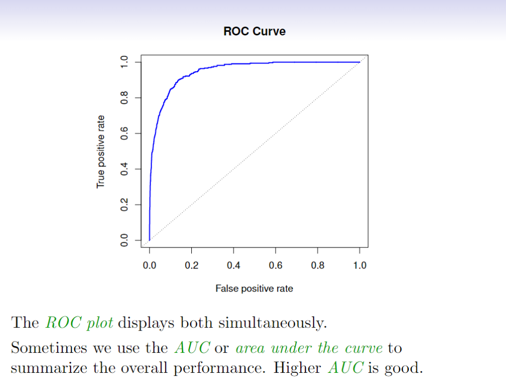

判别分析的其他形式：

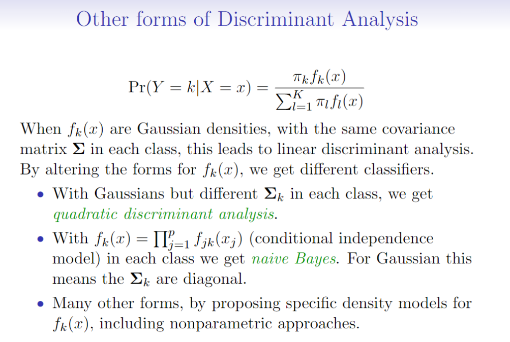

### 8. Quadratic Discriminant Analysis

根据下图，由于每一类的协方差举证不同，二次判别分析表现出更好的拟合。

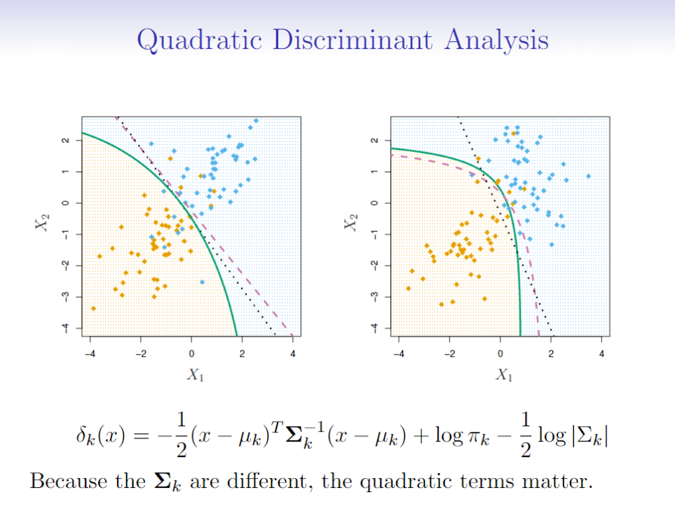

假设所有的特征都是独立的，当p非常大时，大到LDA和QDA无法使用时，我们可以使用朴素贝叶斯方法：

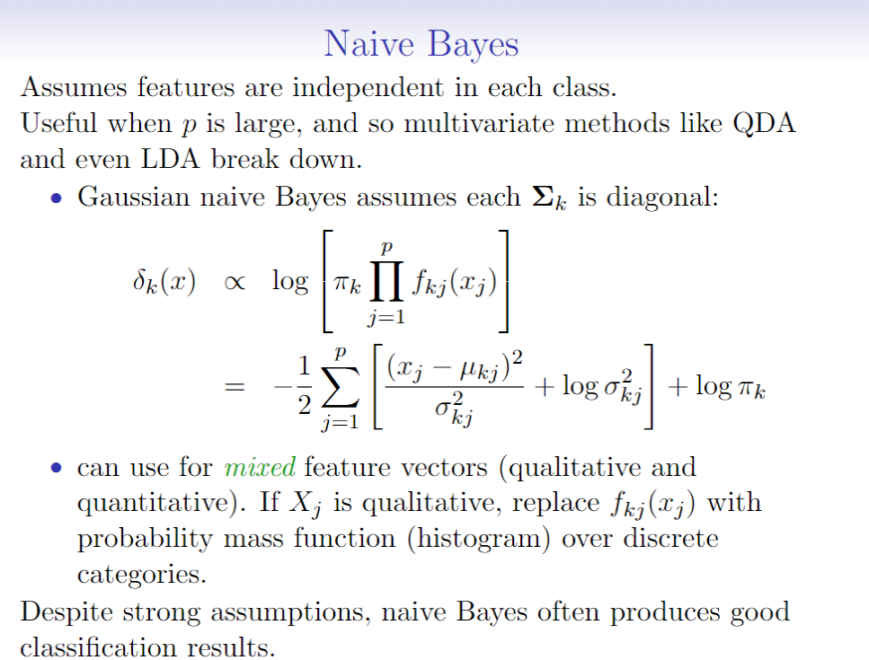

### 9. Logistic Regression versus LDA

* 相同点：

    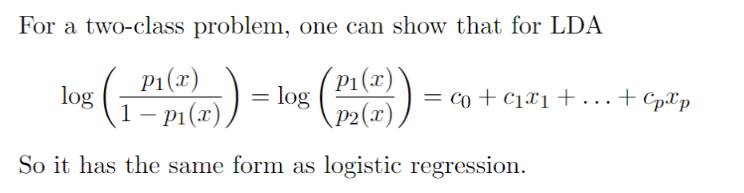

* 不同点主要在于参数估计：

    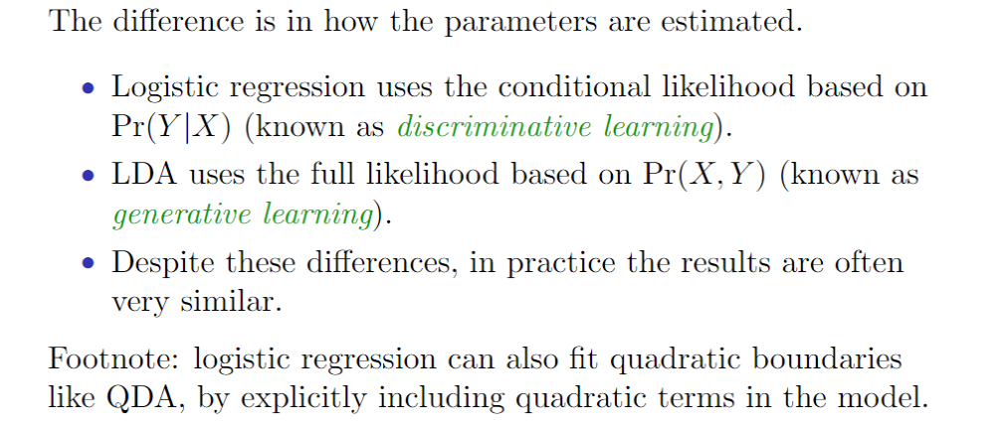

### 10. Summary

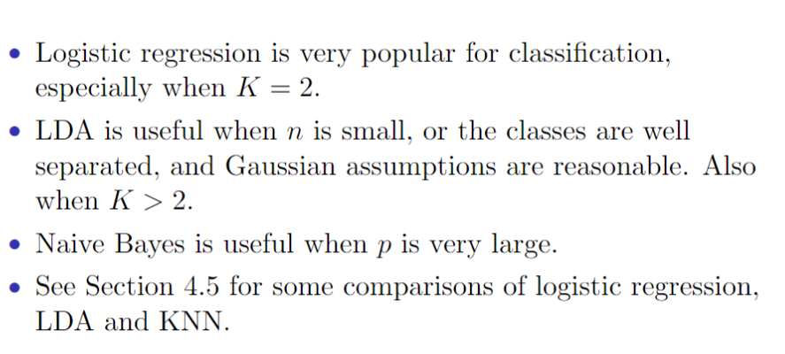