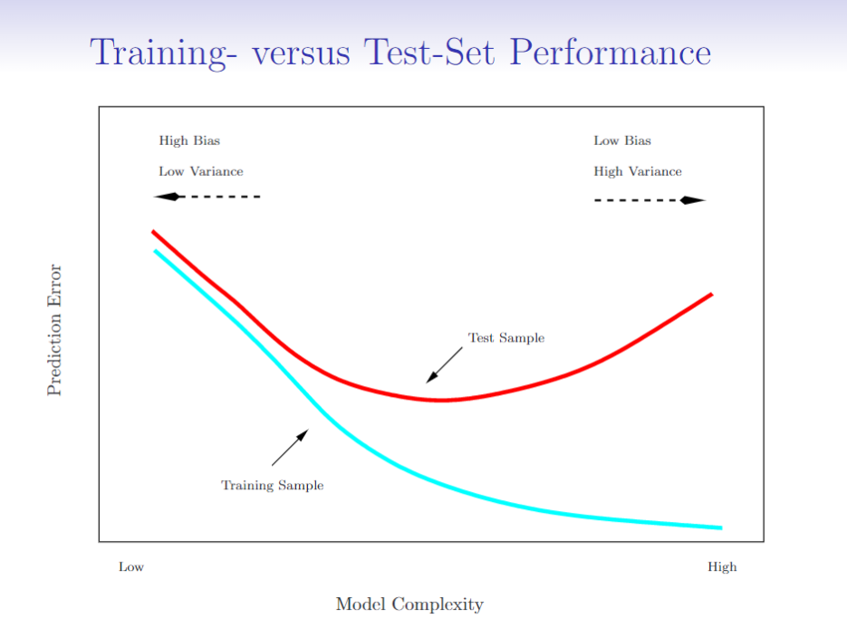
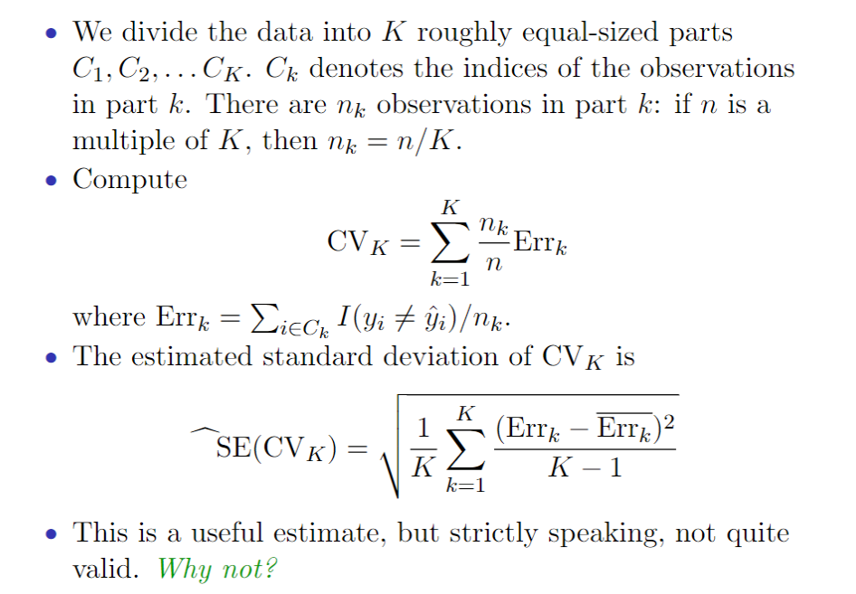
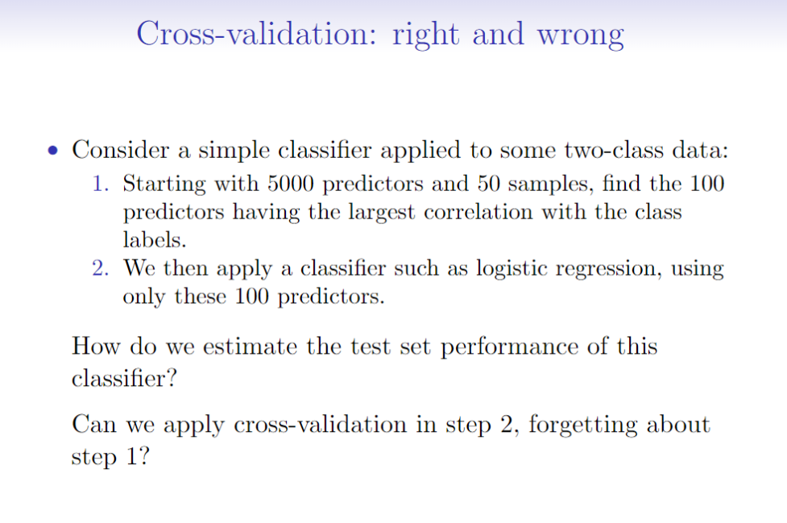
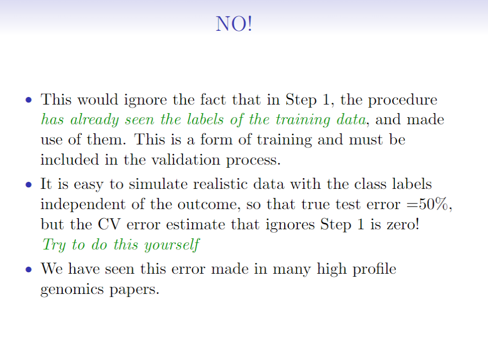
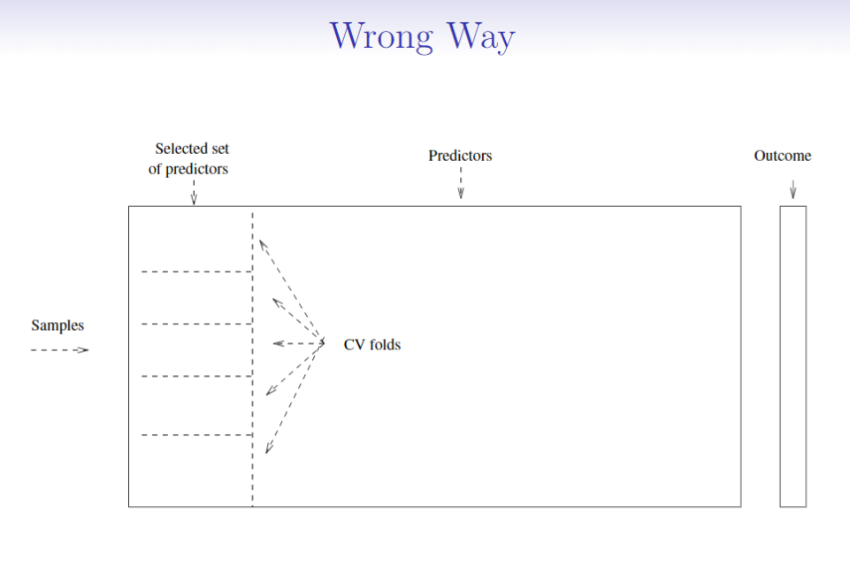
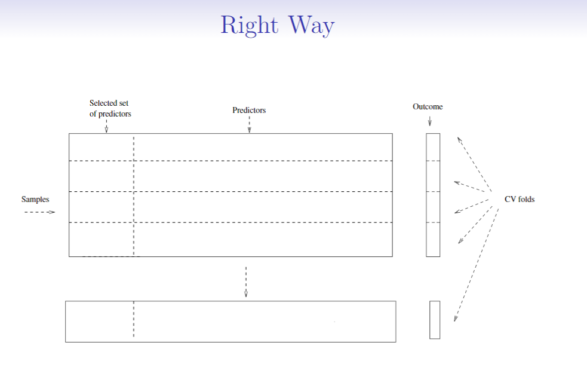
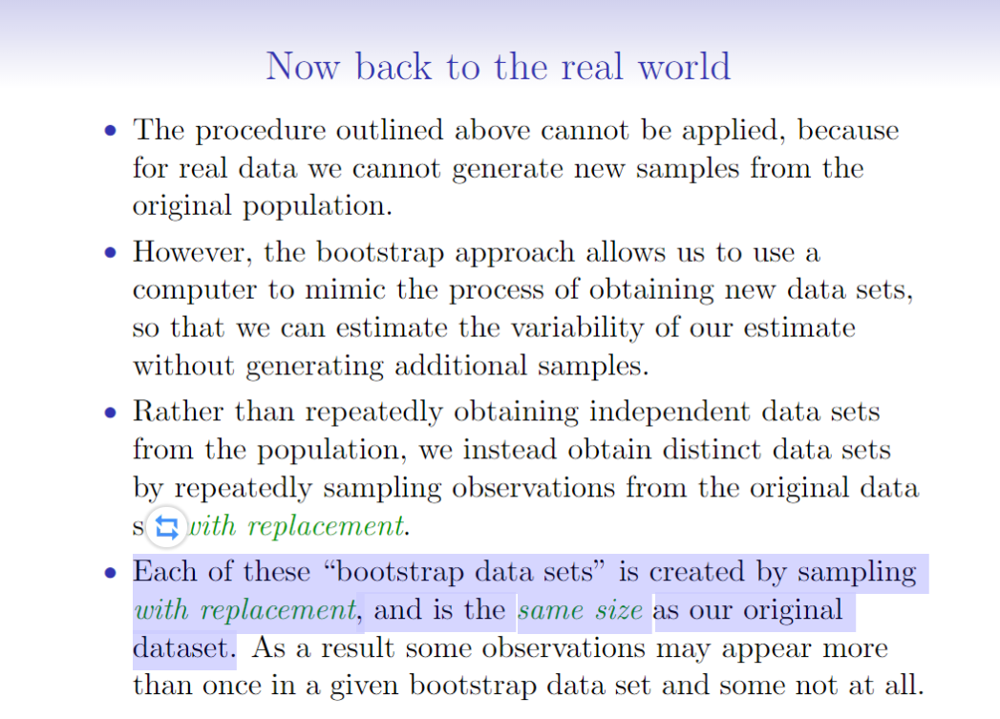
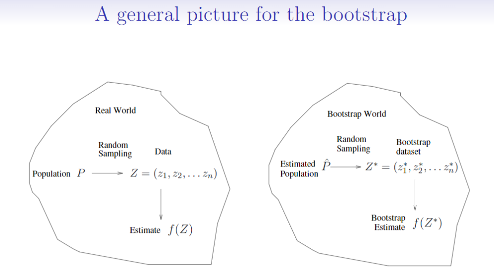
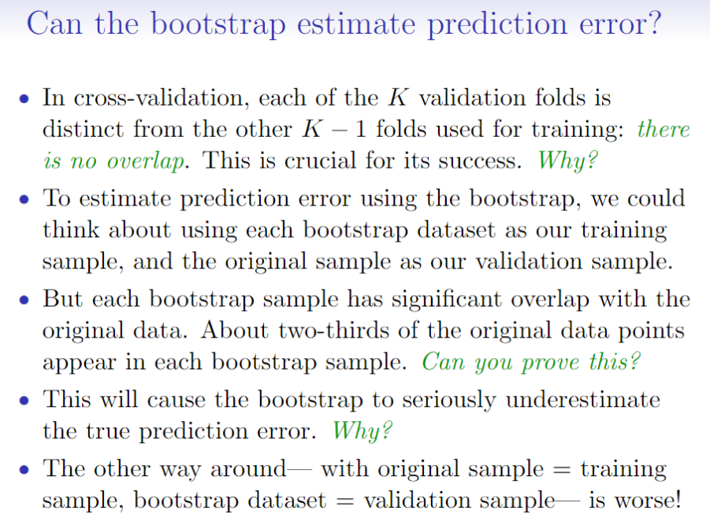
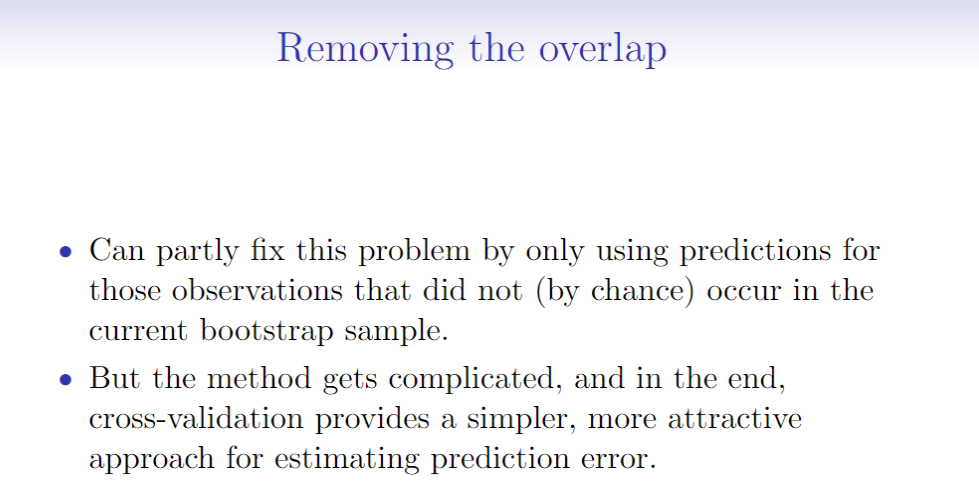

## Resampling Methods

### 1. Cross Validation

#### Training Error versus Test error

* 测试误差是用一种统计学习方法预测在一个新的观测上(这是在训练模型时没有用到的一个测量)的响应值所产生的平均误差。

* 训练误差可通过统计学习方法在观测训练上计算得出。

* 区别在于测试误差往往大于训练误差。

    

    

#### 验证集方法（Validation set approach）

1. 方法原理：把获得的观测数据随机分为两部分：一部分为训练集（通常为原始数据集的一半），另一部分为验证集，或者叫保留集。在训练集上拟合模型，用拟合的模型在验证集上计算响应变量的值，进而得到验证集错误率，即测试错误率。

2. 方法缺陷：

    * 测试错误率的波动会很大，这取决于哪部分数据在训练集中，哪部分数据在验证集中。
    * 在验证集方法中，只有一部分观测数据（没用到所有的数据）被用于拟合模型。由于训练的观测数据越少，统计方法的表现就会越差。这意味着，此方法可能会高估在整个数据集上拟合模型所得到的测试错误率。

    

#### 留一交叉验证法（leave-one-out-validation, LOOCV）

1. 原理：将一个单独的观测数据（x1,x2） 当作验证集数据，剩下的观测数据当作训练集数据。在训练集上训练模型，在验证集上计算MSE。重复这个步骤n次（数据量共总为n），对于每个观测数据，计算其MSE，最终的测试均方误差是n个MSE的均值，即：
    $$
    C V_{(n)}=\frac{1}{n} \sum_{i=1}^{n} M S E_{i}
    $$

2. 相比于验证集方法，该方法优势在于：

    * 偏差较小，由于反复用包含n-1个观测数据来训练模型，观测数几乎与整个数据集中的数据量相等，所以LOOCV相比于验证集方法不容易高估测试误差率。
    * 相比于验证集方法，LOOCV方法在训练集和验证集的分割下不存在随机性。（因为每个数都被选出来当作验证集了），所以每次运用LOOCV方法总会得到相同的结果。

3. 当使用最小二乘法来拟合线性模型或者多项式回归模型时，LOOCV方法花费的时间被神奇的缩减至和只拟合一个模型相同。公式如下：
    $$
    \mathrm{CV}_{(n)}=\frac{1}{n} \sum_{i=1}^{n}\left(\frac{y_{i}-\hat{y}_{i}}{1-h_{i}}\right)^{2}
    $$

4. 缺点：每一折的观测结果都高度相关，因此可能导致高方差。

#### k折交叉验证法（k-fold CV）

​	原理是：将观测集随机地分为k个大小基本一致的组，或者说折（fold）。第一折作为验证集，然后在剩下的k−1折上拟合模型，并在验证集上计算MSE1。重复这个步骤k 次，每一次把不同的观测组作为验证集。最后计算这k个MSE的均值，公式如下：
$$
C V_{k}=\frac{1}{k} \sum_{i=1}^{k} M S E_{i}
\\
\begin{array}{l}{\text { where } \mathrm{MSE}_{k}=\sum_{i \in C_{k}}\left(y_{i}-\hat{y}_{i}\right)^{2} / n_{k}, \text { and } \hat{y}_{i} \text { is the fit for }} \\ {\text { observation } i, \text { obtained from the data with part } k \text { removed. }}\end{array}
$$
​	使用k-fold CV时，一般令k=5或k=10，目的是为了计算方便，LOOCV方法计算量大。当k=n时，该方法就变成leave-one outcross-validation(LOOCV)。

#### 交叉验证法在分类问题中的应用(Cross-Validation for Classification Problems)

#### Cross-Validation：right and wrong

### 2. Bootstrap

很多时候我们的样本数据没有那么多，这时候可以使用bootstrap的方式来对一个数据集进行重抽样，其基本思想是：反复地从原始数据集中有放回地抽取观测数据得到多个数据集进行实验。

bootstrap可以衡量一个指定的统计量或统计学习方法中不确定的因素。如：它可以用来估计一个线性回归拟合模型的系数的标准差。

Bootstrap方法还有以下作用：

* 获取估计的标准差
* 估计总体参数的置信区间

那么Bootstrap方法能否用来估计预测错误呢？

如下图，如果使用Bootstrap数据集作为训练集，原始数据集作为验证集，由于Bootstrap集和原始数据集会有2/3的重合。因此，使用Bootstap方法估计预测错误会大大低估错误率。

换一种方法，用原始数据作为训练集，Bootstrap集作为验证集，结果会更差。

正对上述问题，能不能移除重合部分的数据再验证呢？

可以，但是方法会变得更加复杂，还不及Cross-validation方法简单。

因此，Trevor给出这段话：

A lot of the time, we have simple methods like cross-validation.
And then, a new method comes along like using bootstrap to estimate prediction error.
And we see it's quite a lot more complicated.
And you don't get much in return.
And so our general philosophy is if you can get the job donewith a simple method, it's far better than using a more complicated method just because it maybe looks sexy or whatever.
So keep it simple-- that's the idea.