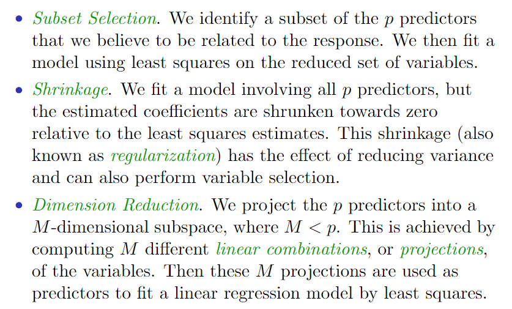
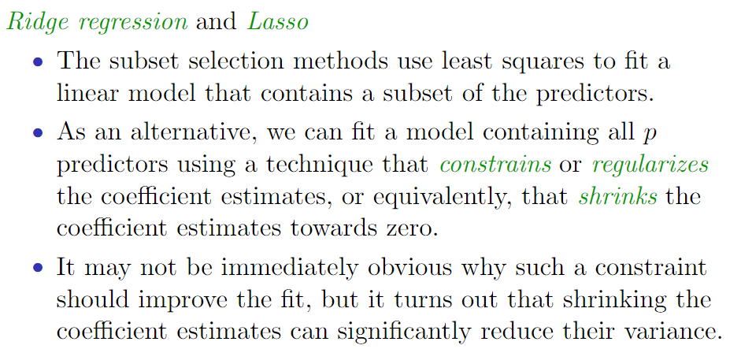
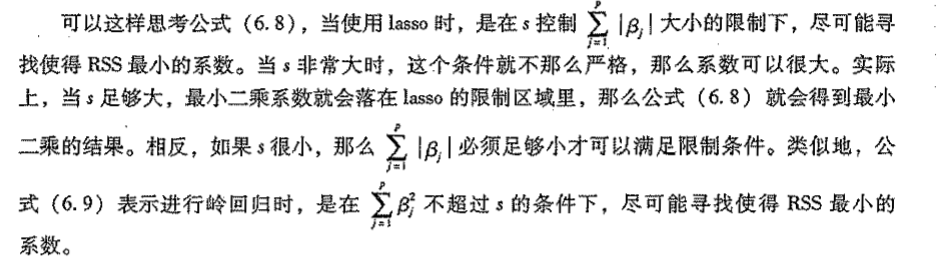

## Linear Model Selection and Regularization

Linear Model的优点：

最小二乘法的缺点：

* 预测准确率（Prediction Accuracy）：若p>n,最小二乘法得到的系数估计结果不唯一，方差表现为无穷大。
* 模型解释力（Model Interpretability）：通过将一些与模型无关的变量的系数设置为0可以移除这些变量，可以使模型更具有解释力，但是最小二乘法很难将系数缩小至0.

因此，我们想要其具有预测准确率和模型解释力的拟合方法。如下图：

### 1. Subset Selection(子集选择)

#### Best subset selection（最优子集选择）

算法：

步骤2在不同子集的规模下，进行模型选择（基于训练样本集），将从2^n个模型中选择一个模型的问题转化为从p+1个备选模型中选出一个模型的问题。

除了对最小二乘回归进行最优子集选择，我们也可以对其它模型进行最优子集选择，例如logistics模型。

当使用logistics模型进行最优子集选择时，应当使用偏差（deviance）替代原先的RSS对模型进行选择。偏差定于为-2与最大似然函数值的乘积，偏差越小，拟合度越高。

#### Stepwise Selection（逐步选择）

Best subset selection的缺点：

* p超过40时，该方法不具有计算性。
* 当p很大时，最优子集法不再适用，而且存在一些统计学上的问题。随着搜索空间的增大，通过此方法找到的模型虽然在训练数据上有较好的表现，但是对新数据并不具备良好的预测能力。从一个巨大的搜索空间中得到的模型可能会有过拟合和系数估计方差高的问题。

然后逐步选择方法限制了搜索空间，从而提高了运算效率。

##### forward stepwise selection（向前逐步选择）

* 优点：

    * 向前逐步选择以一个不包含任何预测变量的零模型为起点，依次在模型中添加变量，知道所有的预测变量都包含在模型中。
    * 特别之处在于，该方法每次只将能最大限度地提升模型效果的变量加入模型中。

* 算法：

    

    一共拟合了1+p(1+p)/2个模型。

* 与最优子集选择的对比：

    * 计算优势明显。
    * 向前逐步选择无法保证找到的模型是2^p个模型中最优的。

##### backward stepwise selection（向后逐步选择）

* 算法：

    

    对1+p(1+p)/2个模型进行搜索。

* 向后逐步选择方法无法保证得到的模型是包含p个预测变量子集的最优模型。

* 向后逐步选择方法需要满足样本量n大于变量个数p（保证全模型可以被拟合)的条件。

#### Choosing the Optimal Model（选择最优模型）

根据R^2和RSS来选择模型并不靠谱（这两个统计量和训练误差相关），我们需要找到具有最小测试误差的模型。因此，为了达到基于测试误差选择最优模型的目的，需要估计测试误差，通常有以下两种方法：

1. 根据过拟合导致的偏差对训练误差进行调整，间接地估计测试误差。
2. 通过训练集方法和交叉验证地方法，直接估计测试误差。

##### C(sub)p , AIC ,BIS and adjusted R^2s

这些方法可以用于选择包含不同变量数的模型。

* C(sub)p
    $$
    \begin{array} { l } { \text {Mallow's } C _ { p } : } \\ { \qquad C _ { p } = \frac { 1 } { n } \left( \mathrm { RSS } + 2 d \hat { \sigma } ^ { 2 } \right) } \\ { \text { where } d \text { is the total } \# \text { of parameters used and } \hat { \sigma } ^ { 2 } \text { is an estimate of the variance} \\\text { of the error associated with each response measurement} } \end{array}
    $$
    sigma^2是各个响应变量观测误差的方差epsilon的估计值。

    

* Akaike information criterion(AIC，赤池信息量准则)

    适用于使用极大似然法进行拟合的模型。L是最大似然函数值。
    $$
    AIC = -2LogL + 2*d
    $$
    
* Bayesian information criterion(BIC，贝叶斯信息准则)
    $$
    \mathrm { BIC } = \frac { 1 } { n } \left( \mathrm { RSS } + \log ( n ) d \hat { \sigma } ^ { 2 } \right)
    $$
    

    

* Adjusted R^2
    $$
    \begin{array} { c } { \text { Adjusted } R ^ { 2 } = 1 - \frac { \operatorname { RSS } / ( n - d - 1 ) } { \operatorname { TSS } / ( n - 1 ) } } \\ { \text { where TSS is the total sum of squares. } } \end{array}
    $$
    调整R^2的值越大，模型测试误差就越低。

    最大化R^2等价于最小化RSS/(n - d - 1)。RSS随着模型包含的变量个数的增加而减少，然而d在分母中出现，RSS/(n - d - 1)可能增加也可能减少。

    与R^2统计量不同，调整R^2统计量对纳入不必要的模型引入了惩罚，增加冗余变量会导致调整R^2减小。

    

##### validation and cross validation

### 2. Shrinkage Methods（压缩估计方法）

#### Ridge regression(岭回归)

##### 岭回归

最小二乘法对β1，β2，...，βp进行估计来进行最小二乘回归，选择能最小化RSS的一组参数：
$$
\mathrm { RSS } = \sum _ { i = 1 } ^ { n } \left( y _ { i } - \beta _ { 0 } - \sum _ { j = 1 } ^ { p } \beta _ { j } x _ { i j } \right) ^ { 2 }
$$
岭回归与最小二乘法相似，系数估计值最小化^β(sup)R通过最小化下式得到：
$$
\sum _ { i = 1 } ^ { n } \left( y _ { i } - \beta _ { 0 } - \sum _ { j = 1 } ^ { p } \beta _ { j } x _ { i j } \right) ^ { 2 } + \lambda \sum _ { j = 1 } ^ { p } \beta _ { j } ^ { 2 } = \mathrm { RSS } + \lambda \sum _ { j = 1 } ^ { p } \beta _ { j } ^ { 2 }
$$

岭回归最后一项是惩罚压缩（shrinkag epenalty），当β1，β2，...，βp接近0时比较小，因此具有将1，β2，...，βp估计值往0的方向压缩的作用。

λ >=0是一个调节参数（tuning parameter），单独确定。调节参数λ的作用是控制这两项对回归系数估计的相对影响程度。选择合适的λ值十分重要。

##### L2范数和预测变量的缩放

L2范数:

其中,
$$
\| \beta \| _ { 2 } = \sqrt { \sum _ { j = 1 } ^ { p } \beta _ { j } ^ { 2 } }
$$
衡量了β与原点的系数。

scaling of predictors(预测变量的缩放):

* 最小二乘法系数估计是尺度不变的（scale invariant）

* 岭回归系数估计值可能会发生显著的改变

* 使用岭回归之前，最好用如下公式对系数进行标准化

    

#### Lasso

##### Lasso

岭回归的缺点：不能像子集选择方法那样选择一个变量的子集进行建模，岭回归的最终模型包括全部的p个变量。

为了克服岭回归的缺点，Lass方法被提出来。Lass的系数^β(sup)L通过求解下式的最小值得到：
$$
\sum _ { i = 1 } ^ { n } \left( y _ { i } - \beta _ { 0 } - \sum _ { j = 1 } ^ { p } \beta _ { j } x _ { i j } \right) ^ { 2 } + \lambda \sum _ { j = 1 } ^ { p } \left| \beta _ { j } \right| = \operatorname { RSS } + \lambda \sum _ { j = 1 } ^ { p } \left| \beta _ { j } \right|
$$
上式与岭回归的拟合公式相似，唯一的区别在于岭回归公式的βl^2在Lasso中被替换为公式总的|βj|。用统计学的方法，Lasso采用 l1惩罚项。

与岭回归相同，Lasso也将系数估计值往0的方向进行缩减。然而，当调节参数 λ 足够大时，L1惩罚项具有将某些系数的估计值强制设置为0的作用。Lasso完成了变量选择，故Lasso建立的模型与岭回归建立的模型相比更易于解释。所以说Lasso得到了**稀疏模型（sparse model）**，即只包含变量的一个子集的模型。与岭回归相同，选择合适的 λ 对于lasso也十分重要。

##### 岭回归和Lasso的其他形式

两种方法的系数估计分别等价于求以下问题：

对于一个 λ 值，都有一些s使得以下第一个等式得到相同的lasso系数估计，同样，对于每一个 λ 值，也有对应的 s 值使得第二个等式得到相同的岭回归系数估计。

当p=2，第一个等式是表示在 |β1|+|β2| <= s 所确定的菱形区域里，Lasso系数估计可以得到最小的RSS。同样，在 β1^2 + β2^2 <= s 所确定的圆形区域里，岭回归系数估计可以得到最小的RSS。

根据上面公式画出误差等高线和限制条件区域如下图。该图解释了为什么Lasso方法可以将变量压缩至0而岭回归不可以。

最小二乘估计系数记为 ^β ,菱形和圆形分别代表上文两个公式的限制条件区域。如果s足够大，那么限制条件区域将包含且并且岭囚归和lasso系数估计将同最小二乘系数一致。(这时的 s 与 λ = 0 对应)。上图中，最小二乘系数落在了菱形和圆形区域之外，所以它不同于lasso 和岭回归结果。

以 ^β 为中心的每个椭园盟代表了某一个RSS数值。也就是说，在一个给定的椭圆边界上，每个点所代表的RSS是相同的。随着椭圆与最小二乘系数估计^β 越来越远，RSS逐渐增大。上面两个公式表示，lasso和岭回归系数估计是由其条件区域与椭圆第一次相交点所决定的。

因为岭回归的条件区域是没有尖点的圆形，所以这个相交点一般不会出现在坐标轴上，所以岭回归系数估计不为零。而lasso的条件区域在每个坐标轴上都有拐角，所以椭圆经常在坐标轴上与条件区域相交。这种情况下，其中一个系数就会为零。在高维情况下，会有很多系数为零。

上图表示的时P=2的简单情况。当p=3时，岭回归的限制条件区域将变成一个球体，而lasso的限制条件区域将变成多面体。当p>3时，岭回归的，岭回归的限制条件区域将变成超球面，而lasso的将变成多面体。

##### 岭回归和Lasso的对比

* 当一部分预测变量时真实有效的而其他预测变量系数非常小或者等于零时，Lasso方法更为出色。
* 当响应变量时很多预测变量的函数并且这些变量系数大致相同时，岭回归更为出色。
* Lasso和岭回归都以偏差代价去降低方差，从而得到更为精准的预测结果。
* A technique such as cross-validation can be used in order to determine which approach is better on a particular dataset.

##### Selecting the Tuning Parameter for Ridge Regressionand Lasso（选择调节参数）

为了对比哪种方法拟合的模型更优，岭回归和Lasso需要一种方法来选择调节参数 λ 或者 限制条件s。

可以是用cross-validation来实现，但是为什么不能使用C(sub)p,AIC,BIC等来验证呢？

因为预测变量个数d是未知的，由于压缩参数，模型的自由度不高，故d并不是已经使用的参数数量。然而交叉验证可以选择一系列的 λ 值，计算每个 λ 的交叉验证误差，然后选择使得交叉验证误差最小的参数值。最后，用所有可用变量和选择的调节参数对模型进行重新拟合。

### 3. Dimension Reduction Methods（降维方法）

对于前面讨论过的对方差的控制有两种不同的方式：一种是只用原变量的子集，另一种时将变量系数压缩至零。但这些方法都是用原始预测变量 X1, X2,... Xp得到的，这节将预测变量进行转换，用转换之后的变量拟合最小二乘模型。这种技术就成为降维方法。

令Z1，Z2，...，Zm表示M个原始预测变量的线性组合（M<P,共有P个原始变量）
$$
\begin{array} { l } { \text { Let } Z _ { 1 } , Z _ { 2 } , \ldots , Z _ { M } \text { represent } M < p \text { linear combinations of } } \\ { \text { our original } p \text { predictors. That is, } } \\ { \qquad Z _ { m } = \sum _ { j = 1 } ^ { p } \phi _ { m j } X _ { j } } \\ { \text { for some constants } \phi _ { m 1 } , \ldots , \phi _ { m p } } \end{array}
$$
那么可用用最小二乘拟合线性模型：
$$
y _ { i } = \theta _ { 0 } + \sum _ { m = 1 } ^ { M } \theta _ { m } z _ { i m } + \epsilon _ { i } , \quad i = 1 , \ldots , n
$$
上式中，回归系数是 θ0, θ1, ... ,θM。如果常数φm1,...,φmp是经过认真选择的，那么这样的降维方法效果通常比最小二乘法要好。

根据第一个公式，有：

降维起到约束系数βj的作用。

#### Principal Components Regression（主成分回归）

##### Principal Components Analysis（主成分分析）

第一主成分向量定义了与数据最接近的那条线，下图中第一主成分线使得所有点到该线得垂直距离平方和最小。

第二主成分向量是与第一主成分向量无关的原始变量的线性组合中方差最大的。

##### Principal Components Regression（主成分回归）

PCR方法是指构造前M个主成分Z1，Z2，...，Zm，然后以这些主成分作为预测变量，用最小二乘拟合线性回归模型。其主要思想就是，少数的主成分足以解释大部分的数据波动和数据以响应变量之前的关系。

在主成分回归里，主成分数量M一般通过交叉验证确定。

#### Partial Least Squares （偏最小二乘）

主成分回归方法涉及能够最大限度地代表预测变量X1, X2,...,Xp的线性组合或方向。这些方向是通过无指导方法得到，因此响应变量Y对选择主成分方向并无帮助。也就是说，响应变量没有指导主成分的构造过程。这就给主成分回归带来一个弊端：无法保证那些很好地解释预测变量的方向同样可以很好地预测响应变量。

偏最小二乘是一种有指导的主成分回归替代方法。

* 向主成分回归一样，偏最小二乘是一种降维手段，它将原始变量的线性组合Z1，Z2,..., ZM作为新的变最集，然后用这M个新变量拟合最小二乘模型。
* 与主成分回归不同，偏最小二乘通过有指导的方法进行新特征提取，也就是说，偏最小二乘利用了响应变量Y的信息筛选新变量。

偏最小二乘方法试图寻找一个可以同时解释响应变量和预测变量的方向。

偏最小二乘方向的个数M也是一个需要调整的参数，一般通过交叉验证选择。

