## Moving Beyond Linearity

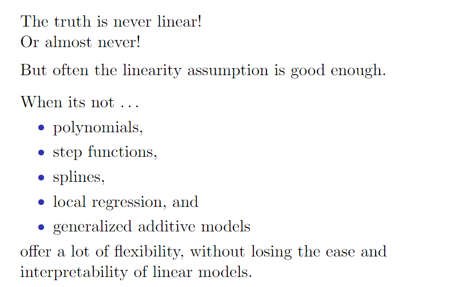

### 1. Polynomial and Step Functions

#### Polynomial Regression（多项式回归）

$$
y _ { i } = \beta _ { 0 } + \beta _ { 1 } x _ { i } + \beta _ { 2 } x _ { i } ^ { 2 } + \beta _ { 3 } x _ { i } ^ { 3 } + \ldots + \beta _ { d } x _ { i } ^ { d } + \epsilon _ { i }
$$

阶数d的值选择不宜过大，或者可以使用交叉验证方法选择d。

#### Step Functions（阶梯函数）

首先在X取值空间上创建分割点c1，c2，...，ck。然后构造K+1个新变量如下：
$$
\begin{aligned} C _ { 0 } ( X ) & = I \left( X < c _ { 1 } \right) \\ C _ { 1 } ( X ) & = I \left( c _ { 1 } \leqslant X < c _ { 2 } \right) \\ C _ { 2 } ( X ) & = I \left( c _ { 2 } \leqslant X < c _ { 3 } \right) \\ & \vdots \\ C _ { k - 1 } ( X ) & = I \left( c _ { k - 1 } \leqslant X < c _ { K } \right) \\ C _ { K } ( X ) & = I \left( c _ { K } \leqslant X \right) \end{aligned}
$$
其中 I( . ) 是示性函数，条件成立时返回1否则返回0。

由于X只能落在K+ 1个区间中的某一个，于是对任意X的取值，C0(X)+C1(X) +... +Ck(X) =1，以C1(X)，C2(X), .... Ck(X) 为预测变量用最小二乘法来拟合线性模型：
$$
y _ { i } = \beta _ { 0 } + \beta _ { 1 } C _ { 1 } \left( x _ { i } \right) + \beta _ { 2 } C _ { 2 } \left( x _ { i } \right) + \cdots + \beta _ { k } C _ { K } \left( x _ { i } \right) + \varepsilon _ { i }
$$
对于X的一个给定值，C0(X)，C2(X)，... ,Ck(X)中至多只有一项系数非零。

如果预测变量本身不具有明显的分割点，那么用分段固定值拟合就不十分恰当。此时，样条法（Splines）更合适。

###  2. Piecewise Polynomials and Splines

#### Piecewise Polynomials（分段多项式）

为取代 X 在全部取值范围内拟合高阶多项式，分段多项式回归在 X 的不同区域拟合独立的低阶多项式函数。如下例子，当d=3，只有一个节点的分段三次多项式具有以下形式：
$$
y _ { i } = \left\{ \begin{array} { l l } { \beta _ { 01 } + \beta _ { 11 } x _ { i } + \beta _ { 21 } x _ { i } ^ { 2 } + \beta _ { 31 } x _ { i } ^ { 3 } + \epsilon _ { i } } & { \text { if } x _ { i } < c } \\ { \beta _ { 02 } + \beta _ { 12 } x _ { i } + \beta _ { 22 } x _ { i } ^ { 2 } + \beta _ { 32 } x _ { i } ^ { 3 } + \epsilon _ { i } } & { \text { if } x _ { i } \geq c } \end{array} \right.
$$
如下图所示：

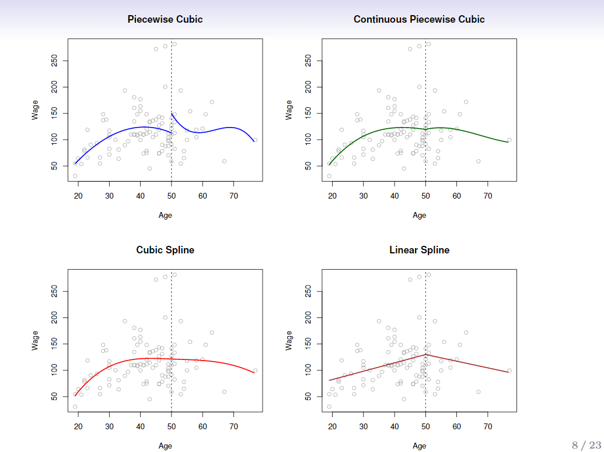

左上角的函数不连续。

右上角的添加连续的约束条件，函数间的连接仍然看起来不自然。

左下角的分段多项式在 age=50 在一阶导数和二阶导数都是连续的。即要求分段多项式不仅在 age =50 处是连续的而且是光滑的。每个对分段三次多项式施加的约束都有效地释放了一个自由度，减少了模型地复杂性。综上所述，左上角地图是使用的是8个自由度，而左下角施加了三个约束（连续性，一阶导数的连续性，二阶导数的连续性），这样就只有5个自由度。左下角的图形通常被称为三次样条（Cubic Spline）,与K个节点一同使用的三次样条会产生 4 + K个自由度。

右下角图是线性样条（Linear Spline），在age=50处连续，d阶样条的一般定义是分段d阶多项式，同时在每个节点知道d-1阶导数都是连续的。因此，线性样条可以通过以下方式得到：在每个区域内拟合一条直线，同时要求在各节点处满足连续性。

#### Linear Splines（线性样条）

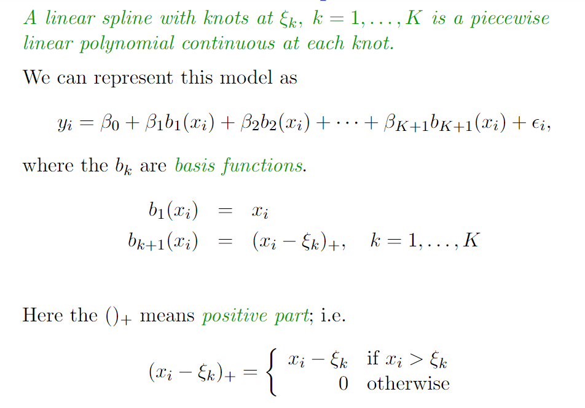

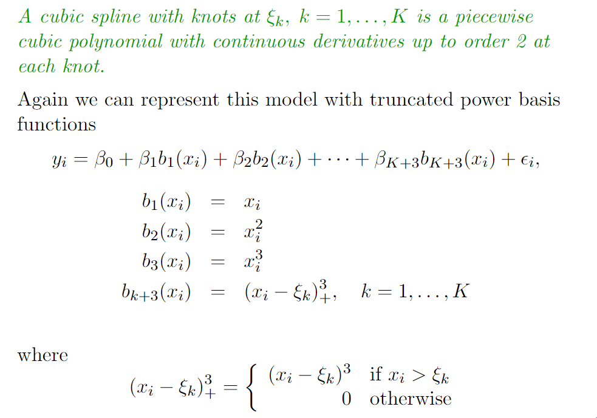

#### Natural Splines（自然样条）

样条在预测变量之外的区域，也就是当 X 取较大值或较小值时，有较大的方差。而自然样条（natural spline）是附加了边界约束的回归样条：函数在边界区域应该是线性的，这里的边界区域指的是 X 的值比最小的节点处的值小或比最大节点处的值大。这个附加条件使得自然样条的估计在边界处更稳定。

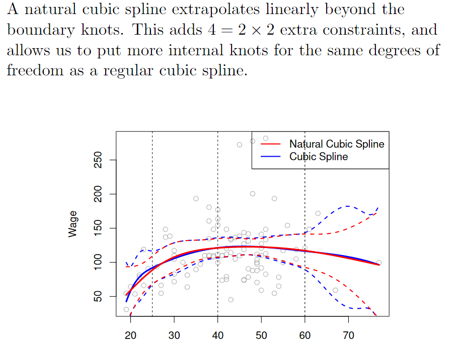

#### Knot placement （结点个数和位置）

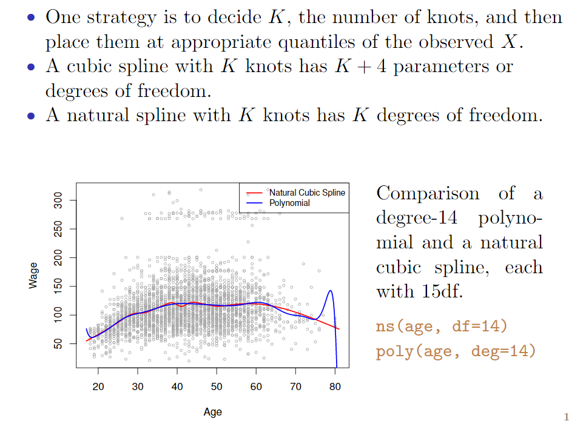

不像多项式回归需要设定较高的幂次才能获得较光滑的拟合效果，样条函数通过增加结点个数但保持自由度固定的方法来使结果光滑。样条函数允许我们在函数 f 变动较快的区域设置多个结点，在函数 f 较稳定的地方设置较少的结点来保证光滑性。

### 3. Smoothing Splines （光滑样条）

#### Smoothing Splines （光滑样条）

为了保证某个函数g(x)是光滑的，最小化

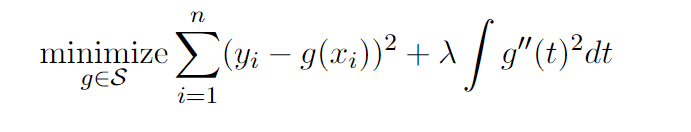

第一项是RSS，第二项是粗糙度惩罚项（roughness penalty），控制g(x)的波动，由调节参数λ≥0决定。

* λ越小，函数波动越大，当 λ=0时 惩罚项不起作用，因此函数 g 会很跳跃并且会在每个训练数据点上做插值。

* 当 λ → ∞ 时，g 会变得非常平稳，也就是说会变成一条尽可能接近所有训练点的直线。

#### Choosing λ （选择光滑参数λ）

光滑样条避免了结点选择问题，仅由 λ 来决定。

有效自由度：

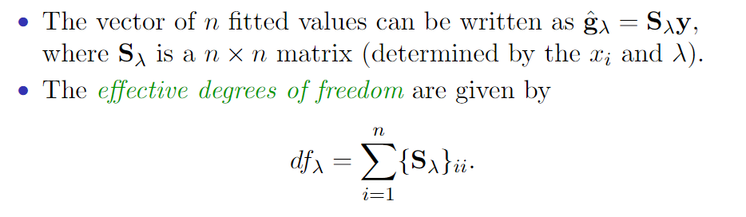

有效自由度的就是矩阵Sλ的对角元素只和。

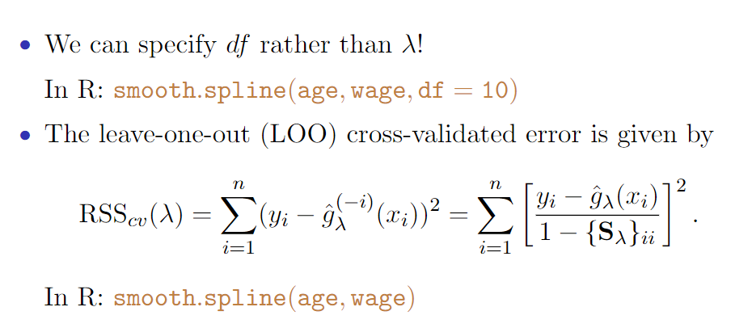

### 4. Generalized Additive Models and Local Regression

#### Local Regression（局部回归）

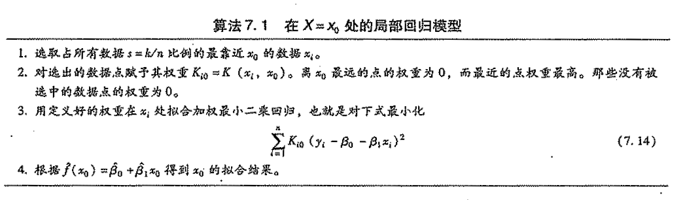

为了实现局部回归，需要确定许多细节，比如如何定义权重函数K，在第3步应该使用一个线性回归函数、单值回归函数还是二次回归函数（式（7.14）对应的是一个线性回归函数）。尽管不同的选择结果会不一样，但最重要的是第1步中定义的间距（span）s。间距在这里的作用相当于调节参数A在光滑样条中的作用，它控制着非线性拟合的光滑性。实际上，选择一个较小的s相当于使用局部观测建模，拟合的效果会剧烈起伏，相反，当s很大时相当于使用所有的观测数据做一个全局的拟合。同样可以使用交叉验证来选择s，或者可以直接给定s。

局部回归的原理可以通过很多方式进行推广。在多变量的情形下，一种比较有用的推广涉及多元线性回归模型，它是对某些变量使用全局回归，另一些变量比如时间则使用局部回归。这种变系数模型（varying coefficient model）是一种将模型扩展至最近收集数据上的有效方式。

#### Generalized Additive Models（广义可加模型）

广义可加模型（generalized additive model，GAM）提供了一种对标准线性模型进行推广的框架，这个框架中，每一个变量用一个非线性函数替换，同时保持着模型的整体可加性。

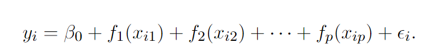

优点与不足：

* GAM模型可以允许对每一个X，都拟合一个非线性f，这样就可自动地对被标准的线性回归模型所忽略的非线性关系进行建模。这就意味着不需要手动地尝试去为每一个变量设置许多不同的变形方式。
* 非线性拟合模型能将响应变量预测得更精准。
* 由于模型是可加的，所以还是能在保持其他变量不变的情况下看每个变量x对Y单独的影响效果。因此如果对推断感兴趣，那么GAM的表达方式同样也适用。
* 针对变量x的函数f的光滑性也能通过对自由度的分析得到。
* GAM模型的主要的局限在于模型的形式被限定为可加形式。在多变量的情况下，这类模型通常会忽略有意义的交互项。不过，就像线性回归一样，也可以通过增加形式为Xi * Xa=j的交互项使得GAM也能够表达交互效应。另外可以增加形式为fjk(Xj, Xk)的低维交互项，这样的交互项可以应用一些二维光滑方法如局部回归或者二维样条来拟合。

GAM可以视为介于线性模型和完全非参数模型之间的一类折中建模的方法。

GAM在R中的使用：

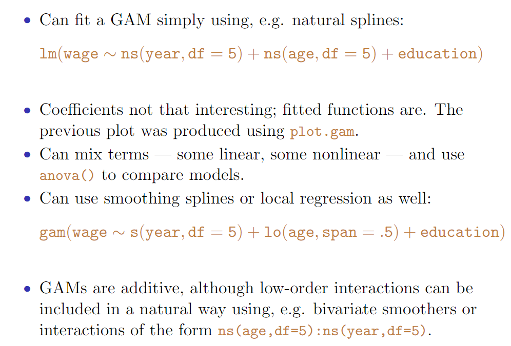