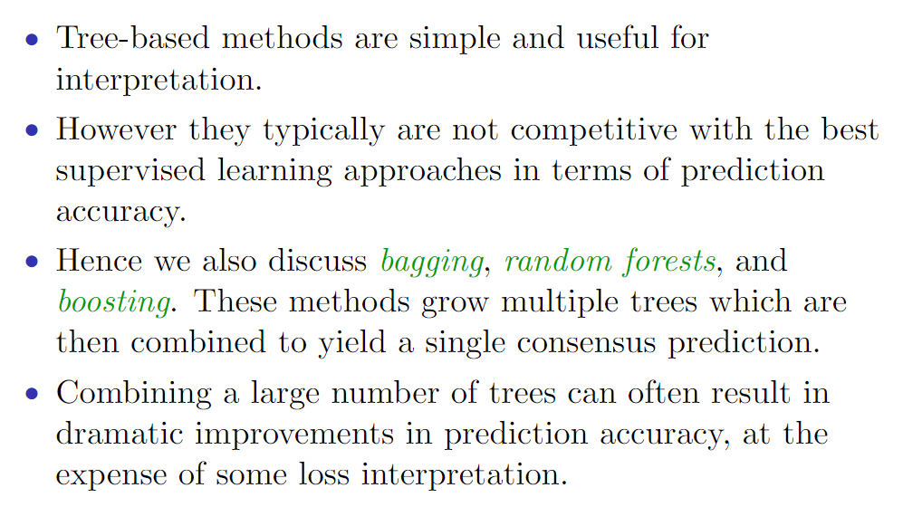
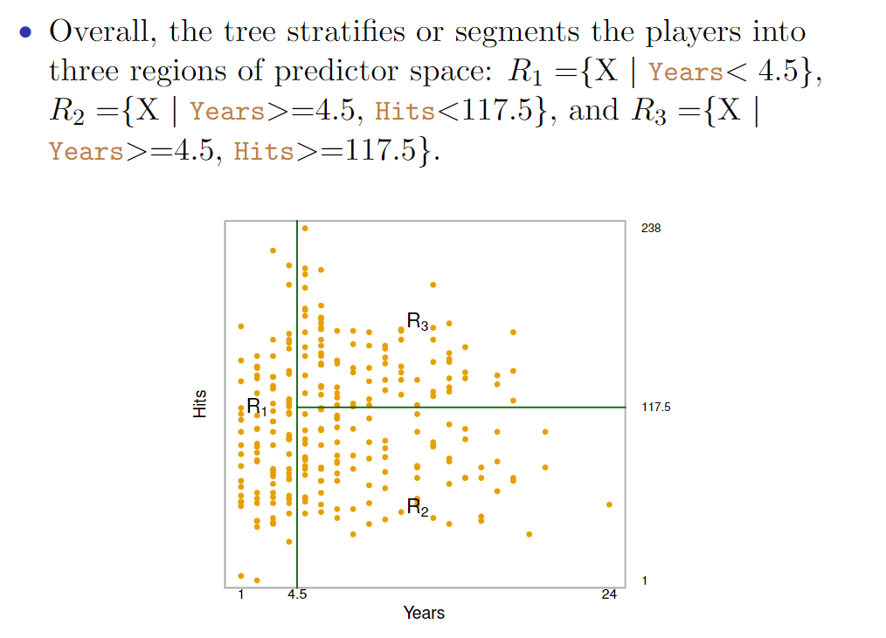
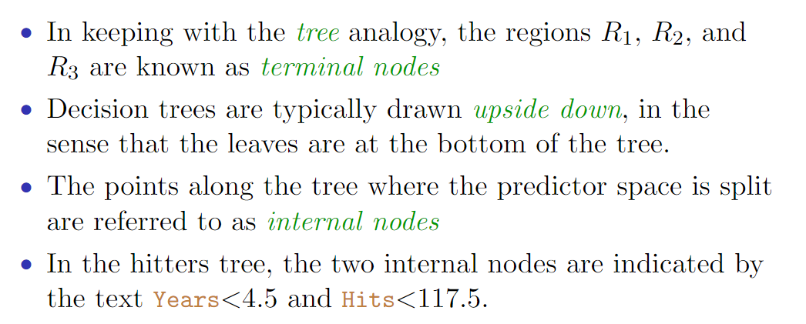
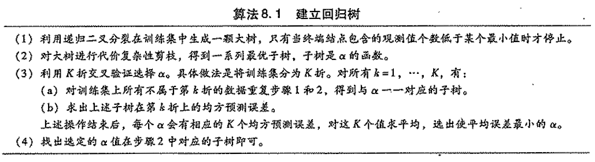
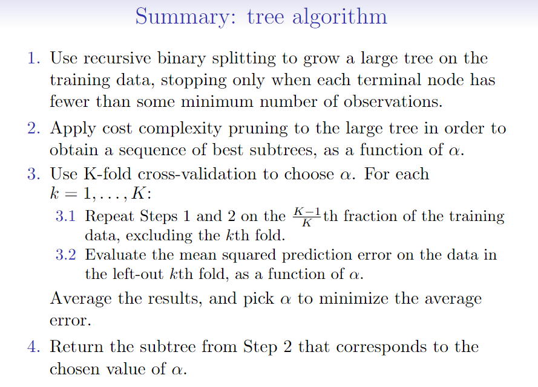
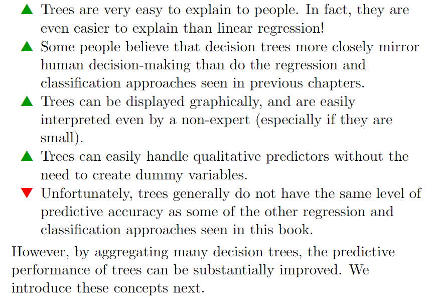
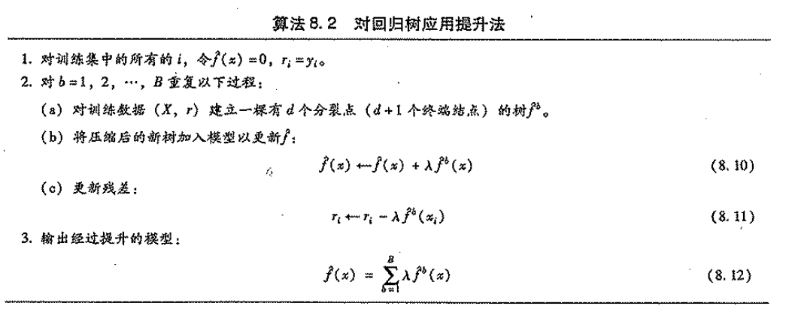
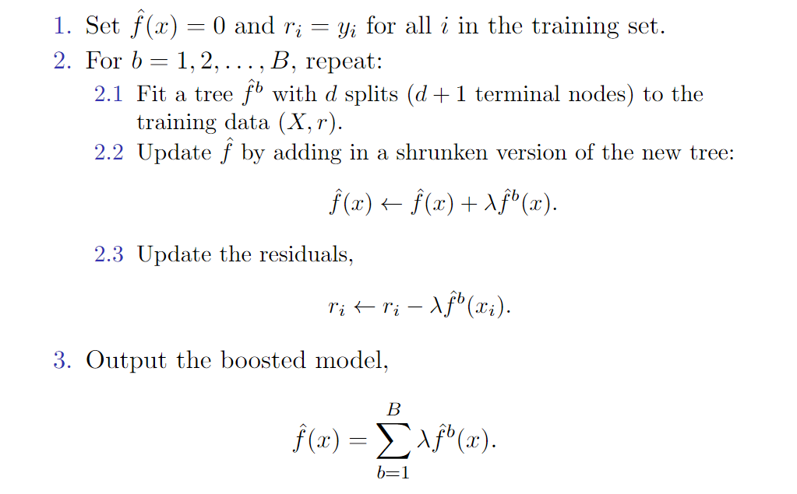

## Tree-based Methods

基于树的方法主要是根据分层（stratifying）和分割（segmenting）的方式将预测变量空间划分为一系列简单区域。由于划分预测变量空间的分裂规则可以被概括为一棵树，所以这类方法被称为决策（decision tree）方法。

基于树的方法的优点和缺点如下：

### The Basics of Decision Trees（决策树的基本原理）

#### Regression Tree（回归树）

如下图例子所示，用回归数预测棒球运动员薪水的例子。

##### Terminology for Trees（树的相关术语）

* 区域R1、R2和R3称为树的终端结点（terminaf node）或树叶（leaf）。
* 决策树通常是从上到下绘制的，树叶位于树的底部。
* 沿树将预测变量空间分开的点称为内部结点（intermal node）。
* 树内部各个结点的连接部分称为分支（branch）。

##### Details of the tree-building process

1. 将预测变量空间（即X1，X2，，…，Xp的可能取值构成的集合）分割成J个互不重叠的区域R1,R2,...,Rj。
2. 对落入区域R的每个观测值作同样的预测，预测值等于Rj上训练集的响应值的简单算术平均。

如何构建区域R1, R2, ..., Rj 更多具体细节如下：

理论上，区域的形状是任意的，但出于模型简化和增强可解释性的考虑，这里将预测变量空间划分成高维矩形，或称盒子（box）。

划分区域的目标是找到使模型的残差平方和RSS最小的矩形区域R1，R2，…，Rj。RSS的定义为：
$$
\begin{array} { c } { \sum _ { j = 1 } ^ { J } \sum _ { i \in R _ { j } } \left( y _ { i } - \hat { y } _ { R _ { j } } \right) ^ { 2 } } \\ { \text { where } \hat { y } _ { R _ { j } } \text { is the mean response for the training } } \\ { \text { observations within the } j \text { th box. } } \end{array}
$$
^y(sub)rj是第 j 个矩形区域中训练集的平均响应值。

遗憾的是，要想考虑将特征空间划分为J个矩形区域的所有可能性，在计算上是不可行的。

因此一般采用一种**自上而下（top-down）**、**贪婪（greedy）**方法：**递归二叉分裂（recursive binary spliting）**。“自上而下”指的是它从树顶端开始（在此处，所有观测值都属于同一个空间）依次分裂预测变量空间，每个分裂点都产生两个新的分支。“贪婪”意指在建立树的每一步中，最优（best）分裂确定仅限于某一步进程，而不是针对全局去选择那些能够在未来进程中构建出更好的树的分裂点。

在执行递归二又分裂时，先选择预测变量xj和分割点s，将预测变量空间分为两个区域{X|Xj<s}和{X|Xj>=s}，使RSS尽可能地减小。（{X|Xj<s}表示Xj的取值小于s的观测值所在的区域。）也就是说，考虑所有预测变量x1，x2，…，xp和与每个预测变量对应的s的所有取值，然后选择预测变量和分割点，使构造出的树具有最小的RSS。

重复上述步骤，寻找继续分割数据集的最优预测变量和最优分割点，使随之产生的区域中的RSS达到最小。此时被分割的不再是整个预测变量空间，而是之前确定的两个区域之一。如此一来就能得到3个区域。接着进一步分割3个区域之一以最小化RSS……这一过程不断持续，直到符合某个停止准则：譬如，当所有区域包含的观测值个数都不大于5时，分裂停止。

##### Pruning a tree（树的剪枝）

上述方法会在训练集中取得良好的预测效果，却很有可能造成数据的过拟合，导致在测试集上效果不佳。原因在于这种方法产生的树可能过于复杂。规模更小的树会有更小的方差和更好的可解释性（以增加微小偏差为代价）。

此时更好的策略是生成一颗很大的树T0，然后通过剪枝得到子树。代价复杂性剪枝（cost complexity pruning），也称最弱联系剪枝（weakest link pruning）可以完成此任务。

考虑以非负调整参数 α 标记一些列子树。每一个 α 的取值对应一颗子树T属于T0。当 α 一定时，其对应得子树使下式最小：
$$
\sum _ { m = 1 } ^ { | T | } \sum _ { x _ { i } \in R _ { m } } \left( y _ { i } - \hat { y } _ { R _ { m } } \right) ^ { 2 } + \alpha | T |
$$
上式中的 T 表述树 T 的终端结点数，Rm是第m个终端结点对应的矩形（预测向量空间的一个子集）。^y(sub)Rm 是与Rm对应的预测值——也就是Rm中训练集的平均值。

调整系数 α 在子树的复杂性和与训练数据的契合度之间控制权衡。当 α = 0 时，子树T等于原树T0。此时上式只衡量了训练误差。而当 α 逐渐增大时，终端结点数多的树将为它的复杂付出代价，所以使上式取到最小值的子树会变得更小。

同时，我们可以使用验证集或者交叉验证确定 α ，然后再整个数据集中找到与之对应的子树。具体算法如下：

#### Classification Trees（分类树）

对分类树来说，给定观测值被预测为它所属区域内的训练集中最常出现的类（most commonly occurring class）。在解释分类树的结果时，我们不仅对特定终端结点对应的预测类别感兴趣，也关注落入此区域的训练集中各个类所占的比例。

与回归树相似，分类树也采用递归二叉分裂，但是再分类树中，RSS无法作为二叉分裂点的准则。以下为三个可用的代替指标：

##### classification error rate（分类错误率）

$$
\begin{array} { l } { \qquad E = 1 - \max _ { k } \left( \hat { p } _ { m k } \right) } \\ { \text { Here } \hat { p } _ { m k } \text { represents the proportion of training observations } } \\ { \text { in the } m \text { th region that are from the } k \text { th class. } } \end{array}
$$

但是分类错误率这一指标在构建时不够敏感。

##### Gini index (基尼系数)

$$
G = \sum _ { k = 1 } ^ { K } \hat { p } _ { m k } \left( 1 - \hat { p } _ { m k } \right)
$$

基尼系数衡量的是第K个类别的方差。如果所有的^Pmk的取值接近0或1，基尼系数会很小，因此基尼系数被视为衡量结点的纯度（purity）的指标。如果基尼系数小，就意味着某个结点包含的观测值几乎来自同一棵树。

##### cross-entropy （互熵，交叉熵）

$$
D = - \sum _ { k = 1 } ^ { K } \hat { p } _ { m k } \log \hat { p } _ { m k }
$$

#### Advantages and Disadvantages of Trees

### Bagging, Random forest and Boosting

#### Bagging（袋装法）

用于减小决策树高方差的一种统计学习方法，又称自助法聚集（bootstrap aggregation）。

自助法取样，即从某个单一的训练集中重复取样。这样一来就能生成B个不同的自助抽样训练集。接下来，用第b个自助抽样训练集拟合模型并求得预测值f*^b（x），最后对所有预测值求平均得：
$$
\hat { f } _ { \mathrm { bag } } ( x ) = \frac { 1 } { B } \sum _ { b = 1 } ^ { B } \hat { f } ^ { * b } ( x )
$$
这就是袋装法。

对于分类问题，最简单的办法如下：对一个给定的测试值，记录B棵树各自给出的预测类别，然后采取多数投票（majority vote）：将B个预测中出现频率最高的类作为总体预测。

##### 袋外误差估计

装袋法的关键是用自助法得到观测值的若干子集，并对它们建立相应的树。可以证明，平均每棵树能利用约三分之二的观测值。对一棵特定的树来说，剩余三分之一没有使用的观测值被称为此树的袋外（out-of-bag，OOB）观测值。可以用所有将第i个观测值作为OOB的树来预测第i个观测值的响应值。这样，便会生成约B/3个对第i个观测值的预测。我们可以对这些预测响应值求平均（回归情况下）或执行多数投票（分类情况下），以得到第i个观测值的一个OOB预测。用这种方法可以求出每个观测值的OOB预测，根据这些就可以计算总体的OOB均方误差（对回归问题）或分类误差（对分类问题）。由此得到的OOB误差是对装袋法模型测试误差的有效估计。

事实证明，当B足够大时，OOB误差实质上与留一法交又验证误差是等价的。在大数据集上使用装袋法时，使用交又验证会让计算变得相当麻烦，此时用OOB方法估计测试误差特别方便。

##### 变量重要性的度量

袋装法对准确性的提升是以牺牲解释性为代价的。

即使装袋法树的集合比单棵树解释数据要困难得多，也可以用RSS（针对装袋法回归树）或基尼系数（针对装袋法分类树）对各预测变量的重要性作出整体概括。在装袋回归树建模过程中，可以记录下任一给定预测变量引发的分裂而减小的RSS的总量，对每个减小总量在所有B棵树上取平均。结果值越大则说明预测变量越重要。同样的道理，在装袋法分类树建模过程中，可以对某一给定的预测变量在一棵树上因分裂而使基尼系数的减小量加总，再取所有B棵树的平均。

#### Random forest（随机森林）

随机森林是对袋装法的改进。不过，在建立这些决策树时，每考虑树上的一个分裂点，都要从全部的p个预测变量中选出一个包含m个预测变量的随机样本作为候选变量。这个分裂点所用的预测变量只能从这m个变量中选择。在每个分裂点处都重新进行抽样，选出m个预测变量，通常m=根号p——也就是说，每个分裂点所考虑的预测变量的个数约等于预测变量总数的平方根。

#### Boosting （提升法）

提升法类似于前两种方法，每一棵树都建立在一个自助抽样数据集上，与其余树独立。但是，提升法的树都是顺序(sequentially)生成的：每棵树的构建都需要用到之前生成的树中的信息。袋装法并不包含自助抽样的步骤；每棵树都是原始数据集的某一修正版本，而非自主抽样训练集生成的。

具体算法如下：

提升方法与生成一棵大规模的决策树不同，生成大树意味着对数据的严格契合（fitting a data hard）和可能的过拟合，而提升法则是一种舒缓（learning slowly）的训练模型的方法。

算法中的参数d控制着树的规模，通过对d的调整，所有这些树都可以变得更小，只有少数终端结点。通过对残差生成小型的树，在f效果不佳的地方缓慢地对它进行改进。压缩参数入允许更多不同结构的树改变残差，它的存在让学习过程进一步变慢。一般而言，学习舒缓的统计学习方法往往有较好的预测效果。与装袋法不同，提升法中每棵树的建立都在很大程度上依赖已有的树。

提升方法的三个参数：

1. 树的总数B。与装袋法和随机森林不同，如果B值过大，提升法可能出现过拟合，不过即使出现过拟合，其发展也很缓慢。我们用交叉验证来选择B。
2. 取极小正值的压缩参数λ。它控制着提升法的学习速度。λ通常取0.01或0.001，合适的取值视具体问题而定。若λ值很小，则需要很大的B才能获得良好的预测效果。
3. 每棵树的分裂点数d，它控制着整个提升模型的复杂性。用d=1构建模型通常能得到上佳效果，此时每棵树都是一个树桩（stump），仅由一个分裂点构成。这种情况下的提升法整体与加法模型相符，因为每个树只包含一个变量。更多情况下，d表示交互深度（interaction depth），它控制着提升模型的交互顺序，因为d个分裂点最多包含d个变量。

### Summary

* Decision trees are simple and interpretable models for regression and classification
* However they are often not competitive with other methods in terms of prediction accuracy
* Bagging, random forests and boosting are good methods for improving the prediction accuracy of trees.  They work by growing many trees on the training data and then combining the predictions of the resulting ensemble of trees
* The latter two methods— random forests and boosting—are among the state-of-the-art methods for supervised learning.  However their results can be difficult to interpret