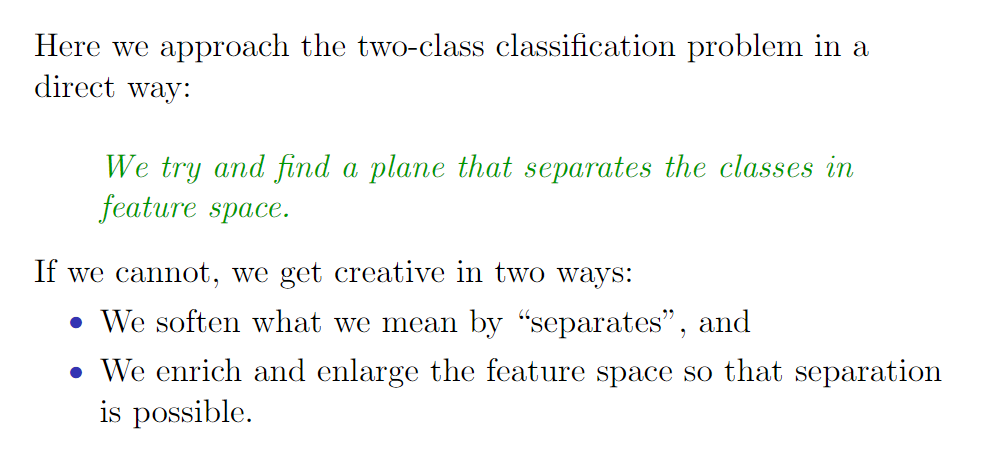
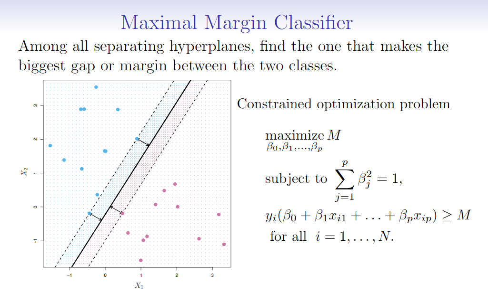
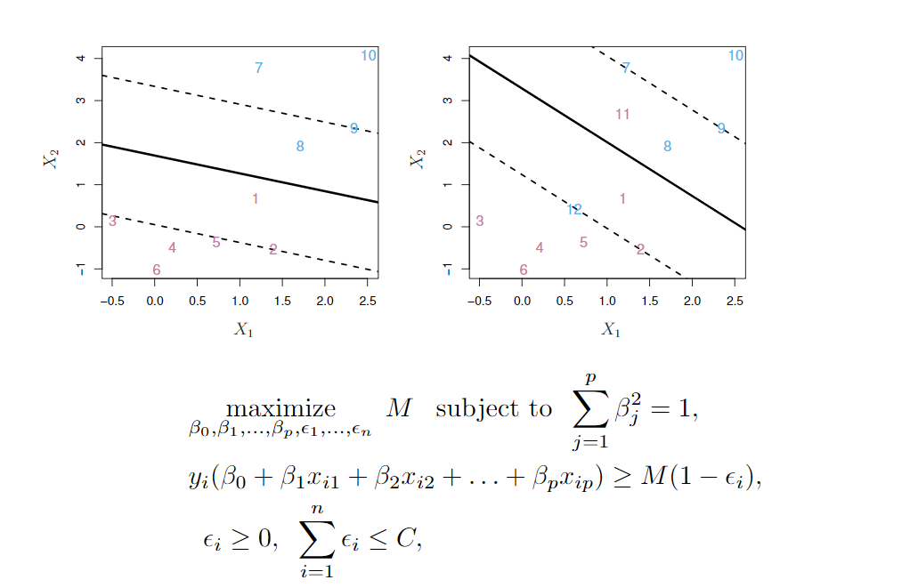
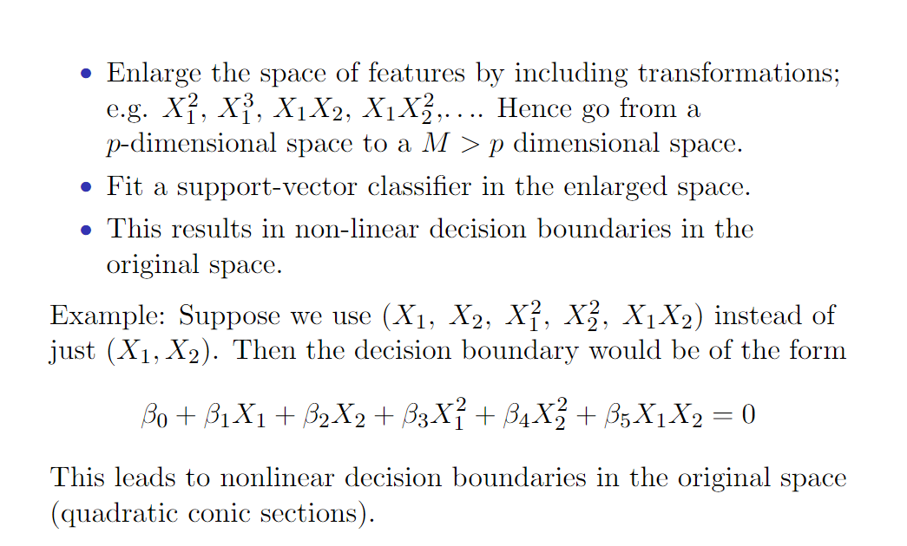
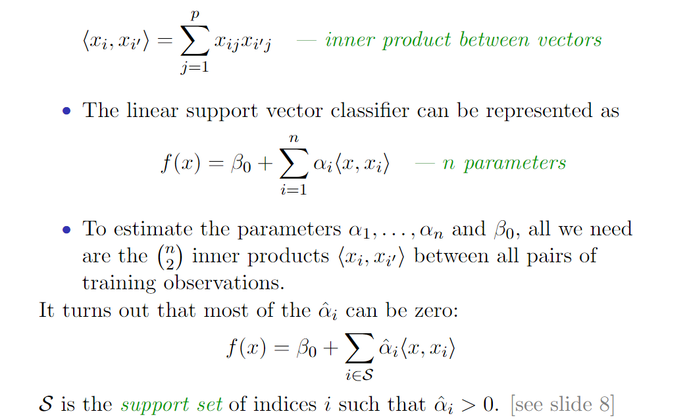
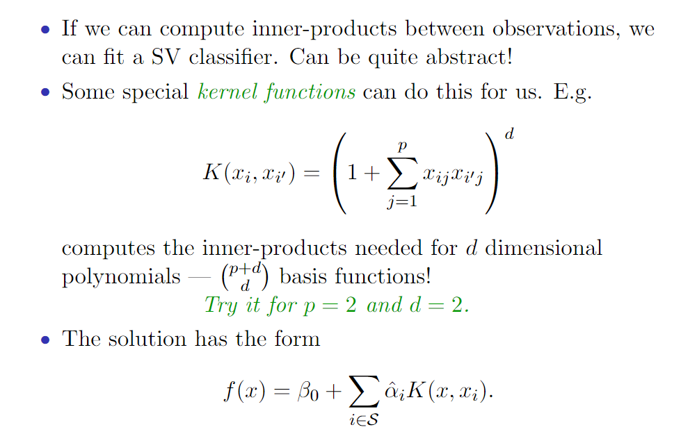
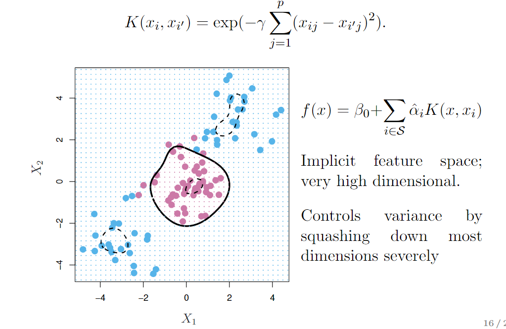
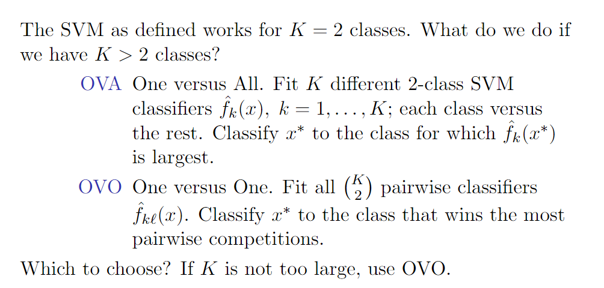
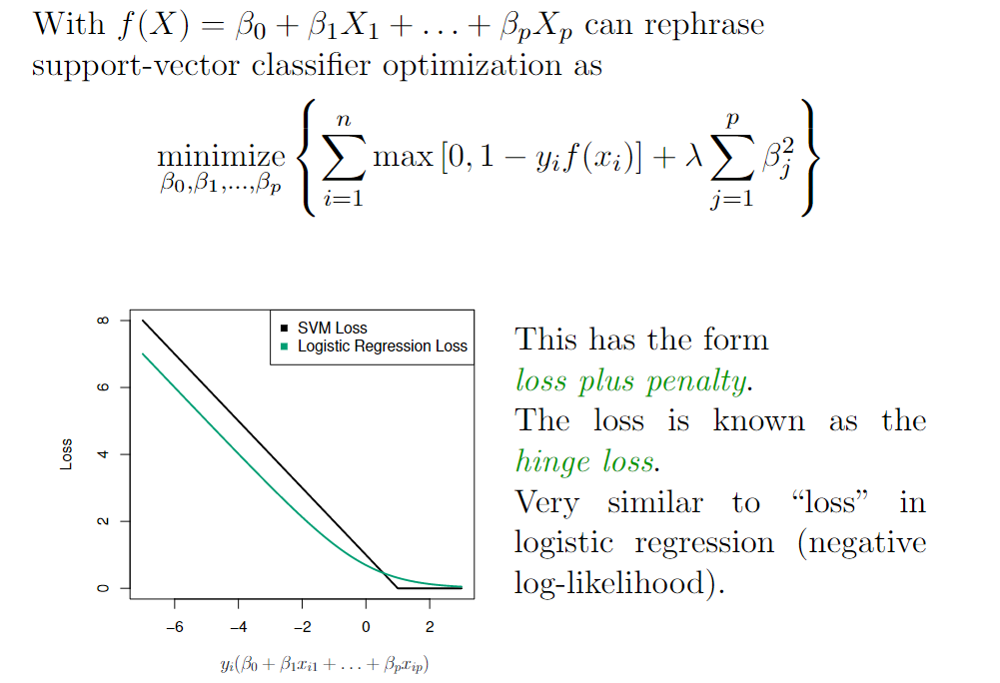
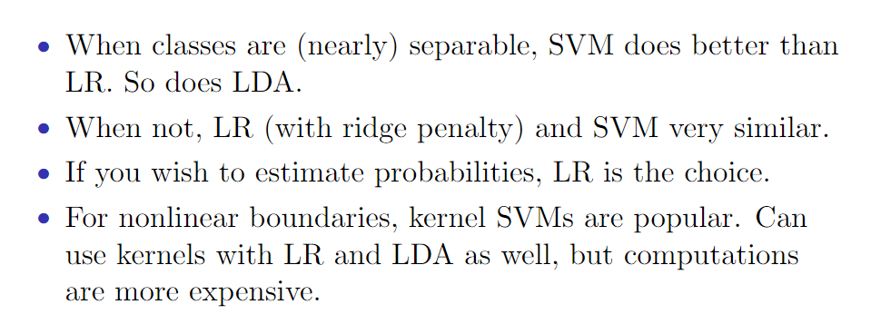

# Support Vector Machines

## Maximal margin classifier（最大间隔分类器）

### Hyperplane(超平面)

在p维空间中，超平面（hyperplane）是p~1维的平面仿射子空间。例如，在二维空间中，超平面是一个平直的一维子空间，换句话说，就是一条直线。在三维空间中，超平面是一个平坦的二维子空间，也就是一个平面。在p>3维的空间中，很难可视化超平面，但是超平面仍然是一个p-1维的平面子空间。

超平面具有如下形式：
$$
\beta _ { 0 } + \beta _ { 1 } X _ { 1 } + \beta _ { 2 } X _ { 2 } + \ldots + \beta _ { p } X _ { p } = 0
$$
β0 = 0时，超平面穿过原点，否则不会。

β= (β1,β2,···,βp) 被称为法向量，指向垂直于超平面表面的方向。

### Maximal Margin Classifier (最大分类间隔器)

## Support Vector Classifier （支持向量分类器）

支持向量分类器（support vector classifier），t称为软间隔分类器（soft margin classifier），就是在做这么一件事。与其寻找可能的最大间隔，要求每个观测不仅落在超平面外正确的一侧，而且还必须满足正确地落在某一间隔以外，不如允许一些观测落在间隔错误的一侧，甚至超平面错误的一侧。

上图中，C是非负的调节参数，M是间隔的宽度，目标是最大化M。

ε1，...，εi 是松弛变量（slack variable），松弛变量的作用是允许训练观测中有小部分观测可以落在间隔的错误的一侧或是超平面的错误的一侧。

C是所有εi 之和的上界，他代表了能够容忍的穿过间隔（以及超平面）的观测的数目和严重程度。可以把C看做是在n个观测中对穿过间隔的观测的数量的“约束”。如果C=0，那么就不允许存在穿过间隔的观测；如果C>0，那么只有不超过C个观测可以落在超平面的错误的一侧。

## Feature Expansion and the SVM

### Feature Expansion

### SVM

支持向量机（support vector machine，SVM）是支持向量分类器的一个扩展，扩展的结果是支持向量机使用了一种特殊的方式，即核函数（kernel）来扩大特征空间。

#### Inner products and support vectors

两个r维向量a和b的内积定义为$\langle a , b \rangle = \sum _ { i = 1 } ^ { r } a _ { i } b _ { i }$ ，因此两个观测 $x_i$ 和 $x^{\prime}_i$ 的内积为：
$$
\left\langle x _ { i } , x _ { i ^ { \prime } } \right\rangle = \sum _ { j = 1 } ^ { p } x _ { i j } x _ { i ^ { \prime } j } - \text {inner product between vectors}
$$
线性支持向量分类器可以描述为：
$$
f ( x ) = \beta _ { 0 } + \sum _ { i = 1 } ^ { n } \alpha _ { i } \left\langle x , x _ { i } \right\rangle \quad - n \text { parameters }
$$

#### Kernels and Support Vector Machines

多项式核函数跟标准的线性核函数比起来，在支持向量分类器的算法中使用d>1的多项式核函数，能够生成光滑度更高的决策边界。从本质上来说，它是在与多项式的自由度d有关的高维空间中拟合支持向量分类器，而不是在原始的特征空间中拟合支持向量分类器。

#### Radial Kernel

径向核函数是一种局部方法，因为只有测试观测周围的训练观测对测试观测的预测类别有影响。

#### Adavantage

使用核函数而不使用原始特征函数的优势是什么呢？

计算量。使用核函数，只需要为$\left( \begin{array} { l } { n } \\ { 2 } \end{array} \right)$ 个不同的配对 $i$, $i^{\prime}$ 计算$K \left( x _ { i } , x _ { i } ^ { \prime } \right)$ 。而在扩大的特征空间中，没有明确的计算量。这一点是非常重要的，因为在许多支持向量机的应用中，扩大的特征空间是大到几乎无法解决计算问题。而对于一些核函数来说（例如如径向核函数），特征空间是不确定的，并且可扩展到无限维，因此无论如何都无法对特征空间做这样的计算。

## SVMs:  more than 2 classes?

OVA：one-versus-one

OVO：one-versus-all

## Support Vector versus Logistic Regression

### Which to use:  SVM or Logistic Regression

当不同类别的观测可以很好地被分离时，SVM的表现比逻辑斯谛回归好。但是如果不同类别存在较多重叠，选择逻辑斯谛回归是比较合适的。

